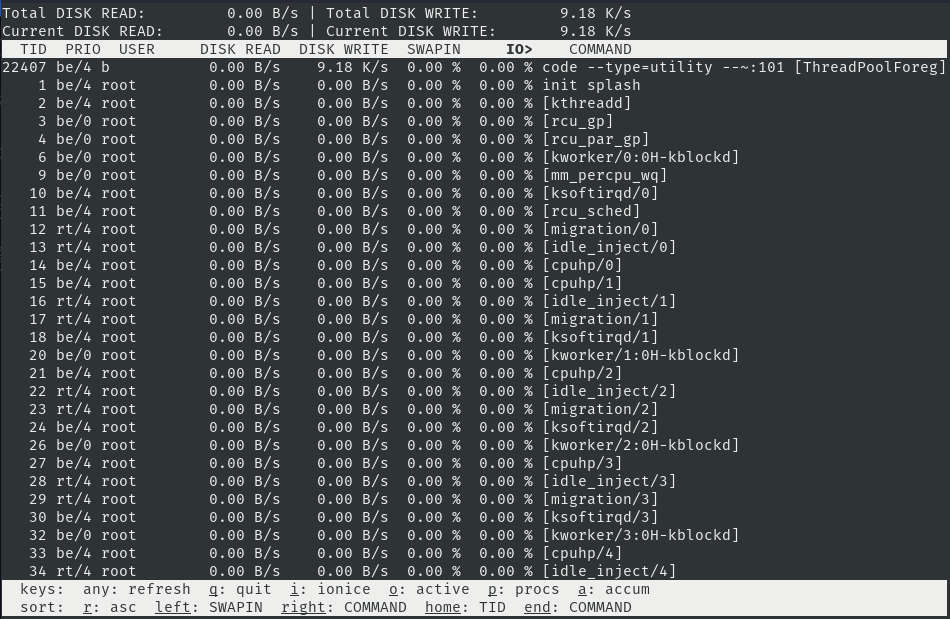

## Iotop - Check live disk speed

### Installation

```plain
sudo apt install iotop
```

### Usage

```plain
iotop [OPTIONS]
```

### Flags

```plain
Usage: /usr/sbin/iotop [OPTIONS]

DISK READ and DISK WRITE are the block I/O bandwidth used during the sampling
period. SWAPIN and IO are the percentages of time the thread spent respectively
while swapping in and waiting on I/O more generally. PRIO is the I/O priority
at which the thread is running (set using the ionice command).

Controls: left and right arrows to change the sorting column, r to invert the
sorting order, o to toggle the --only option, p to toggle the --processes
option, a to toggle the --accumulated option, i to change I/O priority, q to
quit, any other key to force a refresh.

Options:
  --version             show program's version number and exit
  -h, --help            show this help message and exit
  -o, --only            only show processes or threads actually doing I/O
  -b, --batch           non-interactive mode
  -n NUM, --iter=NUM    number of iterations before ending [infinite]
  -d SEC, --delay=SEC   delay between iterations [1 second]
  -p PID, --pid=PID     processes/threads to monitor [all]
  -u USER, --user=USER  users to monitor [all]
  -P, --processes       only show processes, not all threads
  -a, --accumulated     show accumulated I/O instead of bandwidth
  -k, --kilobytes       use kilobytes instead of a human friendly unit
  -t, --time            add a timestamp on each line (implies --batch)
  -q, --quiet           suppress some lines of header (implies --batch)
  --no-help             suppress listing of shortcuts
```

### Examples



### URL list

* [Linux.die.net](https://linux.die.net/man/1/iotop)
