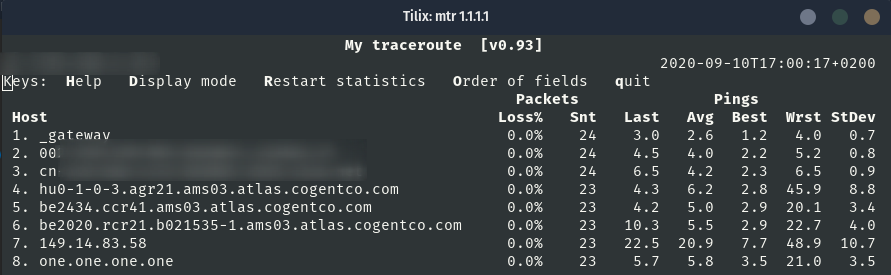

---

A network diagnostic tool - TraceRoute alternative.

## Usage

```plain
mtr [options] hostname
```

## Flags

```plain
 -F, --filename FILE        read hostname(s) from a file
 -4                         use IPv4 only
 -6                         use IPv6 only
 -u, --udp                  use UDP instead of ICMP echo
 -T, --tcp                  use TCP instead of ICMP echo
 -I, --interface NAME       use named network interface
 -a, --address ADDRESS      bind the outgoing socket to ADDRESS
 -f, --first-ttl NUMBER     set what TTL to start
 -m, --max-ttl NUMBER       maximum number of hops
 -U, --max-unknown NUMBER   maximum unknown host
 -P, --port PORT            target port number for TCP, SCTP, or UDP
 -L, --localport LOCALPORT  source port number for UDP
 -s, --psize PACKETSIZE     set the packet size used for probing
 -B, --bitpattern NUMBER    set bit pattern to use in payload
 -i, --interval SECONDS     ICMP echo request interval
 -G, --gracetime SECONDS    number of seconds to wait for responses
 -Q, --tos NUMBER           type of service field in IP header
 -e, --mpls                 display information from ICMP extensions
 -Z, --timeout SECONDS      seconds to keep probe sockets open
 -M, --mark MARK            mark each sent packet
 -r, --report               output using report mode
 -w, --report-wide          output wide report
 -c, --report-cycles COUNT  set the number of pings sent
 -j, --json                 output json
 -x, --xml                  output xml
 -C, --csv                  output comma separated values
 -l, --raw                  output raw format
 -p, --split                split output
 -t, --curses               use curses terminal interface
     --displaymode MODE     select initial display mode
 -n, --no-dns               do not resolve host names
 -b, --show-ips             show IP numbers and host names
 -o, --order FIELDS         select output fields
 -y, --ipinfo NUMBER        select IP information in output
 -z, --aslookup             display AS number
 -h, --help                 display this help and exit
 -v, --version              output version information and exit

See the 'man 8 mtr' for details.
```

## Examples



## URL List

- [Linux.die.net](https://linux.die.net/man/8/mtr)
