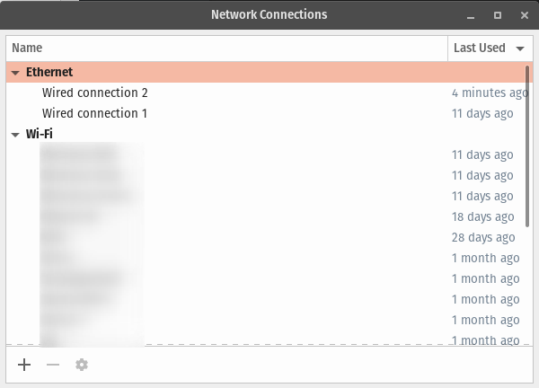

## Nm-Connection-Editor - Allows users to view and edit network connection settings

## Usage

```plain
nm-connection-editor [OPTION…]
```

## Flags

```plain
Allows users to view and edit network connection settings

Help Options:
  -h, --help                    Show help options

Application Options:
  -t, --type=802-3-ethernet     Type of connection to show or create
  -c, --create                  Create a new connection
  -s, --show                    Show a given connection type page
  -e, --edit=UUID               Edit an existing connection with a given UUID
  -i, --import                  Import a VPN connection from given file

```

## Examples



## URL List

* [Manpages.ubuntu.com](https://manpages.ubuntu.com/manpages/artful/en/man1/nm-connection-editor.1.html)
