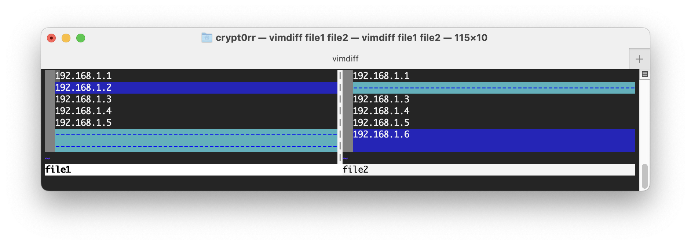

## vimdiff

Vimdiff starts Vim on two up to eight files.  Each file gets its own window.  The differences between the files are highlighted.  This is a nice way to inspect changes and to move changes from one version to another version of the same file.

When started as gvimdiff the GUI will be started, if available.

In each window the 'diff' option will be set, which causes the differences to be highlighted. The 'wrap' and 'scrollbind' options are set to make the text look good. The 'foldmethod' option is set to "diff", which puts ranges of lines without changes in a fold.  'foldcolumn' is set to two to make it easy to spot the folds and open or close them.

## Usage

```plain
vim [arguments] [file ..]       edit specified file(s)
vim [arguments] -               read text from stdin
vim [arguments] -t tag          edit file where tag is defined
vim [arguments] -q [errorfile]  edit file with first error
```

## Flags

```plain
Arguments:
   --                   Only file names after this
   -v                   Vi mode (like "vi")
   -e                   Ex mode (like "ex")
   -E                   Improved Ex mode
   -s                   Silent (batch) mode (only for "ex")
   -d                   Diff mode (like "vimdiff")
   -y                   Easy mode (like "evim", modeless)
   -R                   Readonly mode (like "view")
   -Z                   Restricted mode (like "rvim")
   -m                   Modifications (writing files) not allowed
   -M                   Modifications in text not allowed
   -b                   Binary mode
   -l                   Lisp mode
   -C                   Compatible with Vi: 'compatible'
   -N                   Not fully Vi compatible: 'nocompatible'
   -V[N][fname]         Be verbose [level N] [log messages to fname]
   -D                   Debugging mode
   -n                   No swap file, use memory only
   -r                   List swap files and exit
   -r (with file name)  Recover crashed session
   -L                   Same as -r
   -T <terminal>        Set terminal type to <terminal>
   --not-a-term         Skip warning for input/output not being a terminal
   --ttyfail            Exit if input or output is not a terminal
   -u <vimrc>           Use <vimrc> instead of any .vimrc
   --noplugin           Don't load plugin scripts
   -p[N]                Open N tab pages (default: one for each file)
   -o[N]                Open N windows (default: one for each file)
   -O[N]                Like -o but split vertically
   +                    Start at end of file
   +<lnum>              Start at line <lnum>
   --cmd <command>      Execute <command> before loading any vimrc file
   -c <command>         Execute <command> after loading the first file
   -S <session>         Source file <session> after loading the first file
   -s <scriptin>        Read Normal mode commands from file <scriptin>
   -w <scriptout>       Append all typed commands to file <scriptout>
   -W <scriptout>       Write all typed commands to file <scriptout>
   -x                   Edit encrypted files
   --startuptime <file> Write startup timing messages to <file>
   --log <file> Start logging to <file> early
   -i <viminfo>         Use <viminfo> instead of .viminfo
   --clean              'nocompatible', Vim defaults, no plugins, no viminfo
   -h  or  --help       Print Help (this message) and exit
   --version            Print version information and exit
```

## Examples



## URL List

- [Vim.org](http://www.vim.org/)
- [Git-scm.com - vimdiff](https://git-scm.com/docs/vimdiff/en)
