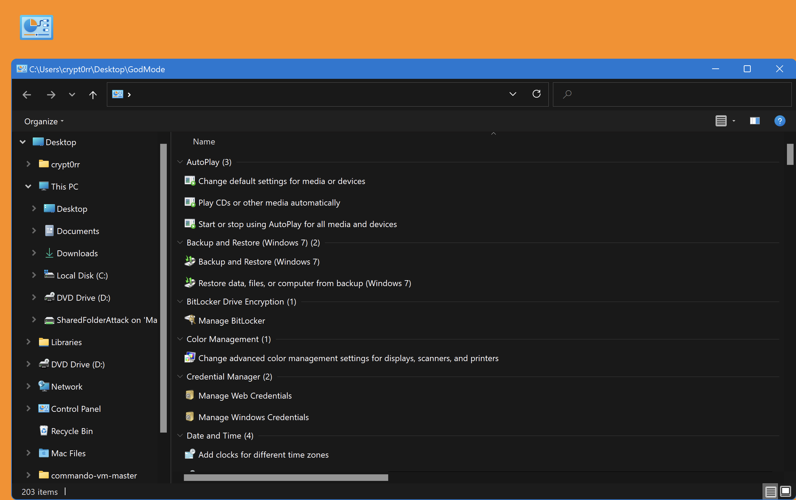

## Windows GodMode

Quickly access administrative tools, backup and restore options and other important management settings from a single window.

### Usage

Create a folder on for example `Desktop` with the name below:

```plain
GodMode.{ED7BA470-8E54-465E-825C-99712043E01C}
```

### Examples



### URL list

* [Lifewire.com - GodMode Windows](https://www.lifewire.com/god-mode-windows-4154662)
* [HowToGeek.com - Enable GodMode in Windows 10](https://www.howtogeek.com/402458/enable-god-mode-in-windows-10/)
