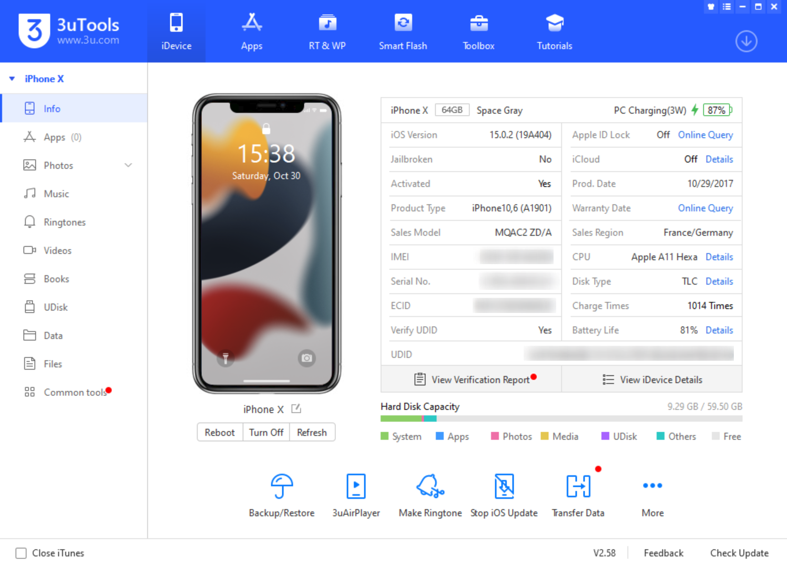
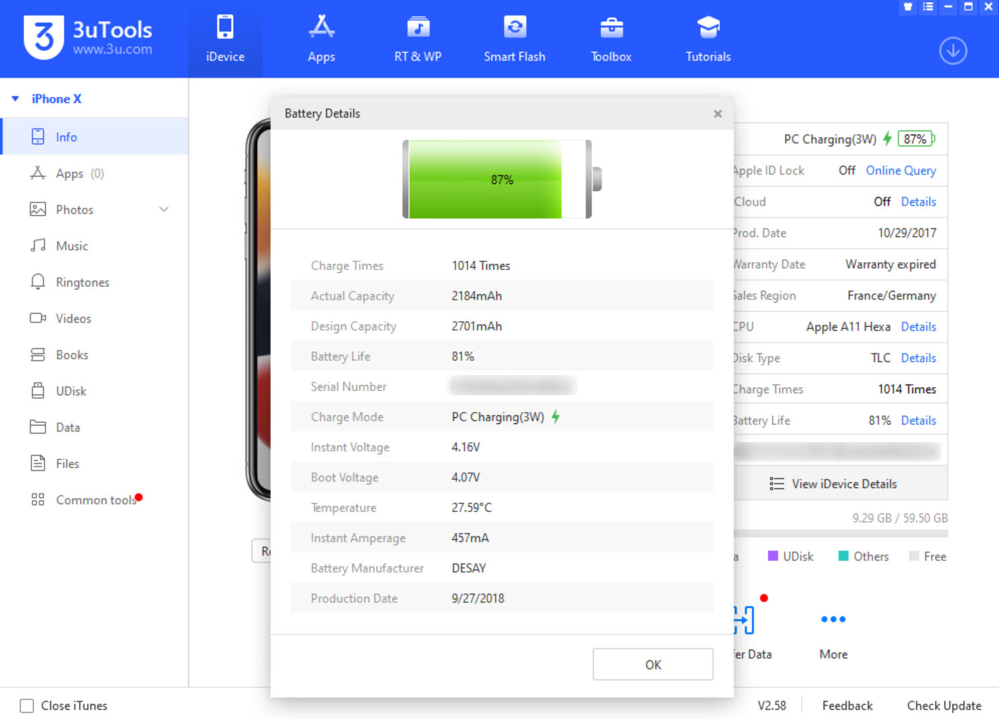
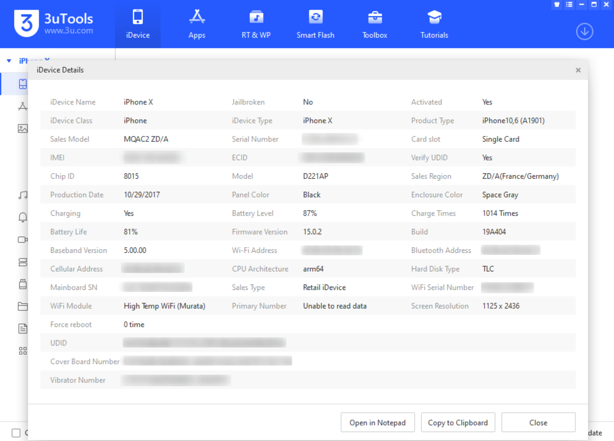
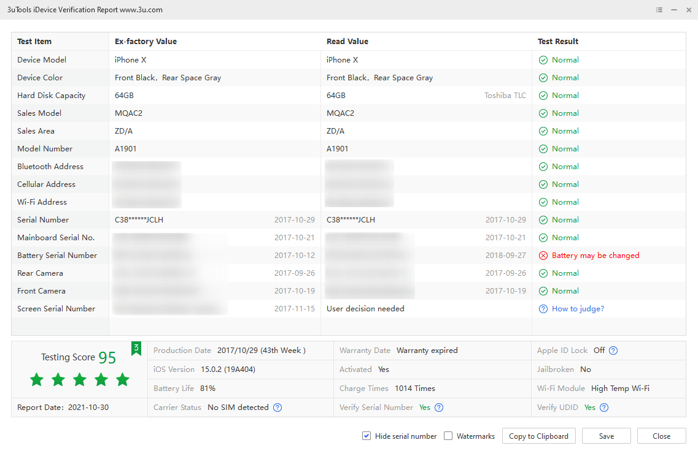

## 3utools

An All-in-One Tool for iOS Devices. 3uTools can manage files, download apps/wallpapers/ringtones, flash, jailbreak…

The Most Efficient iOS Files & Data Management Tool
3uTools makes it so easy to manage apps, photos, music, ringtones, videos and other multimedia files.

Fully view iOS device's different statuses, including activation, jailbreak, battery and iCloud lock statuses, as well as detailed iOS & iDevice information.

## Installation

Download the newest version from [3u.com](https://www.3u.com/)

## Examples

## URL List

* [3u.com](http://www.3u.com/)
