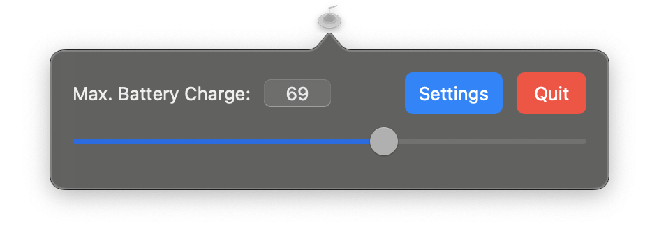
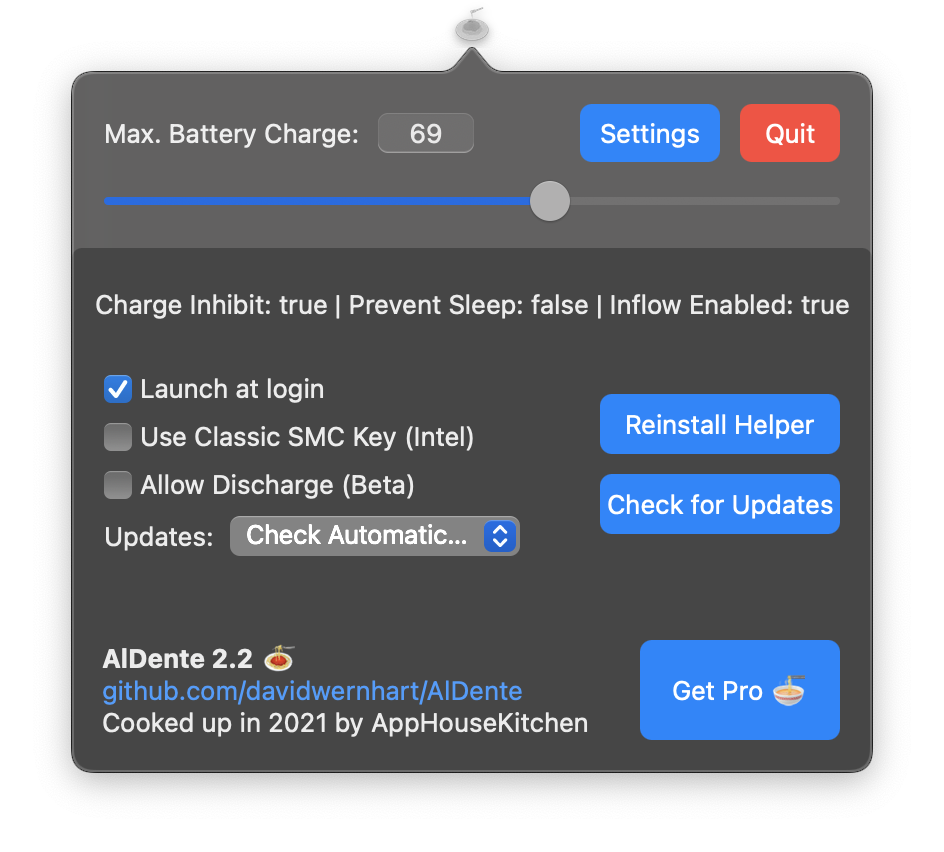

## AlDente

Li-Ion batteries (like the one in your MacBook) last the longest when operating between 20 and 80 percent. Keeping your battery at 100% at all times can shorten the lifespan of your MacBook significantly.

More information can be found here: <https://batteryuniversity.com/article/bu-415-how-to-charge-and-when-to-charge>

### What’s AlDente Pro?

AlDente Pro is our paid version of AlDente. It has many more features such as Heat Protection, Sailing Mode, Top Up, Calibration Mode,... It offers a better design and has live status icons. If you are interested in getting the most out of your battery, check out our website: <https://apphousekitchen.com/>

### Features of AlDente Free

* Charge Limiter allows you to set your maximum charging percentage between 20 and 100 percent. You can either set it by using the slide bar or by typing in the desired percentage in the field above and pressing enter afterwards. Read more about the Charge Limiter feature here: <https://apphousekitchen.com/feature-explanation-charge-limiter/>
* Discharge - This feature allows your MacBook to run completely on Battery even if it is plugged in. Therefore, you can actively discharge your MacBook to a more healthy percentage. Unfortunately, while Discharge is activated, clamshell mode is not supported due to technical limitations. Read more about the Discharge feature here: <https://apphousekitchen.com/feature-explanation-discharge/>

## Installation

Download newest release on [Github.com](https://github.com/davidwernhart/AlDente/releases)

### How to use

When the installation is finished, enter your desired max. charging percentage by clicking on the 🍝 icon on your menu bar. Usually, the operating system will take a minute or two registering the changes, so be patient. You can check if it's working by setting the max. percentage to e.g.: 80%. After a while, clicking on your battery icon will report "Battery is not charging" if you have more than ≈73% left, even though your charger is connected. Notice that in this state, your MacBook is still powered by the charger, but the battery is not charging anymore.

For some reason, macOS will always try to squeeze in a few more percent than specified. For example, if you set yours to 80% it will stop charging at around 83%, so be patient.

IMPORTANT: Keeping your battery at a lower percentage, such as 20-80%, over weeks without doing full cycles (100%-0%) can result in a disturbed battery calibration. When this happens, your Macbook might turn off with 40-50% left or your battery capacity will drop significantly. However, this is only due to a disturbed battery calibration and not because of a faulty or degraded battery. To avoid this issue, we recommend doing at least one full cycle (0%-100%) every two weeks. Even if your battery calibration gets disturbed, doing 4+ full cycles will recalibrate your battery and the capacity will go up again.

## Examples

## URL List

* [Github.com - AlDente](https://github.com/davidwernhart/AlDente)
