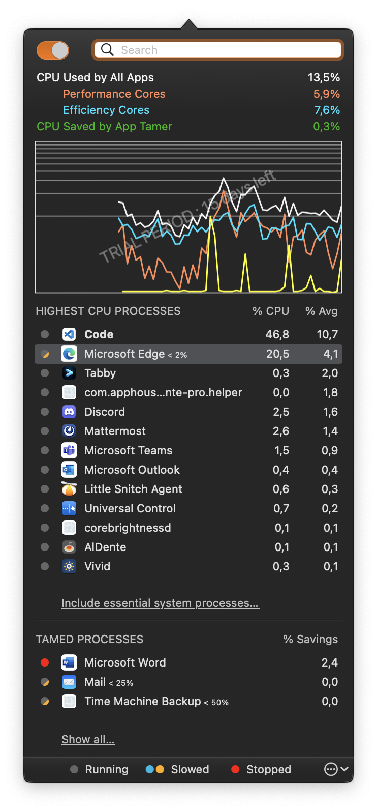

## App Tamer

Some applications, particularly web browsers and older apps, continue running tasks or animating ads even when they're idle. That uses valuable processing (CPU) power, which leaves you with:

* Less CPU power for the application you're using
* Increased heat and fan noise
* Reduced battery run-time

### Installation

Download newest version from [Vendor site](https://stclairsoft.com/AppTamer/index.html)

### Examples

### URL list

* [StClairSoft.com - AppTamer](https://stclairsoft.com/AppTamer/index.html)
