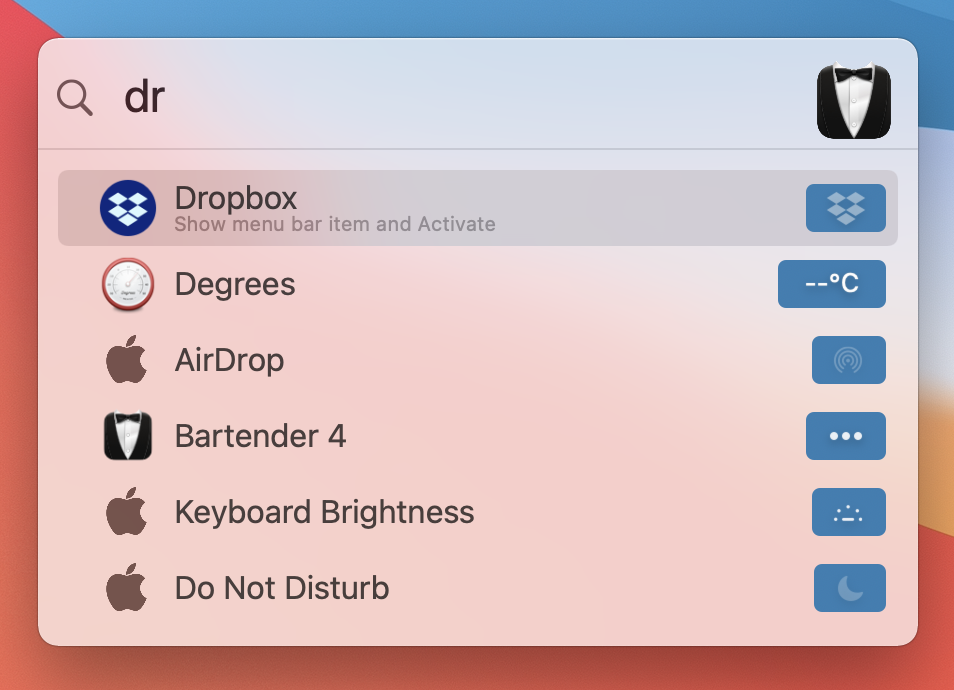

---

Bartender is an award-winning app for macOS that superpowers your menu bar, giving you total control over your menu bar items, what's displayed, and when, with menu bar items only showing when you need them. Bartender improves your workflow with quick reveal, search, custom hotkeys and triggers, and lots more.

## Installation

Download newest release from [MacBartender.com](https://www.macbartender.com/)

## Examples

### Quick Reveal

Lightning-fast access to your menu bar items is now possible with Quick Reveal. Get instant access to your hidden menu bar items simply by moving your mouse to the menu bar, or if you prefer, by clicking the menu bar.

### Bartender Bar

The Bartender Bar is back! Access your hidden menu bar items in the Bartender Bar beneath the menu bar. Great if you need more room for all your menu bar apps.

### Menu Bar Item Spacing

Reduce the space between menu bar items using Bartender, allowing you to have the same spacing as previous macOS versions, or even less, allowing you to have more menu bar items.

### Quick Search

Quick Search will change the way you use your menu bar apps.
Instantly find, show, and activate menu bar items, all from your keyboard.

### Triggers

With the power of the new Triggers in Show for Updates, you now have options when an item shows. Triggers include: any change, icon matching, or a script. Allowing you to show menu bar items exactly when you need them. Bartender also includes some unique Triggers for:

- Battery - show when on battery power or at specific levels.
- WiFi - show when not connected to a WiFi network.
- Time Machine - show while time machine is backing up.

## URL List

- [Macbartender.com](https://www.macbartender.com/)
