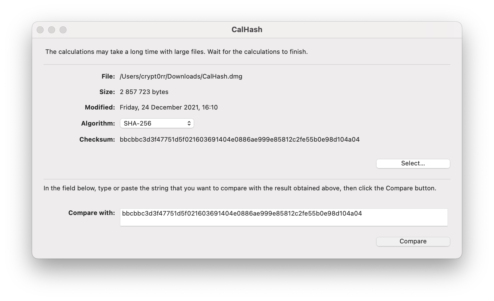
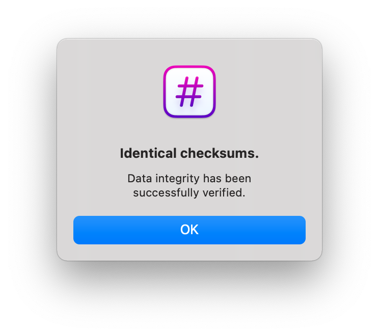

## CalHash

CalHash is a utility that you can use to calculate and compare the checksum (also known as a message-digest-fingerprint) for a file.

## Installation

Download newest release from [titanium-software.fr](https://www.titanium-software.fr/en/calhash.html)

## Examples

## URL List

* [titanium-software.fr - CalHash](https://www.titanium-software.fr/en/calhash.html)
