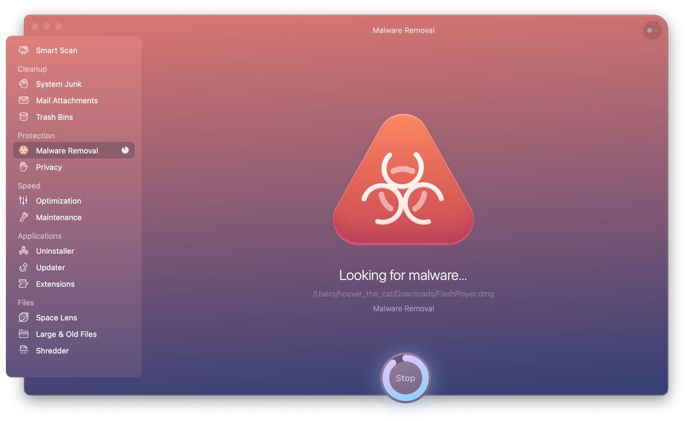

## CleanMyMac

The most user-friendly problem fixer for Mac. Delete system junk, unwanted apps and malware, and tune your Mac for maximum speed. For a slow computer, use immediately.

## Installation

Download newest release from [macOS AppStore](https://apps.apple.com/us/app/cleanmymac-x/id1339170533?l=en&mt=12) or download from website [cleanmymac.com](https://cleanmymac.com/)

## Examples

### Clean up your Mac

#### The end of system junk

Tons of invisible cache files are finally done with. You can mass remove unused DMGs, incomplete downloads, and the rest of old baggage.

#### Sweep away large hidden files

Locate massive old files that were swept under the rug.
Need to filter out just movies or months-old documents? No problem.

#### Space Lens: Your storage, visualized

This tool builds an interactive map of your entire drive. You can visually spot the largest space-wasters to quickly free up space on Mac.

### Speed up your Mac

#### An army of maintenance tools

When your Mac stalls, free up its RAM memory in a click. Also, run Maintenance scripts to make your apps more responsive. Now, your MacBook is unstoppable.

#### Full-scale macOS optimization

Find and disable apps that cannibalize your memory resources. Switch off background plugins and fix small errors like an Apple genius.

### Remove malware from Mac

#### It stops macOS-specific viruses

CleanMyMac X officially holds a “Gold” level of Mac virus detection. We give you a real-time shield against trojans, data miners, and recent browser hijackers.

#### Privacy: Rewrite your online history

Delete tracking cookies so advertisers cannot follow you across the web. Erase sensitive details like messenger chats and browser history.

### Manage apps and extensions

#### Uninstall known and unknown apps

Mass delete unwanted apps, plugins, and extensions. You can find unused apps that have been left undetected for months. Did you know you could also reset an app?

#### Keep your apps forever young

Update all your apps in one sweep, including the macOS itself. Everything is refreshed, and you can see what’s been added in each update.

## URL List

- [CleanMyMac.com](https://cleanmymac.com/)
- [Apps.apple.com](https://apps.apple.com/us/app/cleanmymac-x/id1339170533?l=en&mt=12)
