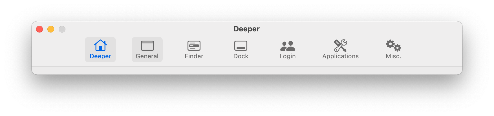
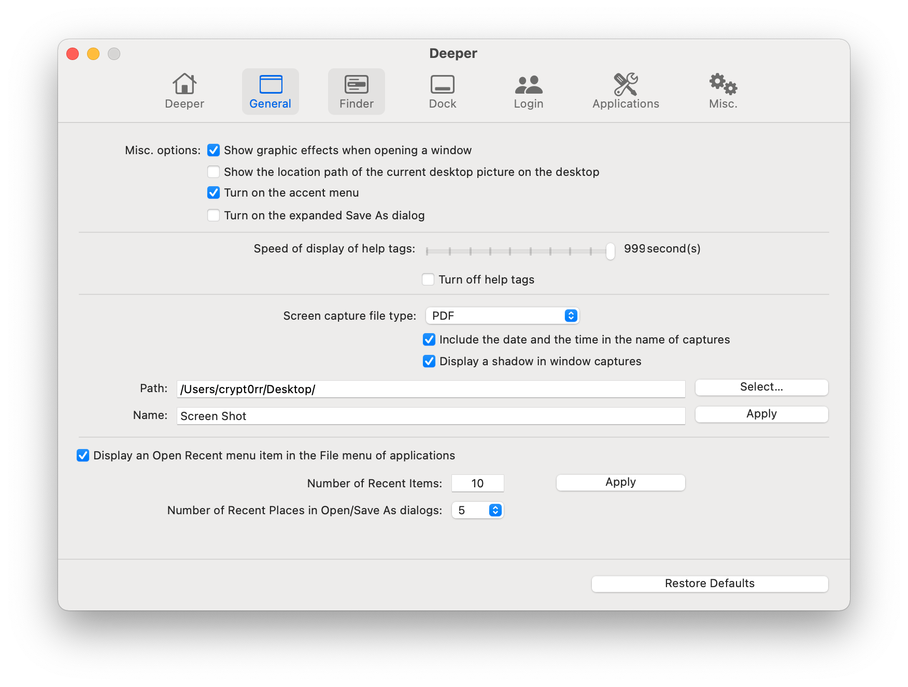
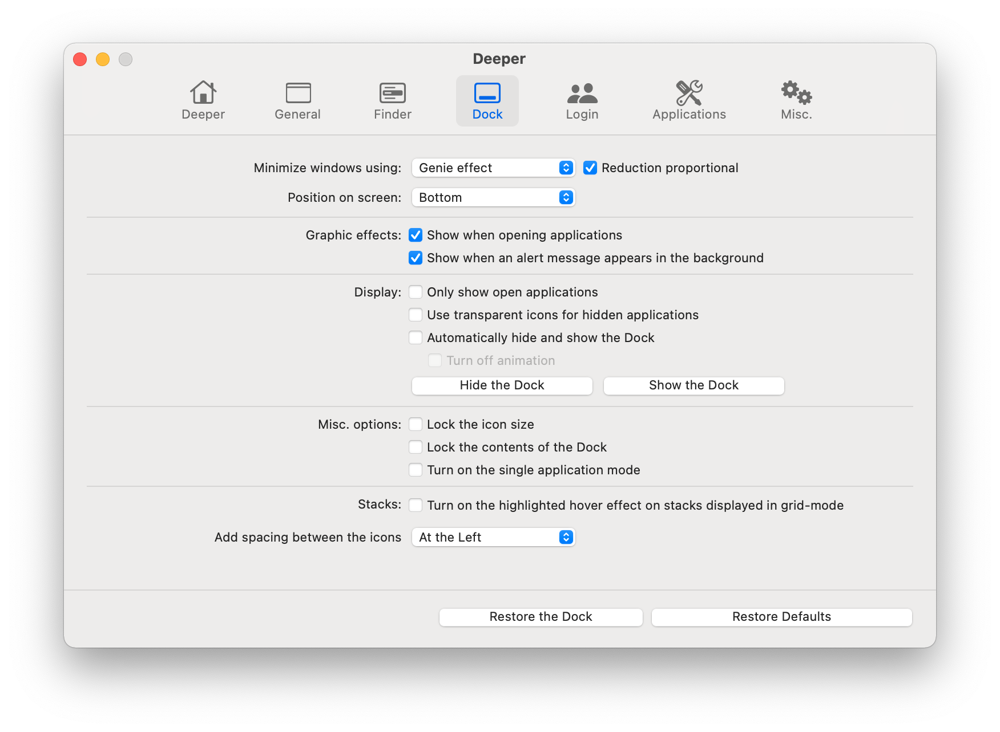
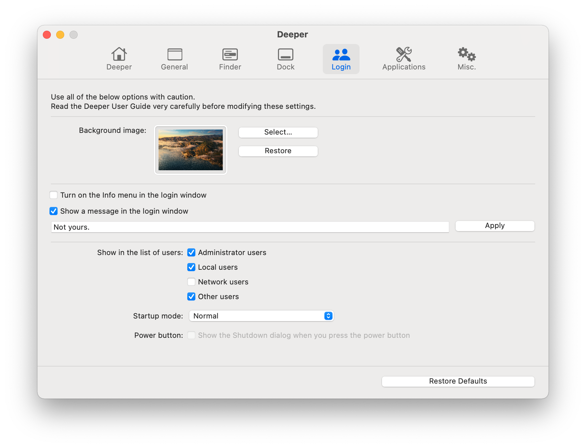
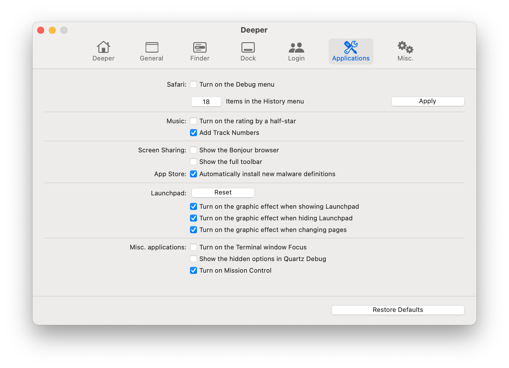
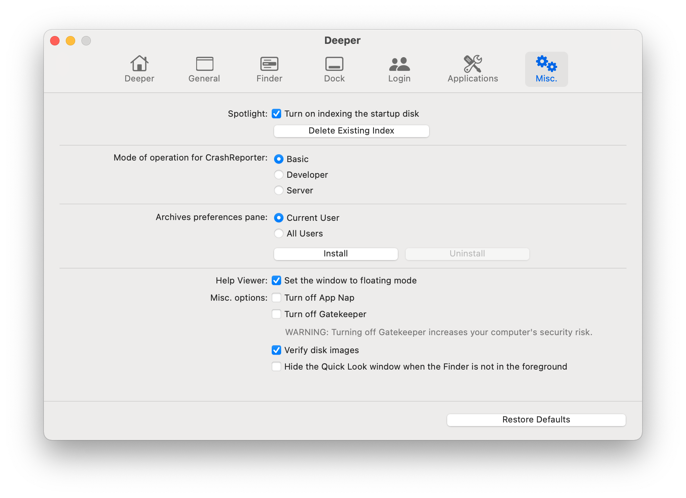

---

Deeper is a personalization utility for macOS that you can use to enable and disable the hidden functions of the Finder, Dock, Safari, iTunes/Music, login window, and many Apple applications, and more.

Deeper is a reliable application which provides a clean interface to many tasks that would otherwise require complex commands to be typed using a command-line interface.

## Installation

Download newest release from [titanium-software.fr](https://www.titanium-software.fr/en/deeper.html)

## Examples

## URL List

- [titanium-software.fr - Deeper](https://www.titanium-software.fr/en/deeper.html)
