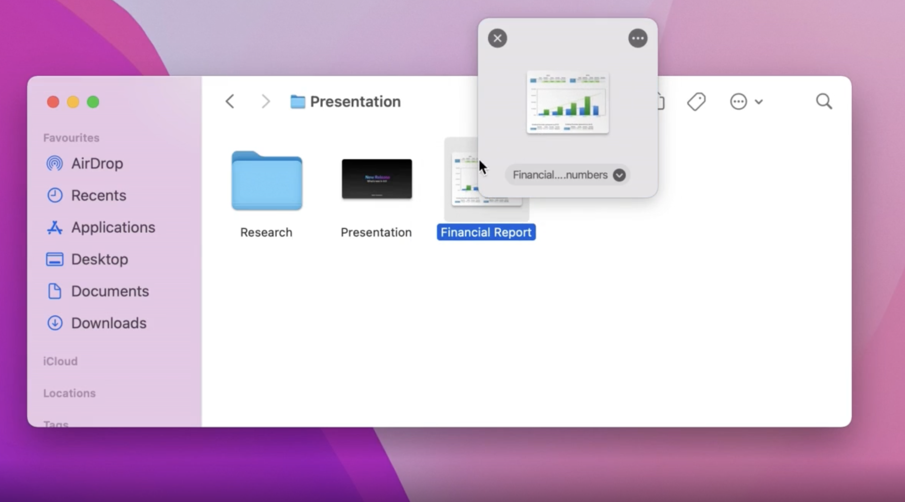

## Dropover

Dropover is a macOS utility that makes Drag and Drop easier. Use it to stash, gather or move any draggable content without having to open side-by-side windows.

## Installation

Download from [Apple AppStore](https://apps.apple.com/us/app/dropover/id1355679052?mt=12).

## Examples

Please check developer website for live examples at [Dropoverapp.com](https://dropoverapp.com/).

## URL List

- [Dropoverapp.com](https://dropoverapp.com/)
