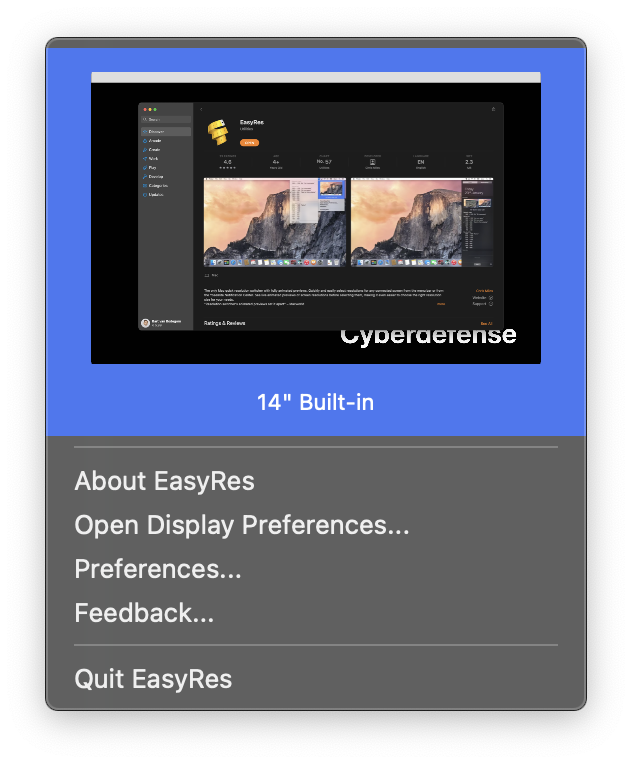
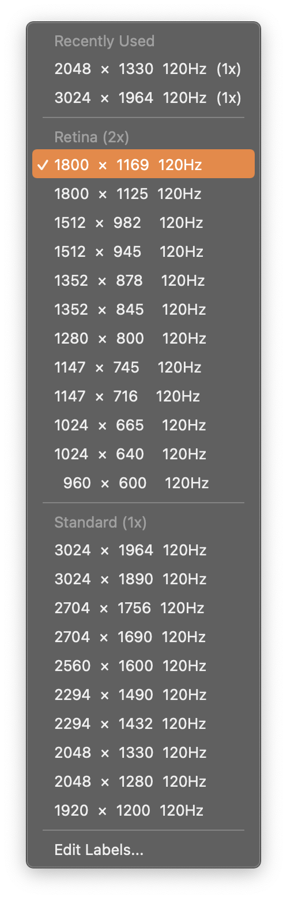
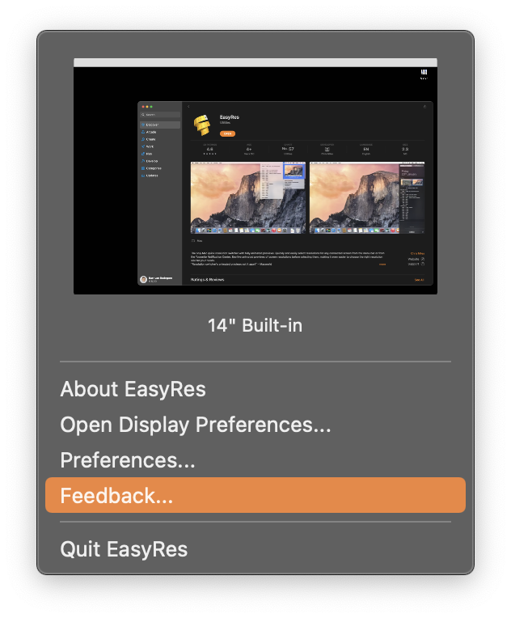

## EasyRes

The only Mac quick resolution switcher with fully animated previews. Quickly and easily select resolutions for any connected screen from the menu bar or from the Yosemite Notification Center. See live animated previews of screen resolutions before selecting them, making it even easier to choose the right resolution size for your needs.

### Installation

Download via [Apple AppStore](https://apps.apple.com/app/easyres/id688211836?ls=1&mt=12)

### Examples

### URL list

* [Easyresapp.com](http://easyresapp.com/)
* [Apps.apple.com](https://apps.apple.com/app/easyres/id688211836?ls=1&mt=12)
