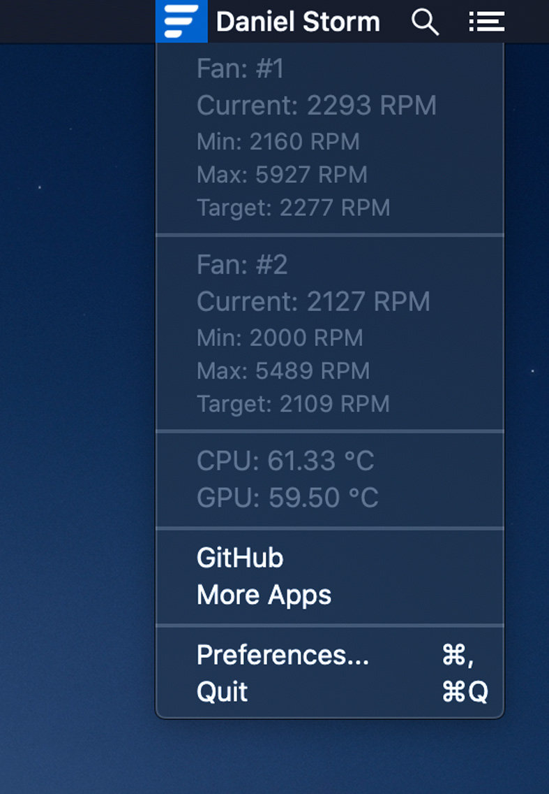
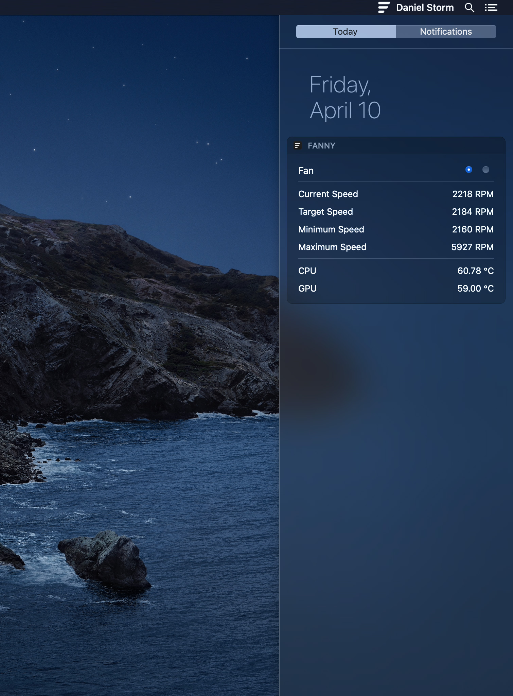

## Fanny

Fanny is a free Notification Center Widget and Menu Bar application to monitor your Macs fans.

* Compact design allowing you to keep an eye on your systems fans and CPU/GPU temperature while not cluttering up your work space.
* Get information on; current speed, target speed, minimum speed, maximum speed, number of fans, and CPU/GPU temperature.
* Simply open the Notification Center or Menu Bar application to glance at your Macs fan stats.

### Installation

Download newest release from [fannywidget.com](https://fannywidget.com/)

### Examples

### URL list

* [Fannywidget.com](https://fannywidget.com/)
* [Github.com - Fanny](https://github.com/DanielStormApps/Fanny)
