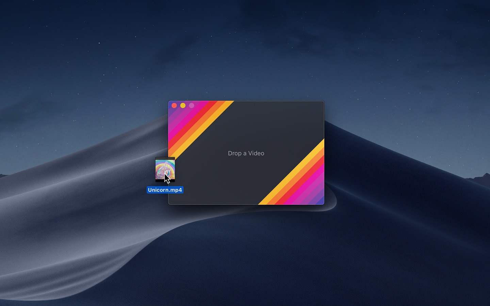
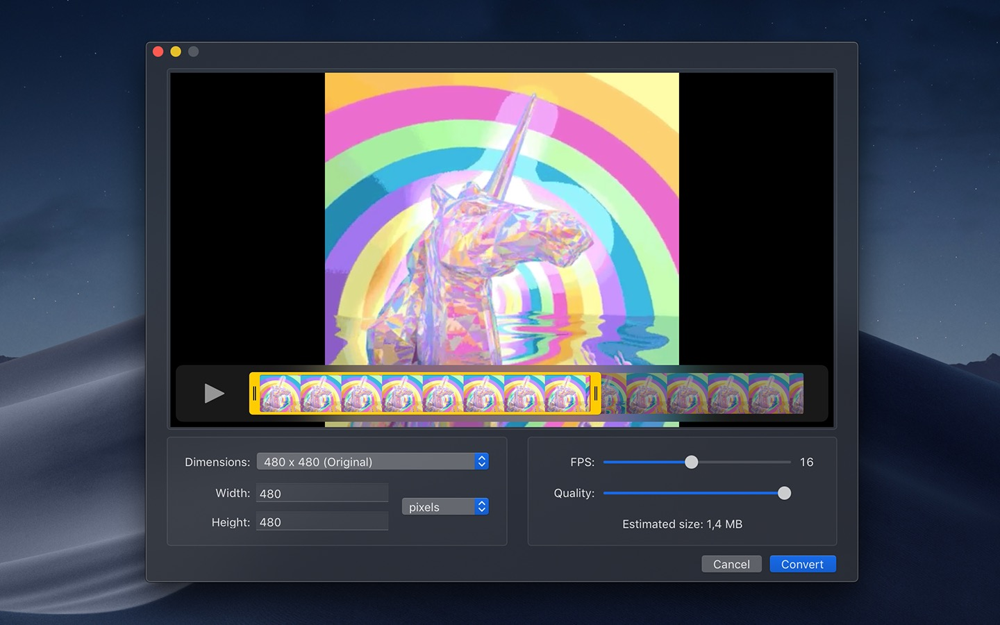
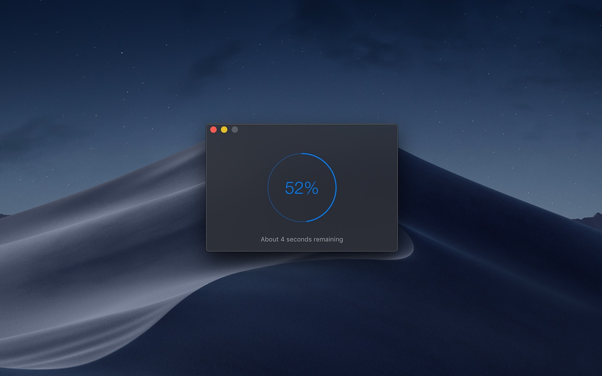
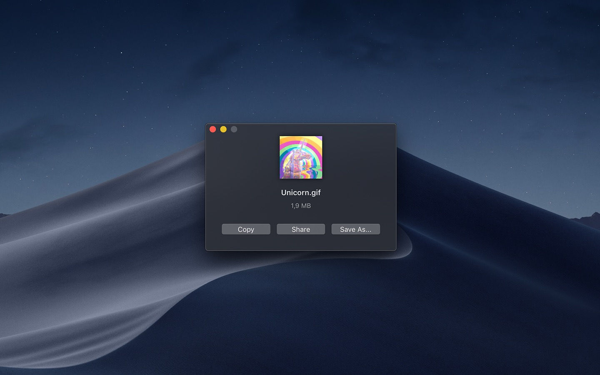

---

It converts videos to animated GIFs that use thousands of colors per frame. This is made possible by some fancy features for efficient cross-frame palettes and temporal dithering.

### Features

- Video trimming
- Precise control of dimensions
- Control over GIF looping and bouncing (yo-yo) playback
- Adjust the speed
- Copy, share, or drag the GIF
- Share extension
- System service
  - Gifski includes a system service that lets you quickly convert a video to GIF from the “Services” menu in any app that provides a compatible video file.
- Optionally produce smaller lower quality GIFs
- Generate up to 50 FPS GIFs (for showing off design work on Dribbble)

### To convert, either

- Drag and drop your HEIC images onto the window or the Dock icon.
- Click the “Open” button in the window (macOS 10.15 and later) or in the “File” menu and then choose your HEIC images.
- Right-click your HEIC images in Finder and select this app in the “Open With” menu.

Gifski supports all the video formats that macOS supports (.mp4 or .mov with H264, HEVC, ProRes, etc). The QuickTime Animation format is not supported. Use ProRes 4444 XQ instead. It's more efficient, more widely supported, and like QuickTime Animation, it also supports alpha channel.

## Installation

Download app from [Apple AppStore](https://apps.apple.com/us/app/gifski/id1351639930?l=en&mt=12)

## Examples

{}

## URL List

- [Sindresorhus.com - Gifski](https://sindresorhus.com/gifski)
- [Github.com - Gifski](https://github.com/sindresorhus/Gifski)
- [Apps.apple.com - Gifski](https://apps.apple.com/us/app/gifski/id1351639930?l=en&mt=12)
