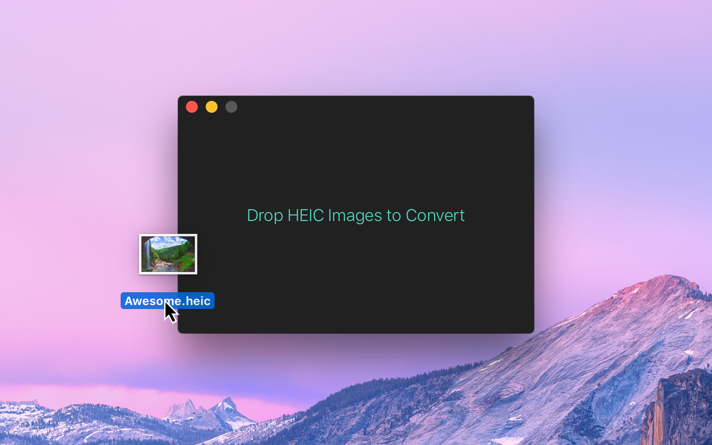
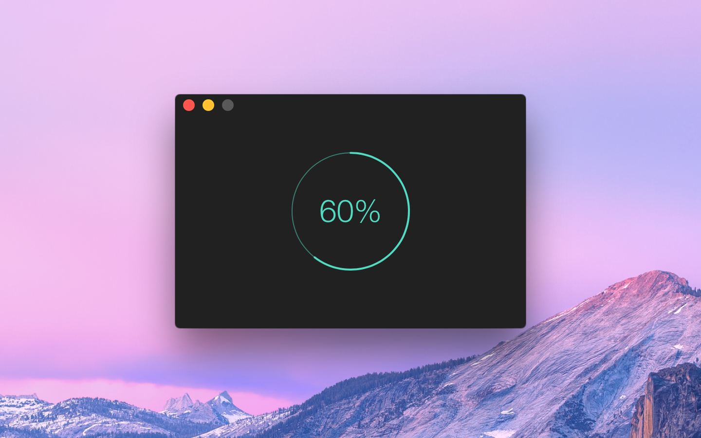
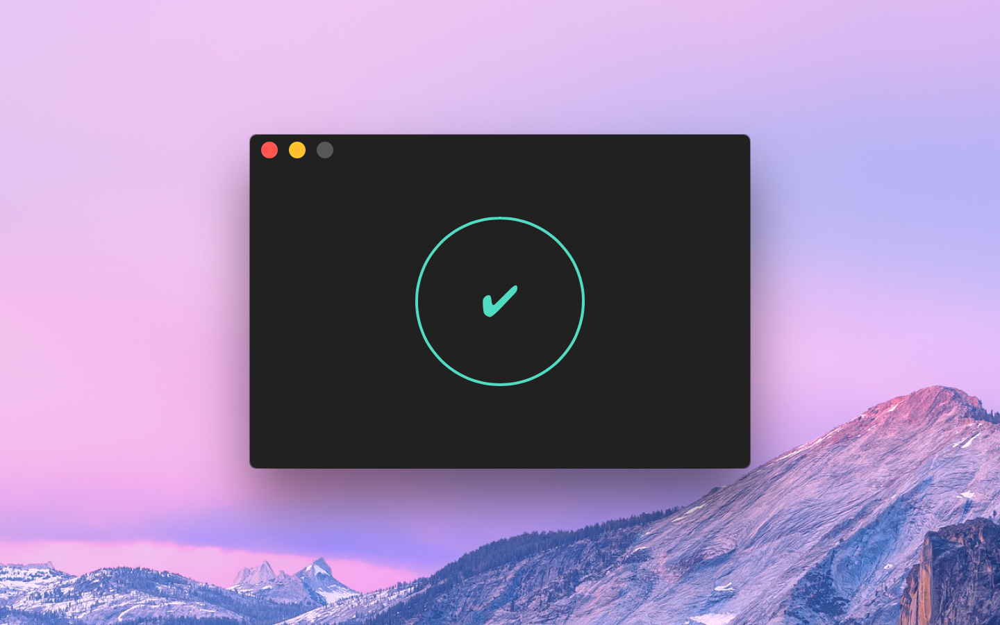

## HEIC Converter

HEIC Converter is a macOS app that makes it easy to quickly convert images in the [HEIC](https://www.macworld.co.uk/feature/iphone/what-is-heic-3660408/) format to JPEG or PNG. HEIC is Apple's new default image format in iOS 11, replacing JPEG. HEIC uses more advanced and modern compression methods to achieve much smaller file sizes with the same visual quality. Unfortunately, HEIC is a very new format and not yet supported outside of iOS and macOS. This app makes it possible to share your HEIC images on the web or with non-Apple users.

If you don't have any HEIC images, you can try the app out with [this one](https://sindresorhus.com/assets/heic-converter/heic-example.heic).

- Does it preserve 10-bit depth?
  - No. JPEG only supports 8-bit. PNG supports 8-bit and 16-bit, but macOS doesn’t have a way to convert 10-bit HEIC to 16-bit PNG, so it ends up as 8-bit too.
- Does it support other HEIF variants like .heif or .hif?
  - No. Only .heic is supported at the moment as macOS support for other variants is buggy.

## Installation

Download HEIC Converter from [macOS App Store](https://apps.apple.com/app/id1294126402)

## Examples

## URL List

- [Sindresorhus.com - HIEC Converter](https://sindresorhus.com/heic-converter)
- [Apps.apple.com - HEIC Converter](https://apps.apple.com/app/id1294126402)
