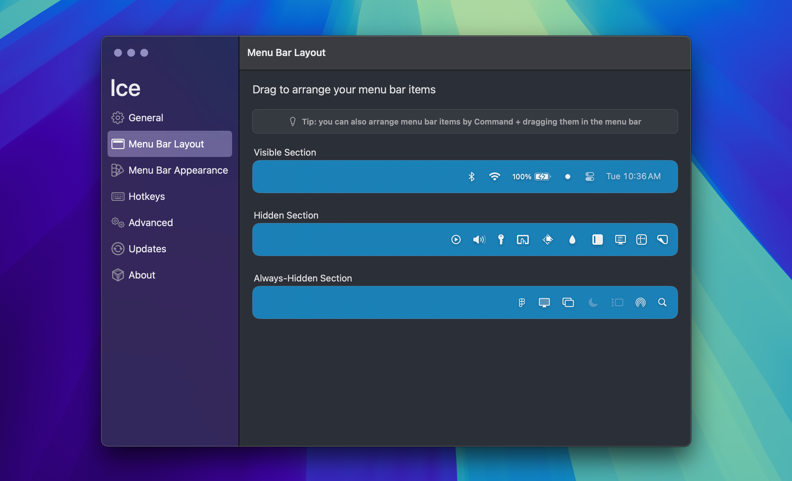
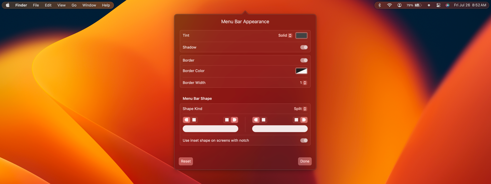

---

Ice is a powerful menu bar management tool. While its primary function is hiding and showing menu bar items, it aims to cover a wide variety of additional features to make it one of the most versatile menu bar tools available.


## Installation

Download the "Ice.zip" file from the [latest release](https://github.com/jordanbaird/Ice/releases/latest) and move the unzipped app into your `Applications` folder.

Or use [Brew.sh](https://brew.sh/):

```plain
brew install jordanbaird-ice
```

## Examples

### Show hidden menu bar items below the menu bar


### Drag-and-drop interface to arrange menu bar items



### Customize the menu bar's appearance



### Menu bar item search


### Custom menu bar item spacing


## URL list

- [Github.com - Ice][(](https://github.com/jordanbaird/Ice))
