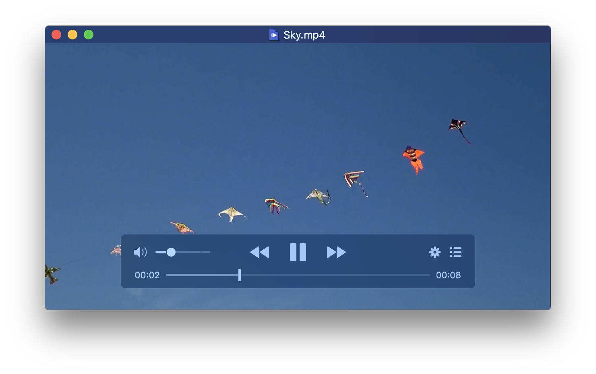
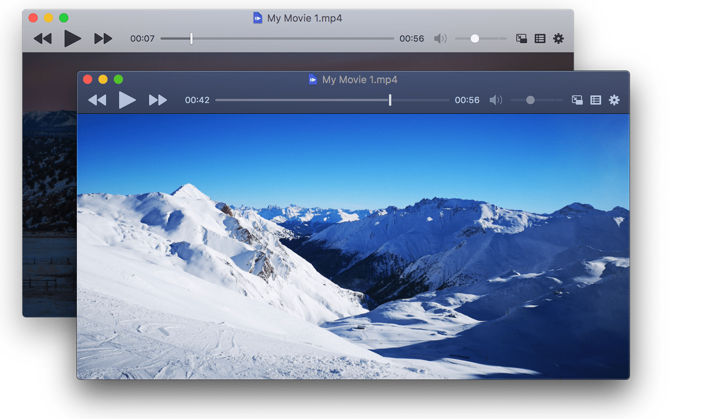
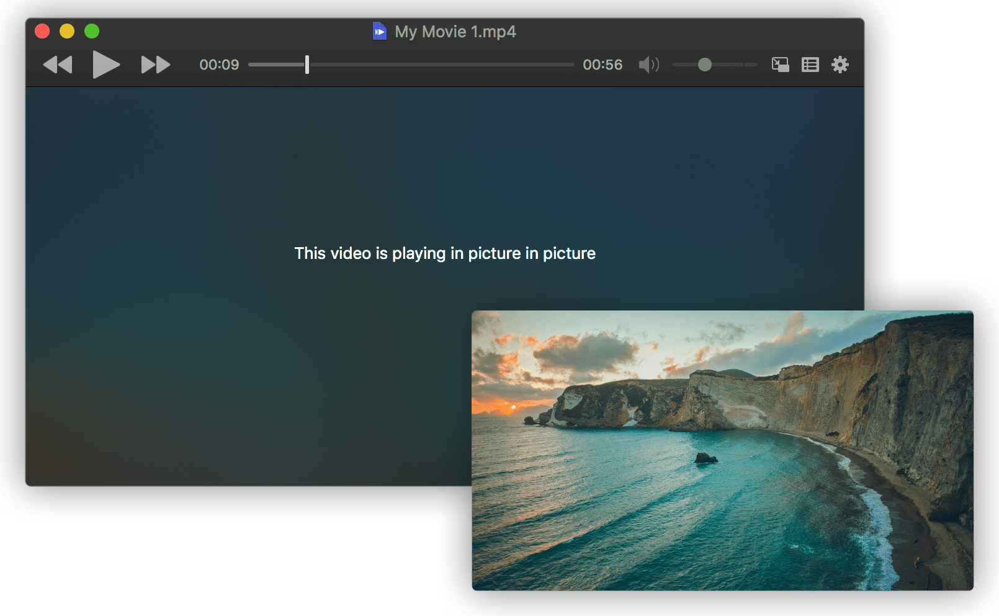
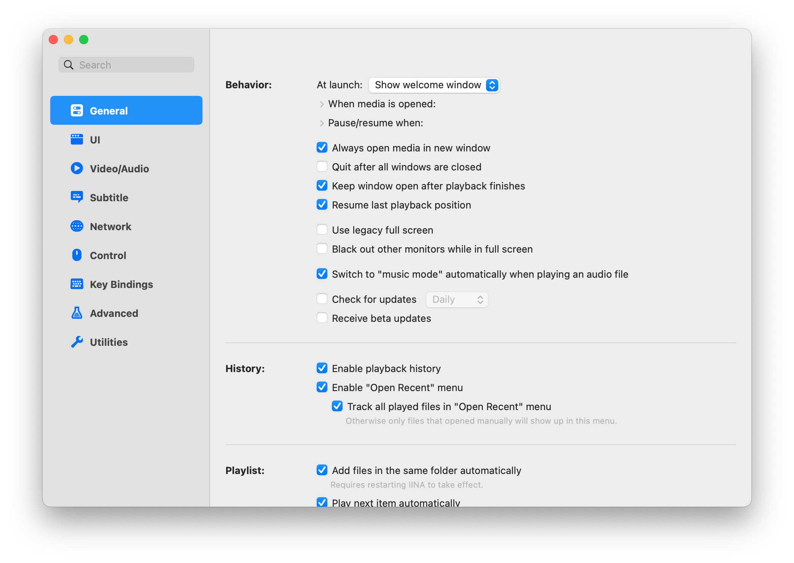

---

IINA is born to be a modern macOS application, from its framework to the user interface. It adopts the post-Yosemite design language of macOS and keeps up the pace of new technologies like Force Touch, Touch Bar, and Picture-in-Picture.



### Features

- Based on [mpv](https://github.com/mpv-player/mpv), which provides the best decoding capacity on macOS
- Designed with modern versions of macOS (10.11+) in mind
- All the features you need for video and music: subtitles, playlists, chapters…and much, much more!
- Force Touch, picture-in-picture and advanced Touch Bar support
- Customizable user interface including multiple color schemes and on screen controller (OSC) layout positioning
- Standalone Music Mode designed for audio files
- Video thumbnails
- Online subtitle searching and intelligent local subtitle matching
- Unlimited playback history
- Convenient and interactive settings for video/audio filters
- Fully customizable keyboard, mouse, trackpad, and gesture controls
- mpv configuration files and script system for advanced users
- Command line tool and browser extensions provided
- In active development

### Plays anything

Powered by the open source media player mpv, IINA can play almost every media file you have. With the support of youtube-dl and our browser extensions, you can also play a variety of online streams in IINA via one click.

- Local files
- Online streams
- YouTube playlists

## Installation

Download newest release from [Github.com](https://github.com/iina/iina/releases)

Or install via HomeBrew.

```plain
brew install --cask iina
```

## Examples

### Dark Mode

IINA ships with a carefully crafted user interface for the macOS Mojave dark mode, which includes adjusted colors, icons and textures, providing a sleek and unified look.



### Picture-in-Picture

IINA supports the native Picture-in-Picture mode, enables you to enjoy either local or online videos without being distracted.



### Settings



## URL List

- [IINA.io](https://iina.io/)
- [Github.com - iina](https://github.com/iina/iina)
- [IINA.io - Browser Extensions](https://iina.io/download/#browser-extensions)
