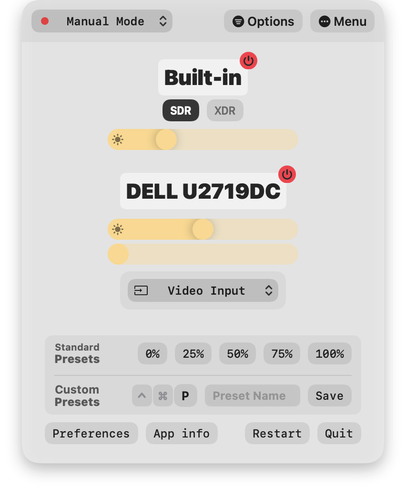
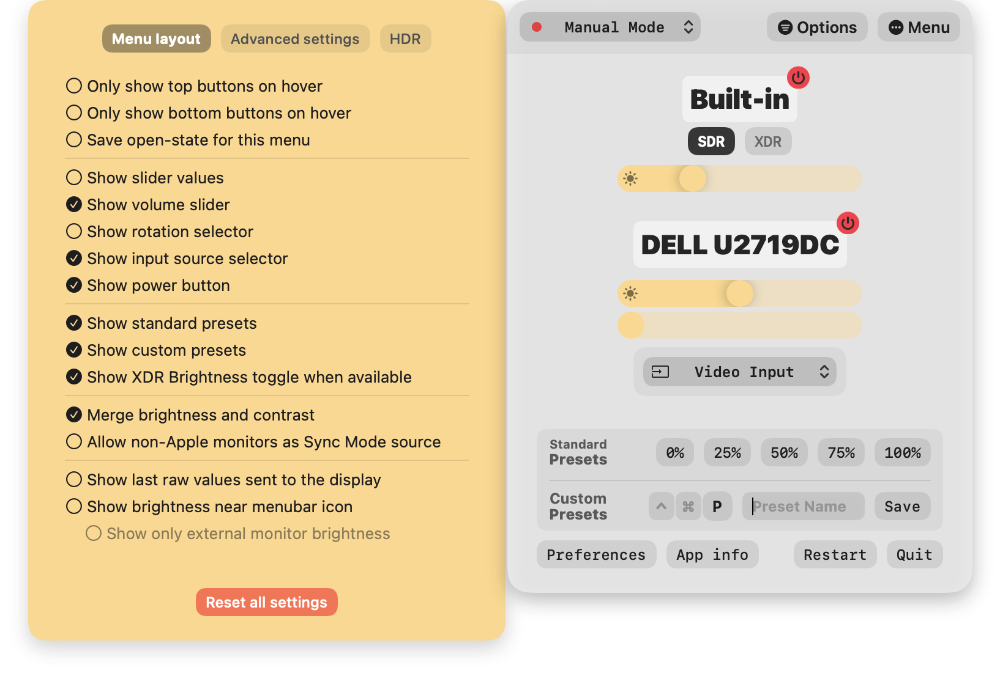
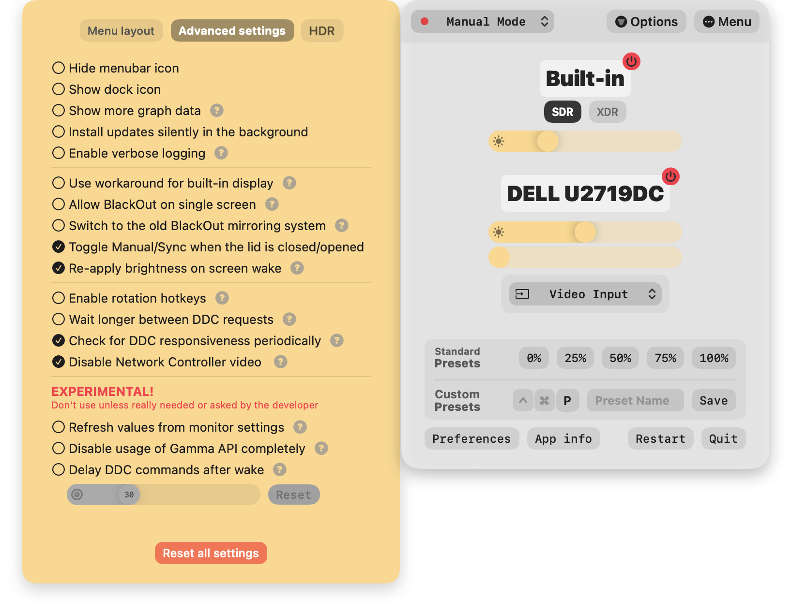
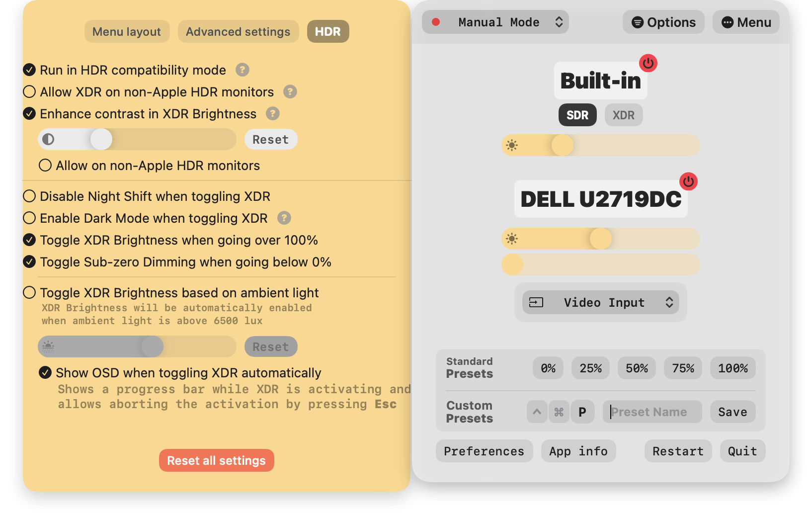

## Lunar

The defacto app for controlling monitors. Intelligent adaptive brightness for your internal and external monitors.

Lunar changes the hardware brightness of the monitor using the DDC protocol.

It doesn't use a software overlay if the monitor supports DDC/CI.

## Features

* **[Native keyboard control](https://lunar.fyi/#keys)** and hotkeys for setting brightness, volume and contrast that respect the min/max values per monitor
* **[1000-to-1600 nits of brightness](https://lunar.fyi/#xdr)** for supported **XDR** and **HDR** displays
* **[Dim brightness below 0%](https://lunar.fyi/#subzero)** for late-night work
* **[Sensor-based Adaptive Brightness](https://lunar.fyi/#sensor)** (and contrast) based on [an external light sensor](https://lunar.fyi/sensor)
* **[Sync-based Adaptive Brightness](https://lunar.fyi/#sync)** (and contrast) based on **the built-in light sensor of the MacBook or iMac**
* **[Location-based Adaptive Brightness](https://lunar.fyi/#location)** (and contrast) based on the sunrise/sunset times in your location
* **[App Presets](https://lunar.fyi/#configuration-page)** if you need more/less brightness for specific activities (watching movies, design work)
* **Input switching** from a convenient dropdown or using up to 3 input-specific hotkeys
* **[Screen orientation](https://lunar.fyi/#display-settings-page)** change from the menu bar or using hotkeys (Ctrl+0/9/8/7 mapped to 0°/90°/180°/270° for the display with the cursor on it)
* **[Hidden resolutions](https://lunar.fyi/#display-settings-page)** accessible from a dropdown in the Display Settings menu
* **[BlackOut](https://lunar.fyi/#blackout)**: turn off monitors (or the built-in display) selectively while also keeping important functions:
  * USB-C charging still works
  * Monitor audio keeps playing
  * Monitor USB hub remains available
  * The built-in keyboard and trackpad are still available for use
  * Avoid overheating the MacBook because of using it with the lid closed

It doesn't interfere at all with the native adaptive brightness that macOS implements for the built-in display.

It works well along Night Shift and True Tone (and f.lux if Gamma dimming is not used).

## Free vs Pro

| Feature                  | Free version                 | Lunar Pro                    |
| ------------------------ | ---------------------------- | ---------------------------- |
| DDC Controls             | <i class="fas fa-check"></i> | <i class="fas fa-check"></i> |
| Sub-zero dimming         | <i class="fas fa-check"></i> | <i class="fas fa-check"></i> |
| Fallback when DDC fails  | <i class="fas fa-check"></i> | <i class="fas fa-check"></i> |
| Brightness keys support  | <i class="fas fa-check"></i> | <i class="fas fa-check"></i> |
| Volume keys support      | <i class="fas fa-check"></i> | <i class="fas fa-check"></i> |
| Command-line integration | <i class="fas fa-check"></i> | <i class="fas fa-check"></i> |
| Input switching          | <i class="fas fa-check"></i> | <i class="fas fa-check"></i> |
| Multi-monitor support    | <i class="fas fa-check"></i> | <i class="fas fa-check"></i> |
| App Presets              | <i class="fas fa-times"></i> | <i class="fas fa-check"></i> |
| XDR Brightness           | <i class="fas fa-times"></i> | <i class="fas fa-check"></i> |
| FaceLight                | <i class="fas fa-times"></i> | <i class="fas fa-check"></i> |
| BlackOut                 | <i class="fas fa-times"></i> | <i class="fas fa-check"></i> |
| Sync Mode                | <i class="fas fa-times"></i> | <i class="fas fa-check"></i> |
| Location Mode            | <i class="fas fa-times"></i> | <i class="fas fa-check"></i> |
| Sensor Mode              | <i class="fas fa-times"></i> | <i class="fas fa-check"></i> |
| Clock Mode               | <i class="fas fa-times"></i> | <i class="fas fa-check"></i> |
| Manual Mode              | 100 adjustments per day      | Unlimited adjustments        |
| Pricing                  | Free                         | $23                          |

## Installation

Download newest release from [Github.com](https://github.com/alin23/Lunar/releases)

## Examples

## URL List

- [Lunar.fyi](https://lunar.fyi)
- [Github.com - Lunar](https://github.com/alin23/Lunar)
