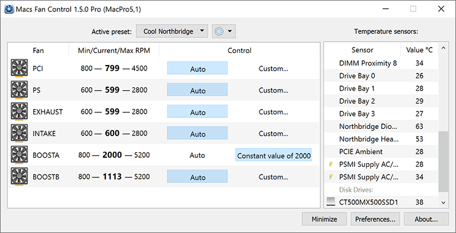
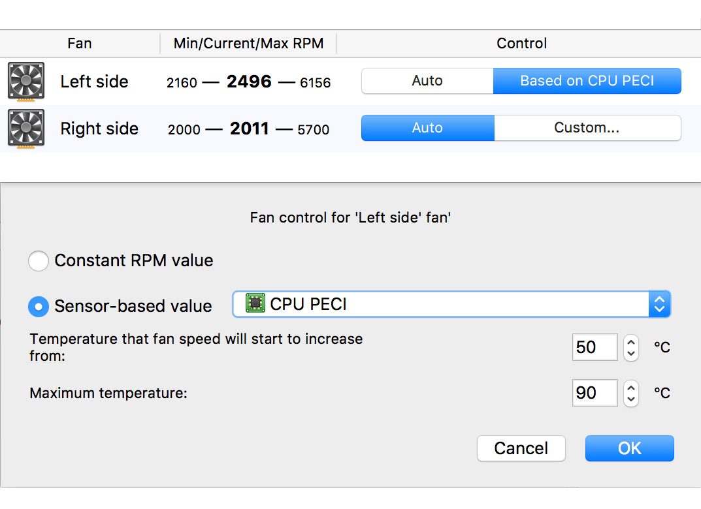
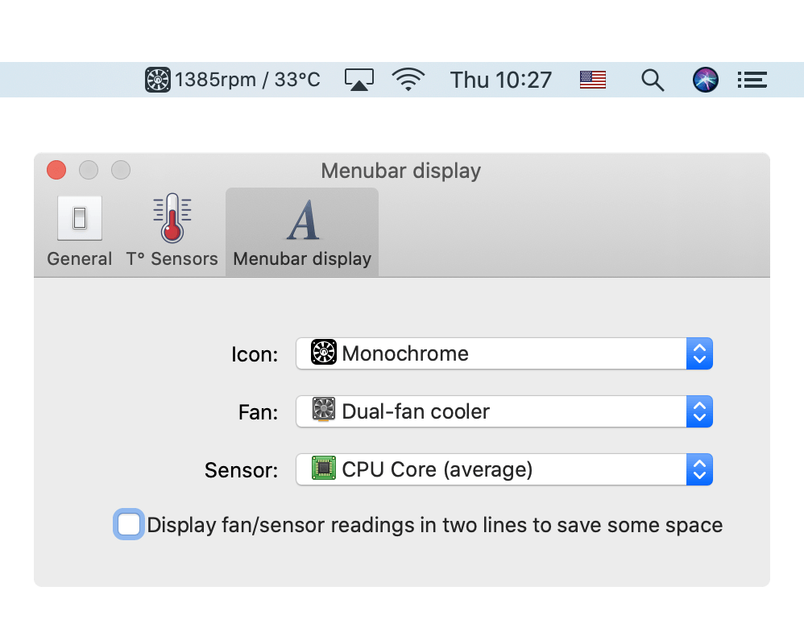

## Macs Fan Control

- Real-time monitoring of fan speeds and temperatures
- Solve overheating problems like those found on a MacBook Pro
- Solve noise problems such as those caused by iMac HDD replacement
- Works on all Macs, both Intel & Apple Silicon

## Installation

Download newest release from [crystalidea.com](https://crystalidea.com/macs-fan-control/download)

## Usage

Fan control and presets
Fan control for your fan(s) on your Apple computer can be either

- Auto: a fan is controlled by the system automatically (Apple's default scenario). When all fans are controlled automatically by the system the app works in monitoring-only mode.
- Custom: a fan is controlled by the app. Can be either some constant RPM value (e.g. 1500 RPM) or sensor-based control (e.g. in relation to CPU PECI sensor).

For convenience the app features [fan presets](https://crystalidea.com/macs-fan-control/fan-presets) that let you quickly put your fan(s) to either **Auto** or some **Custom** mode depending on your activity. You can read more about fan presets [here](https://crystalidea.com/macs-fan-control/fan-presets).

## Examples

### Simple and efficient user interface

Two tables layout: with list of fans and list of temperature sensors.

### Change fan speed

Set custom RPM value or control fan speed in relation to a temperature sensor.

### Configurable menu bar display

Options to display fan speed and sensor temperature (displayed in the tray icon under Windows).

## URL List

- [Crystalidea.com - Macs Fan Control](https://crystalidea.com/macs-fan-control)
