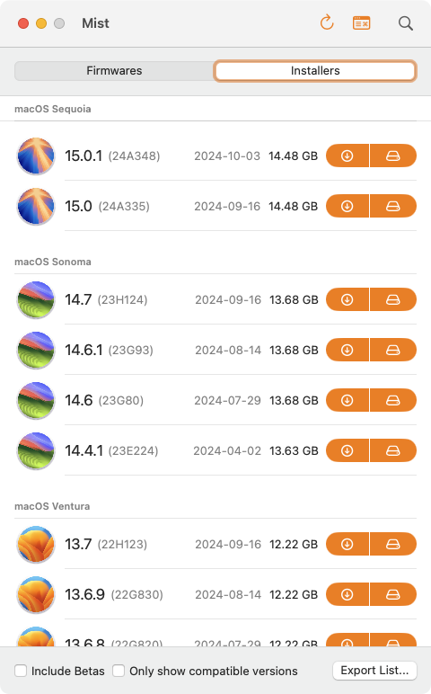
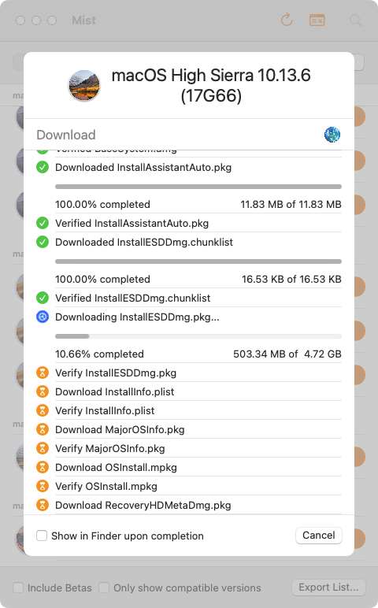

---

A Mac utility that automatically downloads macOS Firmwares / Installers.

## Features

- [x] List all available macOS Firmwares / Installers available for download:
  - Display names, versions, builds, release dates and sizes
  - Optionally show beta versions of macOS
  - Filter macOS versions that are compatible with the Mac the app is being run from
  - Export lists as **CSV**, **JSON**, **Property List** or **YAML**
- [x] Download available macOS Firmwares / Installers:
  - For Apple Silicon Macs:
    - Download a Firmware Restore file (.ipsw)
    - Validates the SHA-1 checksum upon download
    - Copy firmware URLs to clipboard
  - For Intel based Macs (Universal for macOS Big Sur and later):
    - Generate an Application Bundle (.app)
    - Generate a Disk Image (.dmg)
    - Generate a Bootable Disk Image (.iso)
      - For use with virtualization software (ie. Parallels Desktop, UTM, VMware Fusion, VirtualBox)
    - Generate a macOS Installer Package (.pkg)
      - Supports packages on **macOS Big Sur and newer** with a massive 12GB+ payload!
    - Optionally codesign Disk Images and macOS Installer Packages
    - Cache downloads to speed up build operations
    - Select custom Software Update Catalogs, allowing you to list and download macOS Installers from the following:
      - **Standard:** The default catalog that ships with macOS
      - **Customer Seed:** The catalog available as part of the [AppleSeed Program](https://appleseed.apple.com/)
      - **Developer Seed:** The catalog available as part of the [Apple Developer Program](https://developer.apple.com/programs/)
      - **Public Seed:** The catalog available as part of the [Apple Beta Software Program](https://beta.apple.com/)
      - **Note:** Catalogs from the Seed Programs may contain beta / unreleased versions of macOS. Ensure you are a member of these programs before proceeding.
    - Validates the Chunklist checksums upon download
  - Automatic retries for failed downloads!

**Note:** Depending on what **Mist** downloads, you may require allowing **Full Disk Access** for **Mist** via [System Settings](https://support.apple.com/en-us/guide/mac-help/mh15217/13.0/mac/13.0):

## Installation

Grab the latest version of **Mist** from the [releases page](https://github.com/ninxsoft/Mist/releases).

## Examples

## URL list

- [Github.com - Mist](https://github.com/ninxsoft/Mist)
