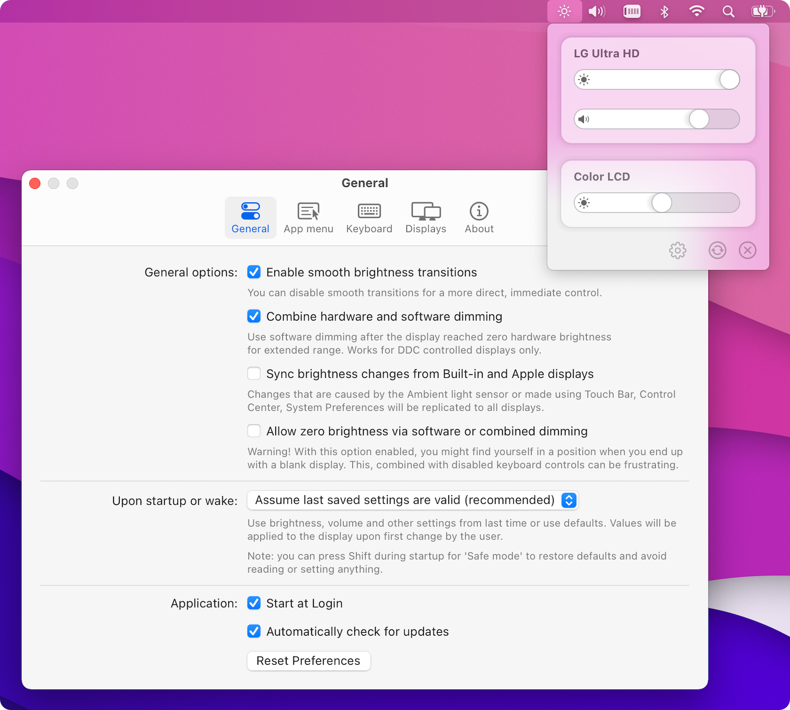
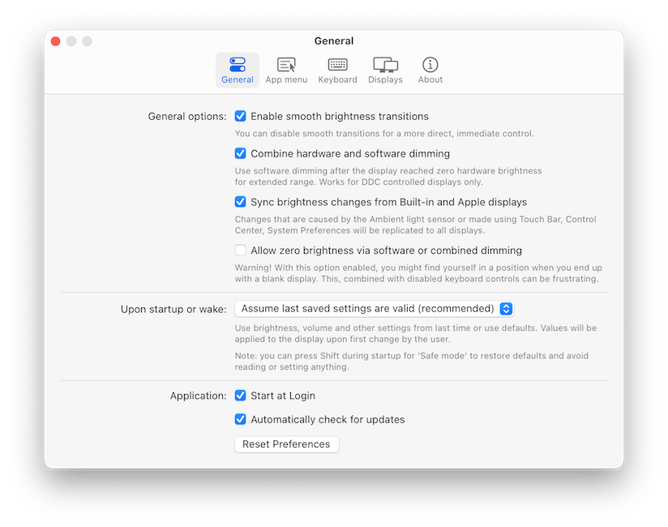
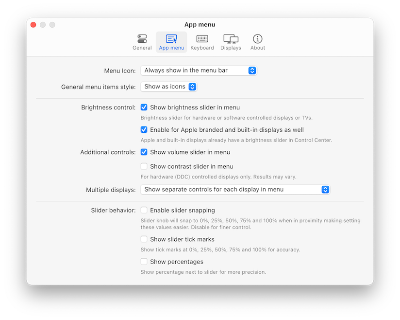
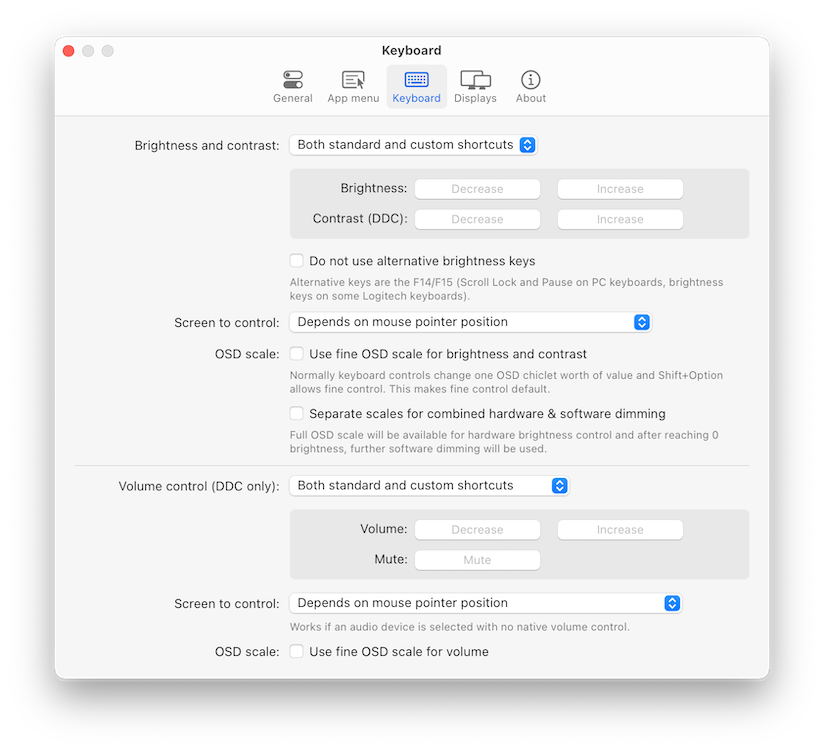
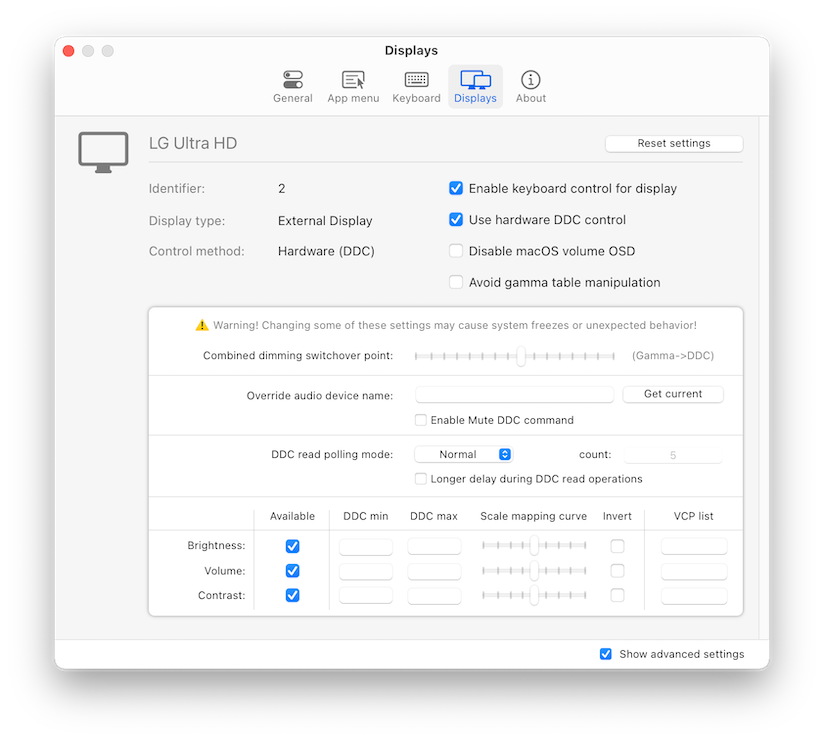

---

Control your display's brightness & volume on your Mac as if it was a native Apple Display. Use Apple Keyboard keys or custom shortcuts. Shows the native macOS OSDs.

## Major features

- Control your display's brightness, volume and contrast!
- Shows native OSD for brightness and volume.
- Supports multiple protocols to adjust brightness: DDC for external displays (brightness, contrast, volume), native Apple protocol for Apple and built-in displays, Gamma table control for software adjustment (recommended for OLED), shade control for AirPlay, Sidecar and Display Link devices.
- Supports smooth brightness transitions.
- Seamlessly combined hardware and software dimming extends dimming beyond the minimum brightness available on your display.
- Synchronize brightness from built-in and Apple screens - replicate Ambient light sensor and touch bar induced changes to a non-Apple external display!
- Sync up all your displays using a single slider or keyboard shortcuts.
- Allows dimming to full black (advanced feature).
- Support for custom keyboard shortcuts as well as standard brightness and media keys on Apple keyboards.
- Dozens of customization options to tweak the inner workings of the app to suit your hardware and needs (don't forget to enable `Show advanced settings` in app Preferences).
- Modern, stylish and highly customizable menulet reflecting the design of Control Center introduced in Big Sur.
- Simple, unobstrusive UI to blend in to the general aesthetics of macOS (even the menu icon can be hidden).
- Supports automatic updates for a hassle-free experience.
- <b>The best app of its kind, completely FREE ([donations welcome](https://opencollective.com/monitorcontrol)) with the source code transparently available!</b>

## Supported displays

- Most modern LCD displays from all major manufacturers supported implemented DDC/CI protocol via DisplayPort, HDMI, USB-C or VGA to allow for hardware backlight control.
- Apple (and LG-Apple) displays and built-in displays are supported using native protocol.
- LCD and LED Televisions usually do not implement DDC, these are supported using software alternatives to dim the image (some higher-end sets are able to translate this into hardware backlight dimming).
- OLED or mini/micro-LED displays and televisions are fully supported using gamma table manipulation (this is a no-compromise solution for this class of displays).
- DisplayLink, Airplay and Sidecar are supported using shade (dark overlay) control.
- The app is compatible with [BetterDummy](https://github.com/waydabber/BetterDummy) mirrored sets.

Notable exceptions for hardware control compatibility:

- Some displays (notably EIZO) use MCCS over USB or an entirely custom protocol for control. These displays are supported with software dimming only.
- The HDMI port of the 2018 Intel Mac mini and 2020 M1 Mac mini prohibit DDC communication. Software control is still available. We recommend connecting the display via the USB-C port (USB-C to HDMI dongles usually work).
- DisplayLink docks and dongles do not allow for DDC control on Macs, only software dimming is available for these connections.

## Installation

Download newest release from [Github.com](https://github.com/MonitorControl/MonitorControl/releases).

## Examples

## URL list

- [Github.com - MonitorControl](https://github.com/MonitorControl/MonitorControl)
