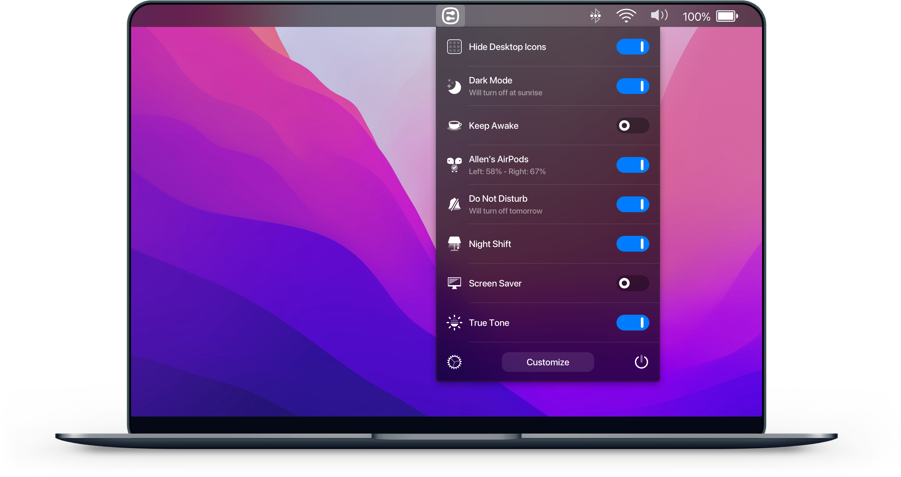
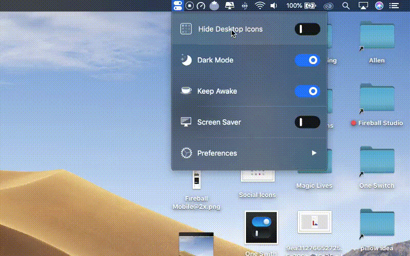
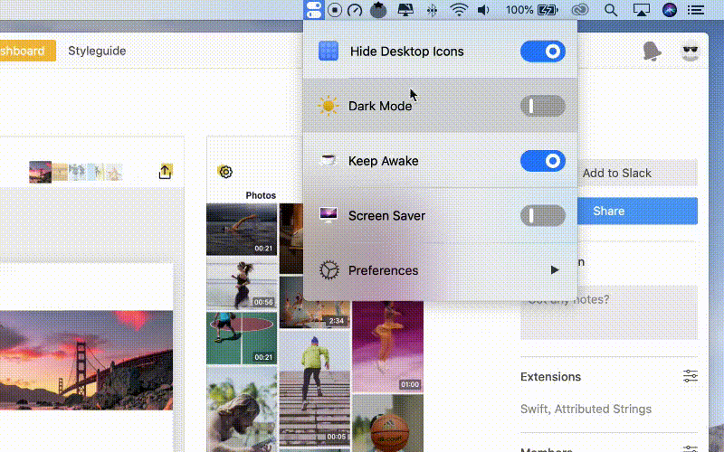
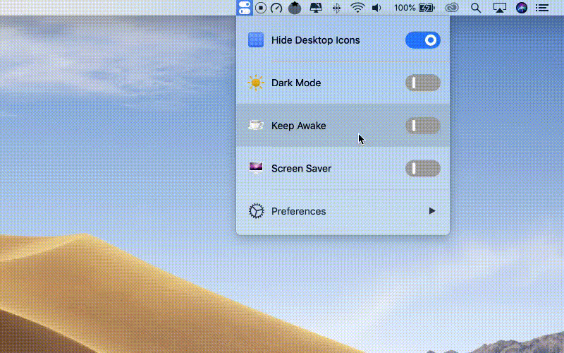
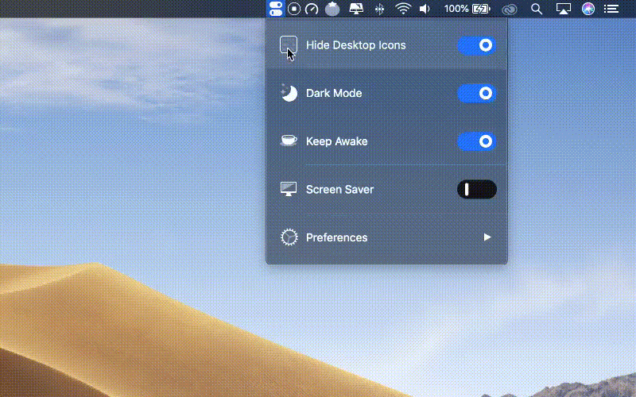
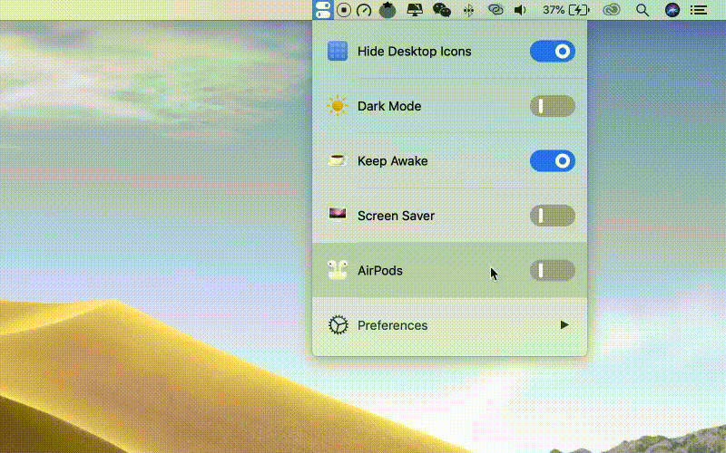
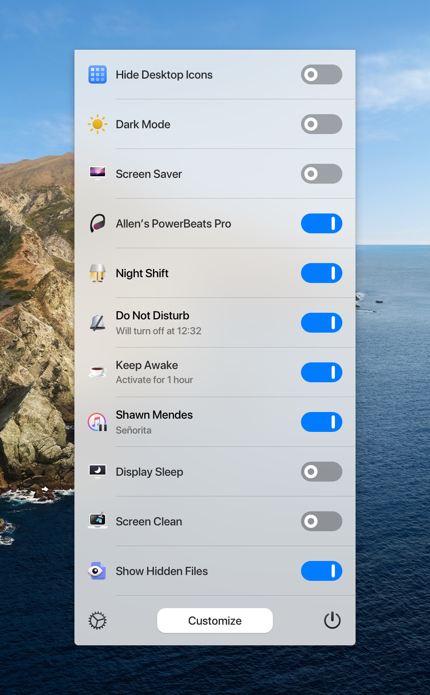
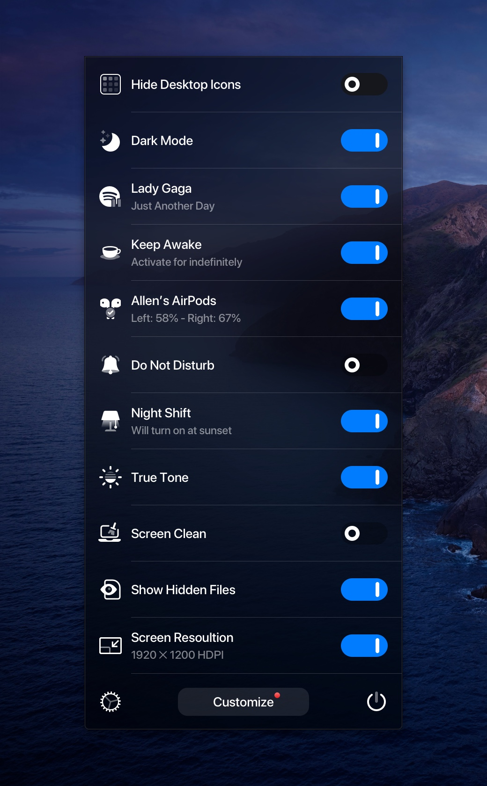

## One Switch

One Switch is a tiny app designed to improve your efficiency by providing quick access to a few important switches. It can be opened from your menu bar, and it allows you to toggle certain system features with just a couple of clicks.

## Installation

Download newest release from [fireball.studio](https://fireball.studio/oneswitch).

## Examples

### Hide Desktop Icons

Hide your messy desktop with one click.

### Dark Mode

Toggle Dark Mode at any time.

### Keep Awake

Prevent your Mac from sleeping or displaying the screen saver.

### Screen Saver

Sometimes you will like to turn it on manually.

### AirPods

Connect AirPods with your Mac in just a second.

### Designed for macOS

Perfect for both dark mode and light mode.

## URL List

- [Fireball.studio - One Switch](https://fireball.studio/oneswitch/)
