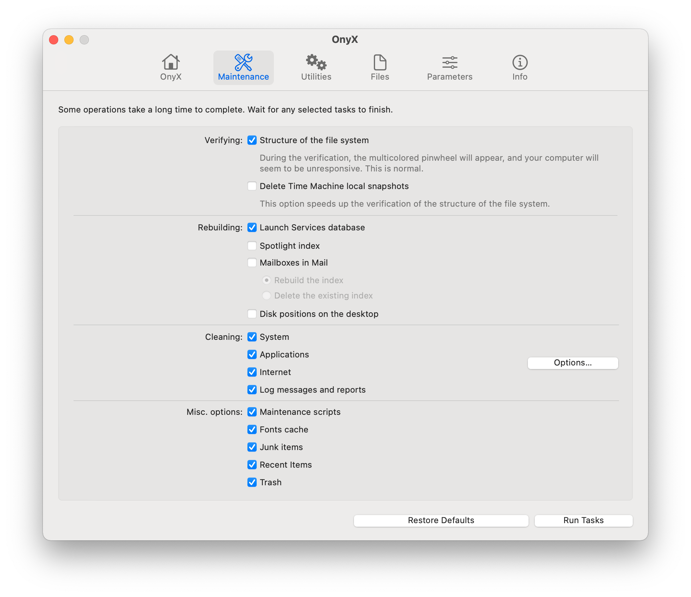
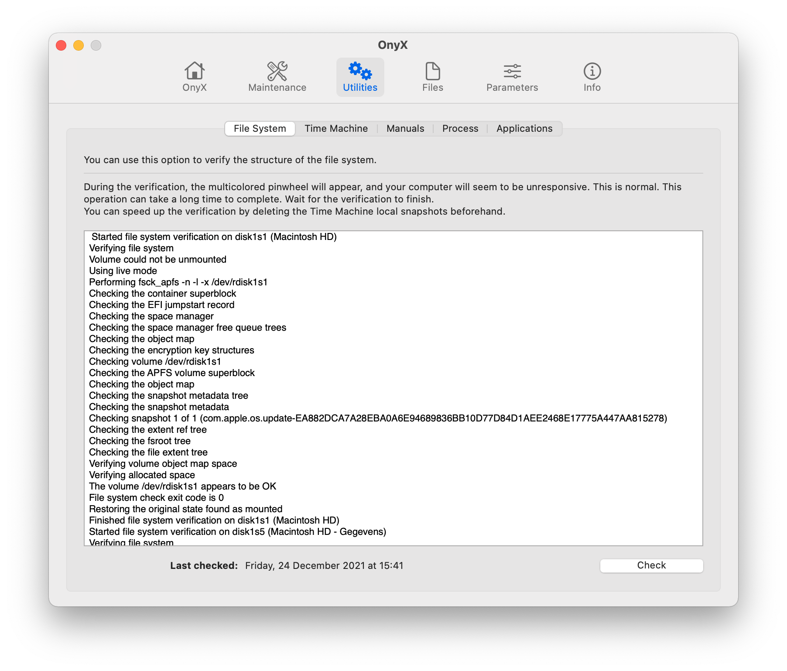
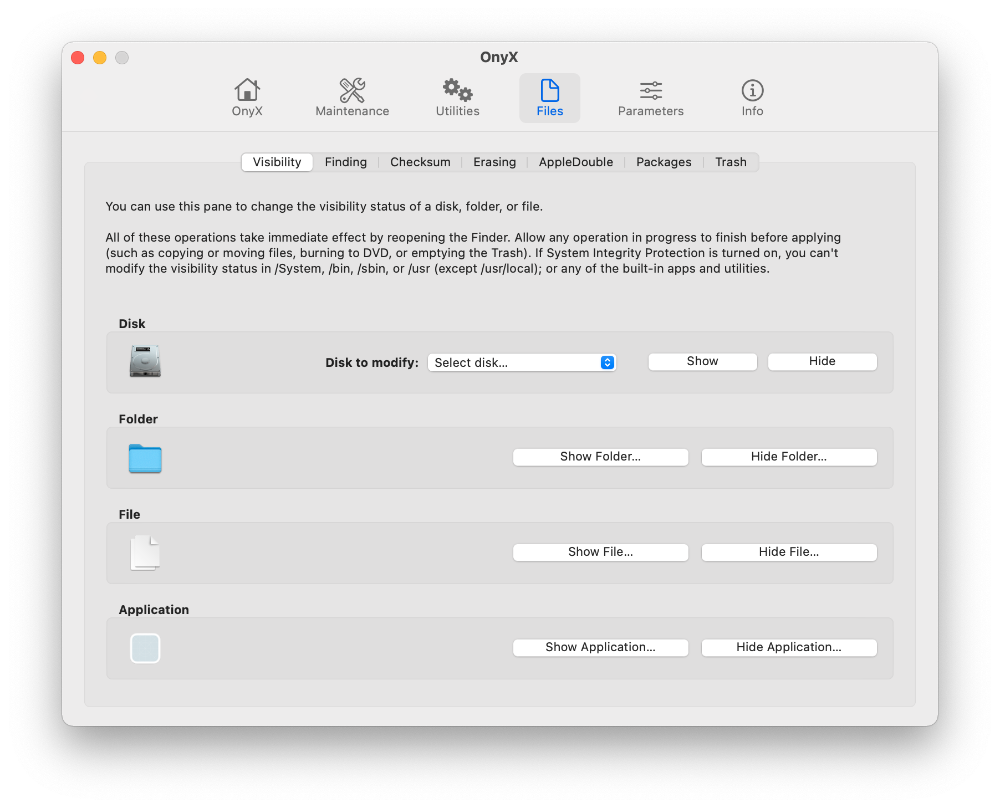
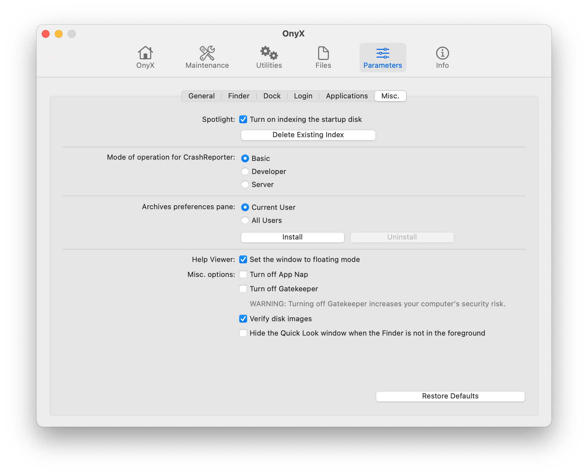
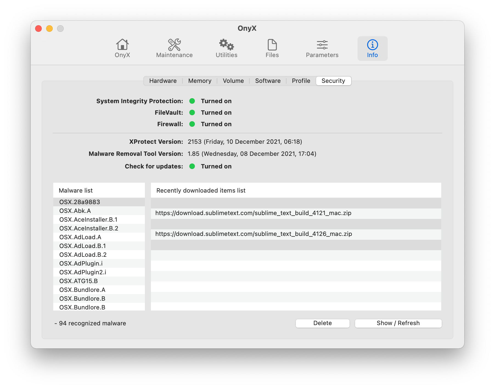

---

OnyX is a multifunction utility that you can use to verify the structure of the system files; run miscellaneous maintenance and cleaning tasks; configure parameters in the Finder, Dock, Safari, and some Apple applications; delete caches; remove certain problematic folders and files; rebuild various databases and indexes; and more.

## Installation

Download newest release from [titanium-software.fr](https://www.titanium-software.fr/en/onyx.html)

## Examples

## URL List

- [Titanium-software.fr - OnyX](https://www.titanium-software.fr/en/onyx.html)
