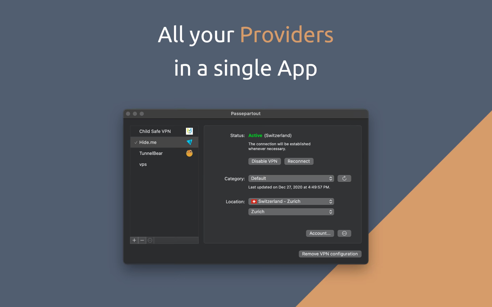
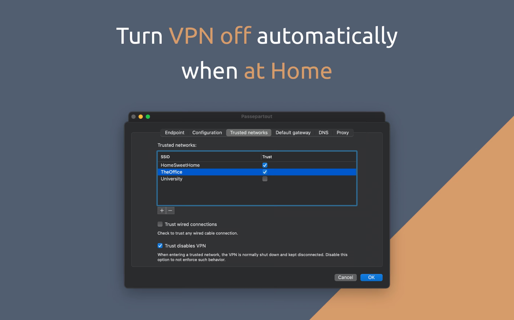
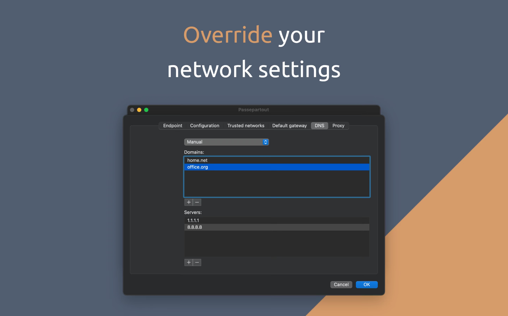

## Passepartout

Passepartout is a smart OpenVPN client perfectly integrated with Apple platforms. Passepartout is the only app you need for both well-known OpenVPN providers and your personal OpenVPN servers.

With Trusted Networks, Passepartout unlocks the very best of using a VPN.

Passepartout does not engage any unrequested background activity other than the VPN tunnel, thus being also friendlier to firewalls.

- Presets for multiple providers (virtually any)
- Trusted networks
- Siri shortcuts (iOS)
- Override network settings
- No background activities
- Wise on battery

### Easy to use

- Incredible ease of use, with native look & feel.
- Handle your profiles in one single place.
- Import .ovpn configuration files.
- Use Trusted Networks to fine-grain your connectivity.
- Fine-tune encryption without tweaking any configuration file.
- Override network settings in a snap (default gateway, DNS, proxy, MTU).

### Privacy Friendly

- Full transparency on what servers you're connecting to.
- Pick pre-resolved endpoints when DNS is problematic.
- No web services, ads or any undesired bloat besides the VPN itself.

## Installation

### macOS / iOS

Download from [Apple AppStore](https://apps.apple.com/us/app/passepartout-openvpn-client/id1433648537?mt=8)

## Examples

## URL List

- [Github.com - Passepartout](https://github.com/passepartoutvpn)
- [Reddit.com - Passepartout](https://www.reddit.com/r/passepartout)
