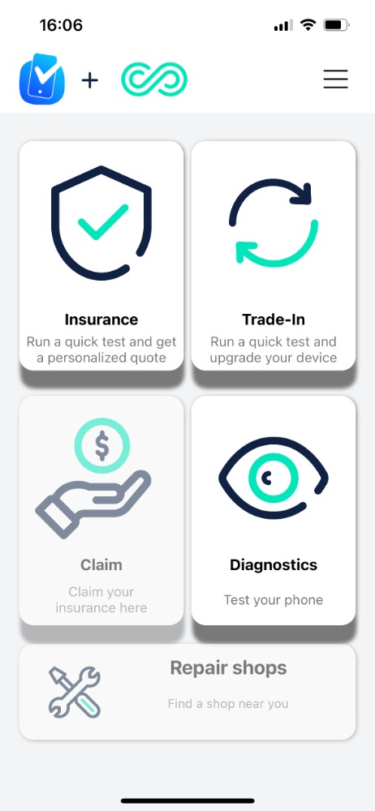
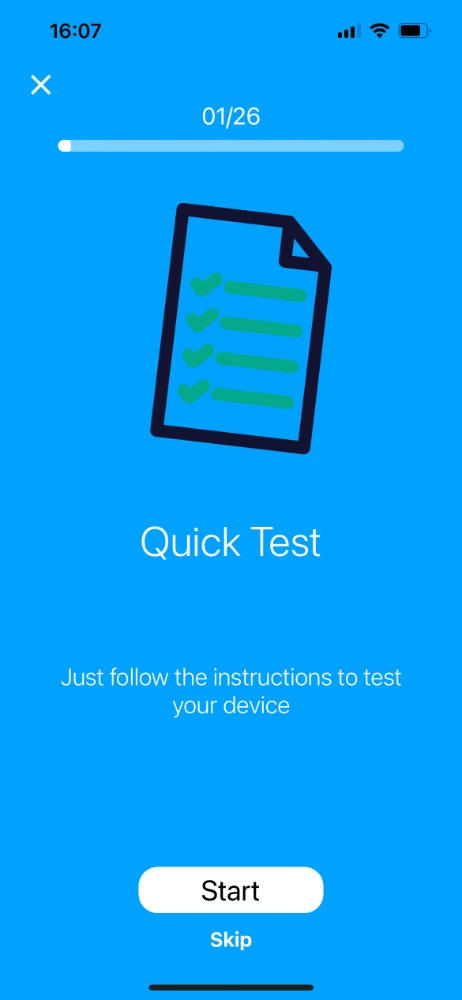

## TestM

Want to check your phone's hardware, sensors and components, to make sure everything is operating properly? Need to fix your smartphone or tablet?

Use TestM app to get a full phone info and device status before you go into the lab!

Hardware Check and Report for your Device.

Complete the phone IMEI check and receive a full status report online, and within minutes, get an accurate objective report with all your phone info, that can be repair your phone.

TestM reports are easy to understand, simple to produce, and available online anywhere, anytime, for any smartphone or mobile device and you can also set reminders to check your device every time you like.

List of Tests Included in the app:

* Screen test: Touch Screen, 3D touch
* Sound test: Speakers, Earpiece, Microphone, Headphones
* Motion: Gyroscope, Accelerometer, Compass
* Connectivity test: WiFi, Bluetooth, Cellular, GPS
* Hardware test: Light Sensor, Charger, Vibration, Proximity Sensor, Fingerprint Sensor
* Camera test: Front Camera, Back Camera, LED Flash

## Installation

[AppStore - TestM](https://apps.apple.com/nl/app/testm-check-phone-report/id1242371446)

## Examples

## URL List

* [Apps.apple.com - TestM](https://apps.apple.com/nl/app/testm-check-phone-report/id1242371446)
