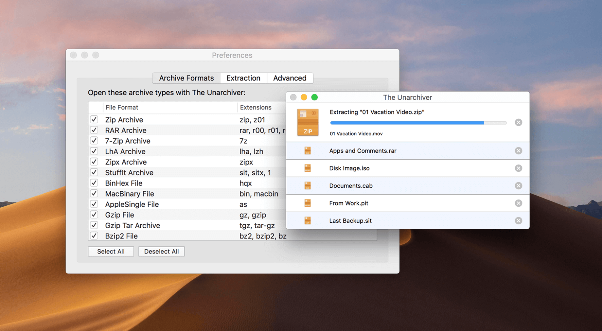

## The Unarchiver

The Unarchiver is a small and easy to use program that can unarchive many different kinds of archive files. It will open common formats such as Zip, RAR (including v5), 7-zip, Tar, Gzip and Bzip2. It will also open many older formats, such as StuffIt, DiskDoubler, LZH, ARJ and ARC. It will even open other kinds of files, like ISO and BIN disc images, some Windows .EXE installers. The list is actually much longer - see the program homepage for the full list.

The Unarchiver also tries to detect and correctly handle the filename encoding in the archives it opens, allowing you to open files from every part of the world without getting garbled filenames.

The Unarchiver aims to be the only unarchiving program you will ever need, and to stay out of your way.

Also, if you need to open archives on your iPad or iPhone, look for "Archives" on the App Store, or go to <https://theunarchiver.com/archives>. It is based on The Unarchiver, and lets you easily handle Archives on iOS!

### Supported archive formats

With The Unarchiver you can extract files from the following archive formats.

| Popular formats         | Support   | Old formats   | Support        | Unusual formats | Support          |
| ----------------------- | --------- | ------------- | -------------- | --------------- | ---------------- |
| Zip                     | Full      | StuffIt       | No encryption  | XAR             | FFS              |
| Zipx                    | Full      | StuffIt X     | Partial        | RPM             | Full             |
| RAR                     | Full      | DiskDoubler   | Almost Full    | Deb             | Full             |
| 7z                      | Full      | Compact Pro   | No Encryption  | Ar              | Full             |
| Tar                     | Full      | PackIt        | Full           | ALZip           | No encryption    |
| Gzip                    | Full      | Cpio          | Full           | WARC            | Full             |
| Bzip2                   | Full      | Compress (.Z) | Full           | NSA, SAR        | Partial          |
| LZMA, XZ                | Full      | ARJ           | No multi-part  | NDS             | Full             |
| CAB                     | Full      | ARC,PAK       | Full           | SWF             | Images and audio |
| MSI                     | Full      | Ace           | Only old files | PDF             | Bitmap images    |
| NSIS                    | Extensive | Zoo           | Full           |
| EXE                     | Some      | LZH           | Full           |
| ISO, BIN, MDF, NRG, CDI | Extensive | ADF           | FFS            |
| Split files             | Basic     | DMS           | FFS            |
|                         |           | LZX           | Full           |
|                         |           | PowerPacker   | Full           |
|                         |           | LBR           | Full           |
|                         |           | Squeeze       | Full           |
|                         |           | Crunch        | Full           |

## Installation

Download newest release from [Apple AppStore](https://apps.apple.com/nl/app/the-unarchiver/id425424353) or developer website [TheUnarchiver.com](https://theunarchiver.com/)

## Examples

## URL List

* [TheUnarchiver.com](https://theunarchiver.com/)
* [Apps.apple.com](https://apps.apple.com/nl/app/the-unarchiver/id425424353)
