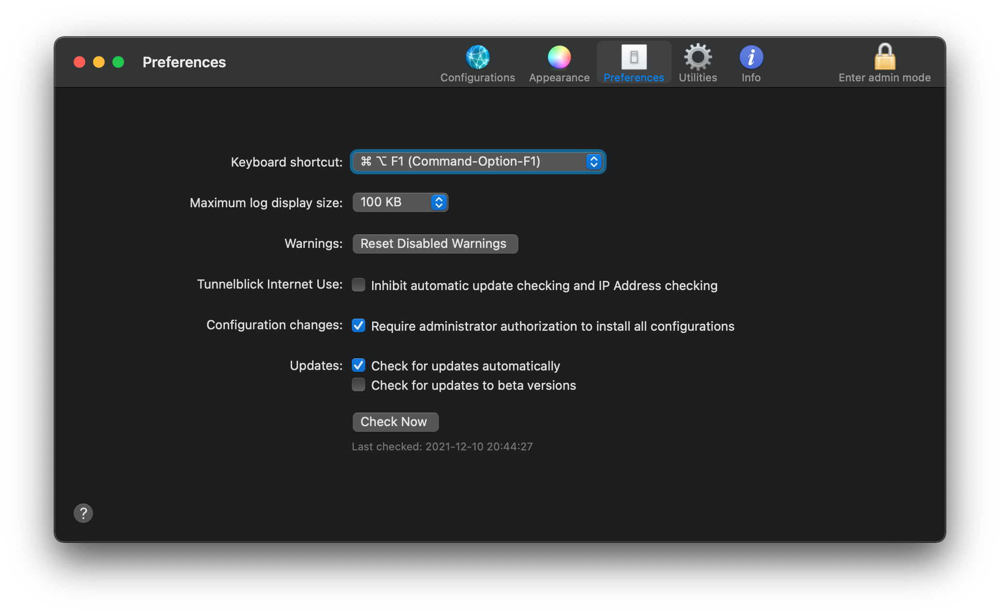

## Tunnelblick

Tunnelblick helps you control OpenVPN® VPNs on macOS. It is Free Software that puts its users first. There are no ads, no affiliate marketers, no tracking — we don't even keep logs of your IP address or other information. We just supply open technology for fast, easy, private, and secure control of VPNs.

Tunnelblick comes as a ready-to-use application with all necessary binaries and drivers (including OpenVPN, easy-rsa, and tun/tap drivers). No additional installation is necessary — just add your OpenVPN configuration and encryption information.

To use Tunnelblick you need access to a VPN server: your computer is one end of the tunnel and the VPN server is the other end. For more information, see Getting VPN Service.

Tunnelblick is licensed under the GNU General Public License, version 2 and may be distributed only in accordance with the terms of that license.

### Installation

Download newest release from [Github.com - release](https://github.com/Tunnelblick/Tunnelblick/releases)

### Examples

### URL list

* [Tunnelblick.net](https://tunnelblick.net/)
* [Github.com - Tunnelblick](https://github.com/Tunnelblick/Tunnelblick)
