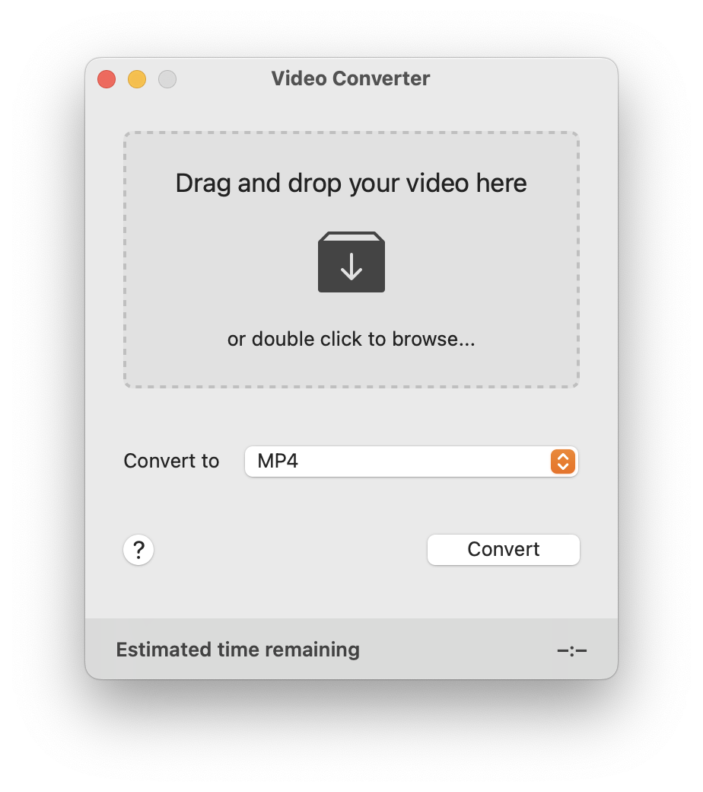
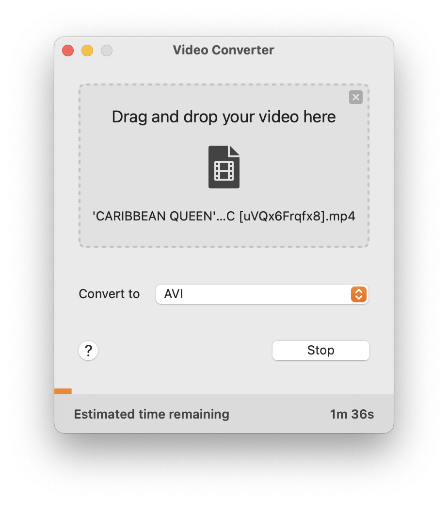

## Video Converter

Simple. Powerful. Elegant. Video conversion that just works.

Video Converter for macOS features the most intelligent conversion software on the market. Sporting a combination of industry standard A/V codecs, and smart-detection algorithms under the hood, you can expect the highest quality video output with optimized size to match.

Supports:

* MP4
* MKV
* M4V
* MOV
* WEBM
* AVI

### Installation

Installation via [Apple AppStore](https://apps.apple.com/nl/app/video-converter/id1518836004?l=en&mt=12)

### Examples

### URL list

* [Apps.apple.com - Video Converter](https://apps.apple.com/nl/app/video-converter/id1518836004?l=en&mt=12)
* [Converter.airtv.io](https://converter.airtv.io/)
