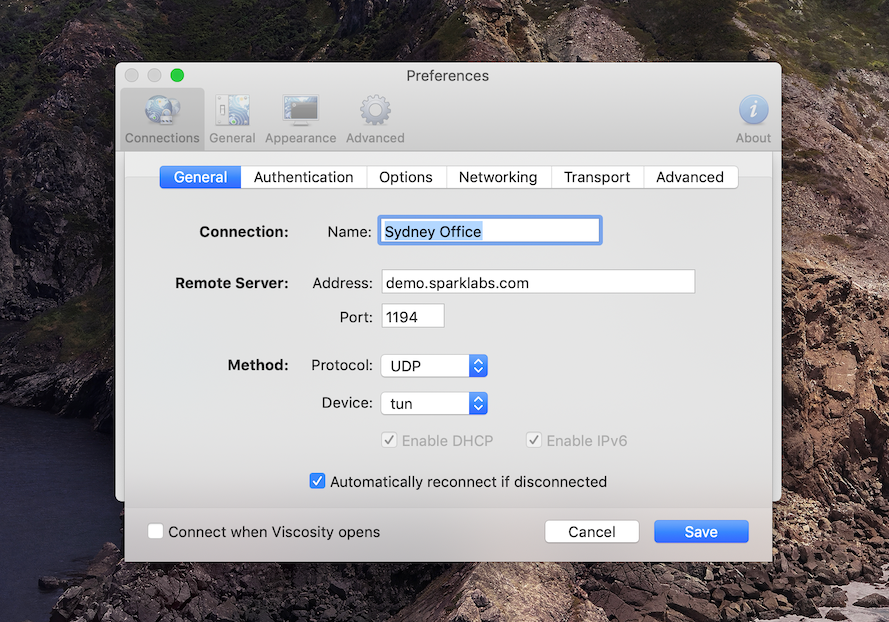
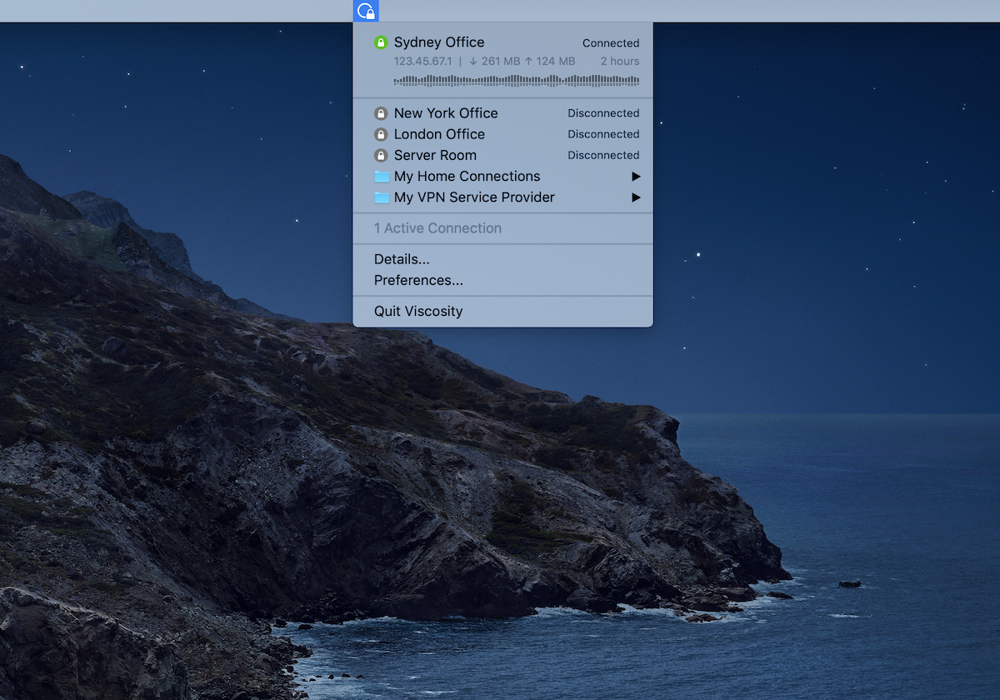
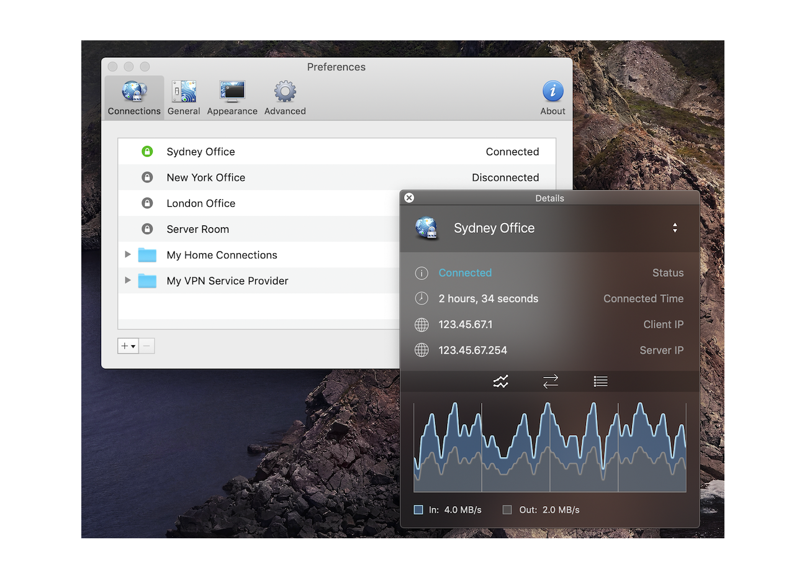
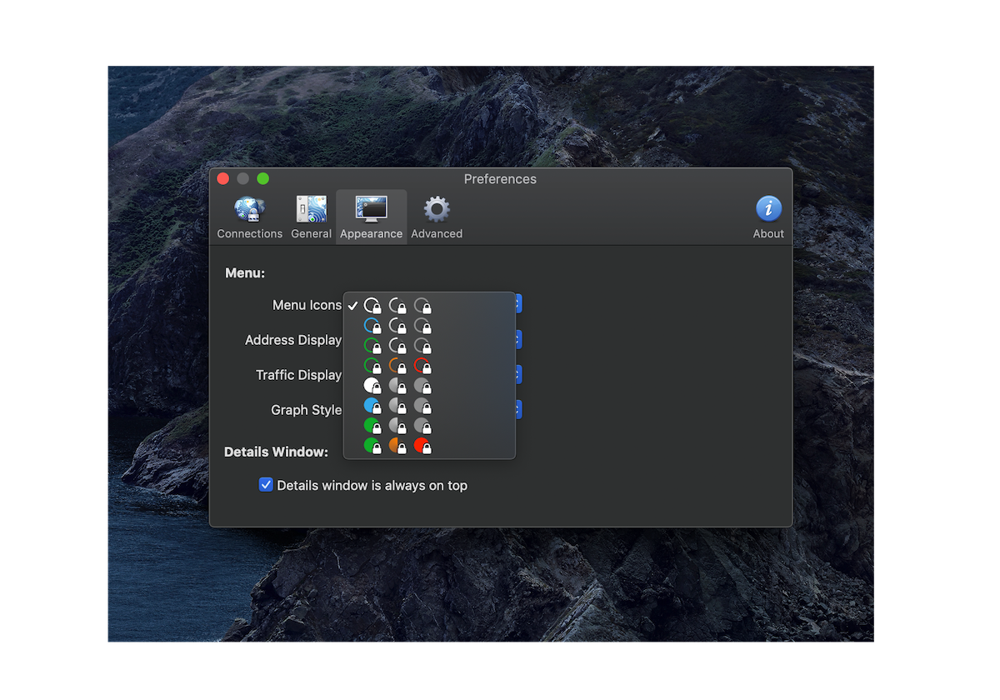
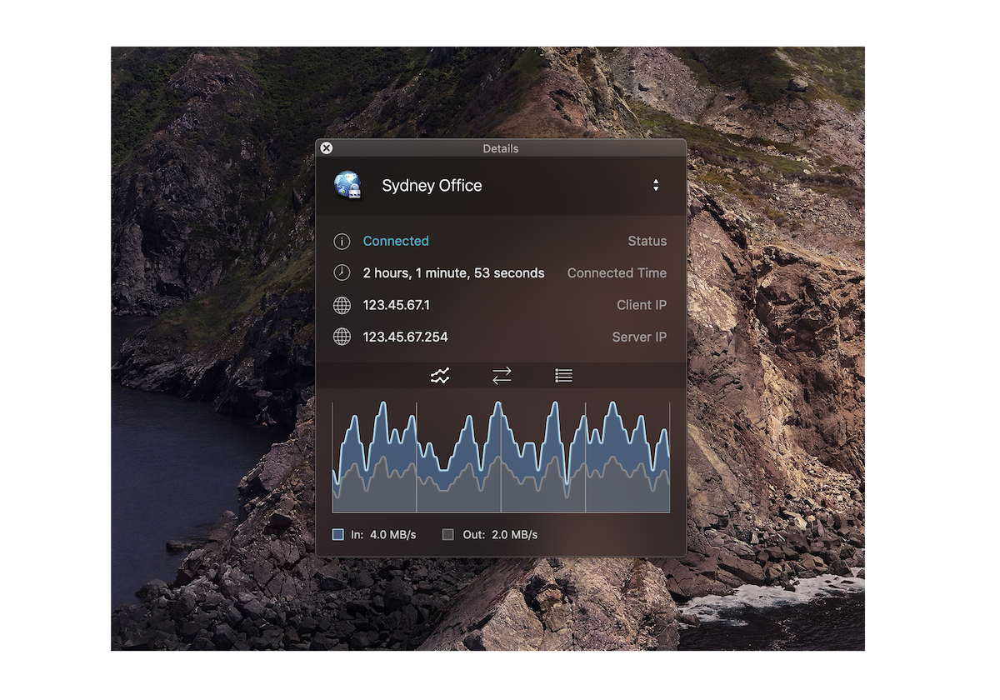
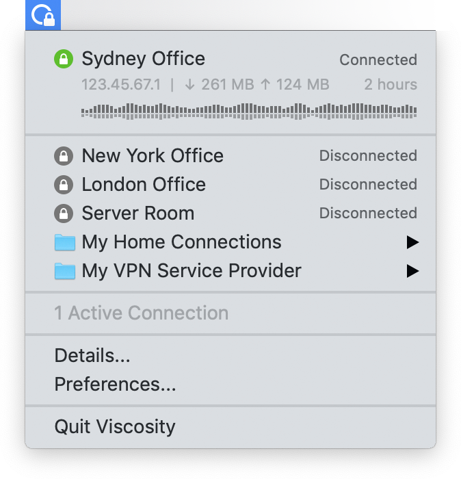
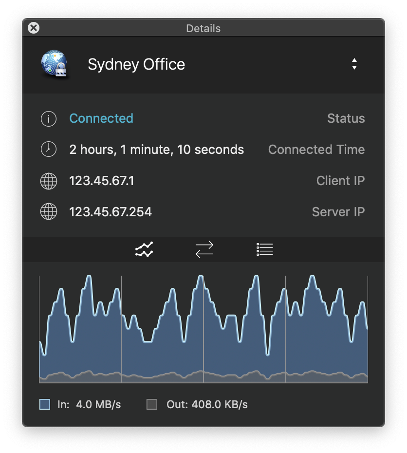
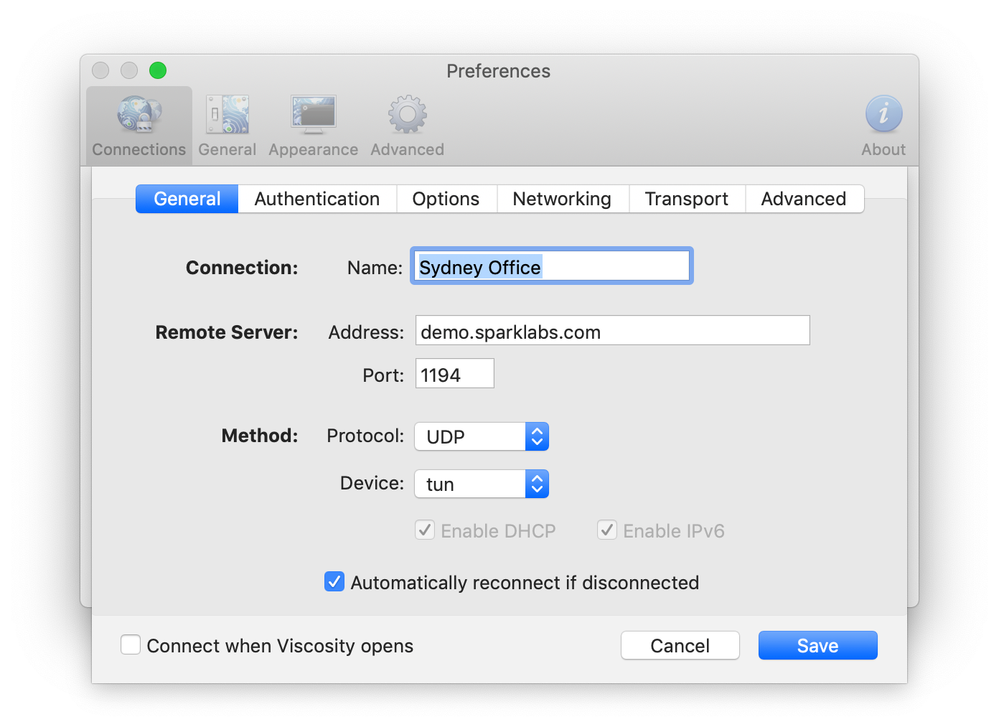

---

Viscosity is a first class VPN client, providing everything you need to establish fast and secure OpenVPN connections on both macOS and Windows.

Viscosity caters to both users new to VPNs and experts alike, providing secure and reliable VPN connections. Whether remotely connecting to your workplace network, home network, VPN Service Provider, or other setup, Viscosity ensures it's done with ease and style.

### Features

### Authentication

- Username & Password
- Public Key Infrastructure (PKI) & PKCS#12
- Shared Secret
- PKCS#11 Token & Smartcard
- FIDO Universal 2nd Factor (U2F)
- One Time Password (OTP)
- Dynamic & Static Two Factor

### Network

- Simultaneous Connections
- Full & Split DNS Modes
- Connect via HTTP or SOCKS Proxy
- Traffic Obfuscation
- DHCP IP, DNS, And Route Assignment
- Complete IPv4 and IPv6 Support
- Automatic & Manual Proxy Settings
- Powerful Traffic Routing Options
- Intelligent Server Selection & Fallback

### Interface

- Powerful Connection Editor
- Traffic Graph & Statistics
- Unobtrusive Status Icon & Menu
- Customisable Menu Icons
- Customisable Menu Quick Statistics
- Connection Folders & Shared Credentials
- OpenVPN Version Selection

### Performance & Integration

- Native Implementation for Each Platform
- Low CPU & Memory Usage
- Reliable OpenVPN Connections
- Automatically Disconnect on Inactivity
- Automatically Reconnect on Disconnect
- Automatically Reconnect on Network Availability
- Automatically Disable Time Machine Backups

### Security

- Latest Cipher & Digest Support
- Sandboxed OpenVPN & Scripts
- Keychain & Windows Password Store Integration
- IPv6 Leak Protection

### Enterprise

- Bundling Connections & Preferences
- GPO Group Policy Deployment
- Connection Importing & Exporting
- Admin Rights Not Required for User Operation

### Advanced

- Conditional Connections
- Control Viscosity using AppleScript
- Control Viscosity using Scripts or Command Line
- Run Scripts on Connection Events
- Advanced Configuration Commands

## Installation

Download newest release from [sparklabs.com](https://www.sparklabs.com/viscosity/)

## Examples

### Powerful Connections

Viscosity is a first class VPN client, providing everything you need to establish fast and secure OpenVPN connections on both macOS and Windows.

Viscosity caters to both users new to VPNs and experts alike, providing secure and reliable VPN connections. Whether remotely connecting to your workplace network, home network, VPN Service Provider, or other setup, Viscosity ensures it's done with ease and style.

### Stay Informed

Viscosity has a clear and intuitive interface for monitoring your VPN connections. Whether you simply want a quick overview of your OpenVPN connections, or want to drill down to the technical network and encryption details, Viscosity has you covered.

Viscosity's unobtrusive main menu provides an instant overview of your VPN connections, making it a breeze to monitor connection details in real-time. When more information is needed, Viscosity's powerful Details window provides a stylish traffic graph and detailed connection statistics.

### Intuitive Editor

Viscosity takes the complexity out of editing VPN connections, while also adding a lot of power at your fingertips. Viscosity's connection editor makes it easy to configure new VPN connections from scratch or edit existing ones. All without needing to know complex commands.

Easily configure everything from network settings to complex multi-factor authentication. Viscosity's powerful DNS modes and traffic routing are also readily accessible to ensure that traffic goes where you want. Power users are also accommodated, with scripting and advanced command support.

## URL List

- [Sparklabs.com - Viscosity](https://www.sparklabs.com/viscosity/)
