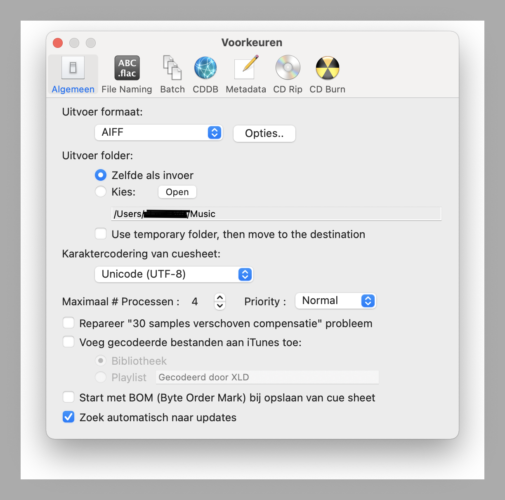
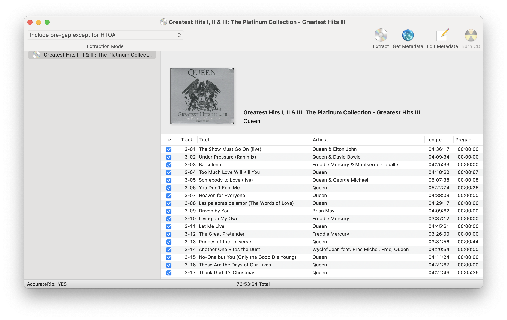
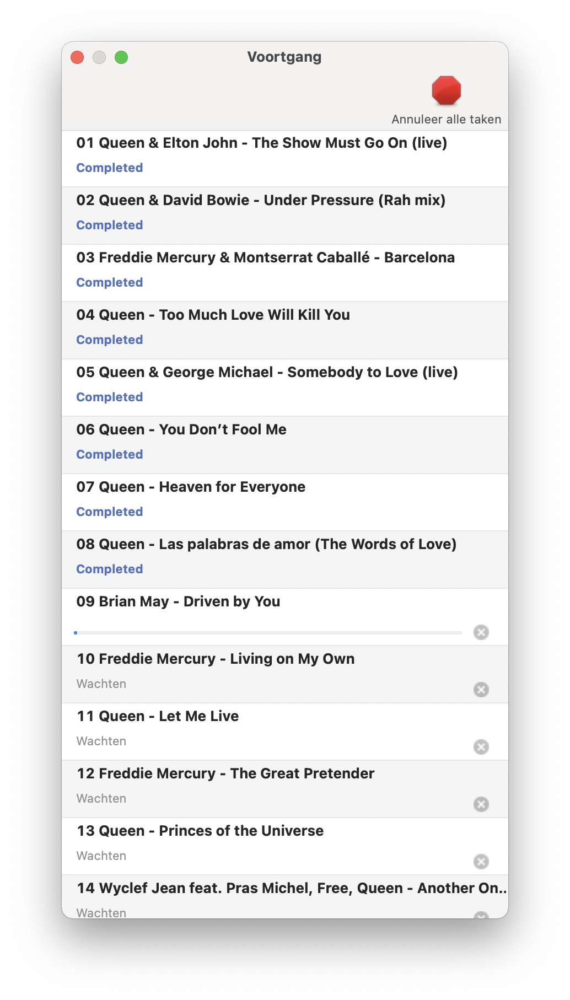

## XLD

X Lossless Decoder(XLD) is a tool for Mac OS X that is able to decode/convert/play various 'lossless' audio files. The supported audio files can be split into some tracks with cue sheet when decoding

## Installation

Download newest release from [tmkk.undo.jp](https://tmkk.undo.jp/xld/index_e.html)

{}

## Examples





```plain
X Lossless Decoder version 20210101 (153.1)

XLD extraction logfile from 2021-05-25 13:35:09 +0200

Queen / Greatest Hits I, II & III: The Platinum Collection - Greatest Hits I

Used drive : Apple SuperDrive (revision 2.03)
Media type : Pressed CD

Ripper mode             : XLD Secure Ripper
Disable audio cache     : OK for the drive with a cache less than 1375KiB
Make use of C2 pointers : NO
Read offset correction  : 0
Max retry count         : 20
Gap status              : Analyzed, Appended (except HTOA)

TOC of the extracted CD
     Track |   Start  |  Length  | Start sector | End sector 
    ---------------------------------------------------------
        1  | 00:00:00 | 05:56:01 |         0    |    26700   
        2  | 05:56:01 | 03:35:25 |     26701    |    42850   
        3  | 09:31:26 | 03:01:00 |     42851    |    56425   
        4  | 12:32:26 | 03:23:16 |     56426    |    71666   
        5  | 15:55:42 | 03:01:17 |     71667    |    85258   
        6  | 18:56:59 | 02:52:69 |     85259    |    98227   
        7  | 21:49:53 | 03:30:22 |     98228    |   113999   
        8  | 25:20:00 | 03:48:04 |    114000    |   131103   
        9  | 29:08:04 | 02:44:67 |    131104    |   143470   
       10  | 31:52:71 | 04:57:02 |    143471    |   165747   
       11  | 36:49:73 | 04:14:69 |    165748    |   184866   
       12  | 41:04:67 | 02:53:04 |    184867    |   197845   
       13  | 43:57:71 | 03:33:35 |    197846    |   213855   
       14  | 47:31:31 | 02:48:41 |    213856    |   226496   
       15  | 50:19:72 | 02:47:39 |    226497    |   239060   
       16  | 53:07:36 | 02:02:10 |    239061    |   248220   
       17  | 55:09:46 | 03:06:69 |    248221    |   262239   

List of alternate offset correction values
        #  | Absolute | Relative | Confidence 
    ------------------------------------------
        1  |      6   |      6   |     252     
        2  |     -6   |     -6   |     75     
        3  |   -688   |   -688   |     28     
        4  |   -694   |   -694   |     10     
        5  |   -640   |   -640   |      7     
        6  |   -658   |   -658   |      6     
        7  |    -47   |    -47   |      4     
        8  |    -60   |    -60   |      3     
        9  |    -42   |    -42   |      2     
       10  |  -1394   |  -1394   |      2     

AccurateRip Summary (DiscID: 0026450b-01dd04d9-e00da811)
    Track 01 : OK (v1+v2, confidence 251/385, with different offset)
    Track 02 : OK (v1+v2, confidence 252/387, with different offset)
    Track 03 : OK (v1+v2, confidence 252/389, with different offset)
    Track 04 : OK (v1+v2, confidence 252/387, with different offset)
    Track 05 : OK (v1+v2, confidence 251/385, with different offset)
    Track 06 : OK (v1+v2, confidence 252/386, with different offset)
    Track 07 : OK (v1+v2, confidence 252/388, with different offset)
    Track 08 : OK (v1+v2, confidence 252/386, with different offset)
    Track 09 : OK (v1+v2, confidence 252/387, with different offset)
    Track 10 : OK (v1+v2, confidence 250/384, with different offset)
    Track 11 : OK (v1+v2, confidence 251/387, with different offset)
    Track 12 : OK (v1+v2, confidence 249/383, with different offset)
    Track 13 : OK (v1+v2, confidence 251/385, with different offset)
    Track 14 : OK (v1+v2, confidence 251/386, with different offset)
    Track 15 : OK (v1+v2, confidence 250/387, with different offset)
    Track 16 : OK (v1+v2, confidence 251/387, with different offset)
    Track 17 : OK (v1+v2, confidence 248/384, with different offset)
        ->All tracks accurately ripped.

All Tracks
    Statistics
        Read error                           : 0
        Jitter error (maybe fixed)           : 0
        Retry sector count                   : 0
        Damaged sector count                 : 0

Track 01
    Filename : Queen/CD1/01 Queen - Bohemian Rhapsody.aiff
    Pre-gap length : 00:02:00

    CRC32 hash               : 2748B9F8
    CRC32 hash (skip zero)   : 2785A50F
    AccurateRip v1 signature : B1966831 (9E3FBAA9 w/correction)
    AccurateRip v2 signature : 8AA70437 (774E1533 w/correction)
        ->Accurately ripped with different offset (v1+v2, confidence 51+200/385, offset +6)
    Statistics
        Read error                           : 0
        Jitter error (maybe fixed)           : 0
        Retry sector count                   : 0
        Damaged sector count                 : 0

Track 02
    Filename : Queen/CD1/02 Queen - Another One Bites the Dust.aiff
    Pre-gap length : 00:00:41

    CRC32 hash               : 7792570D
    CRC32 hash (skip zero)   : C0F3415B
    AccurateRip v1 signature : CDDD5EC5 (D1A5B7E4 w/correction)
    AccurateRip v2 signature : 450B80F9 (47B8A159 w/correction)
        ->Accurately ripped with different offset (v1+v2, confidence 52+200/387, offset +6)
    Statistics
        Read error                           : 0
        Jitter error (maybe fixed)           : 0
        Retry sector count                   : 0
        Damaged sector count                 : 0

Track 03
    Filename : Queen/CD1/03 Queen - Killer Queen.aiff

    CRC32 hash               : 6931C623
    CRC32 hash (skip zero)   : 90D70F95
    AccurateRip v1 signature : CD7BF941 (3FD13EDA w/correction)
    AccurateRip v2 signature : 921E2ACB (037EB36D w/correction)
        ->Accurately ripped with different offset (v1+v2, confidence 52+200/389, offset +6)
    Statistics
        Read error                           : 0
        Jitter error (maybe fixed)           : 0
        Retry sector count                   : 0
        Damaged sector count                 : 0

Track 04
    Filename : Queen/CD1/04 Queen - Fat Bottomed Girls.aiff
    Pre-gap length : 00:01:30

    CRC32 hash               : 7B44F7F5
    CRC32 hash (skip zero)   : FA47A5C2
    AccurateRip v1 signature : 16E70EF7 (F587E3A8 w/correction)
    AccurateRip v2 signature : C28F917C (A13264DB w/correction)
        ->Accurately ripped with different offset (v1+v2, confidence 52+200/387, offset +6)
    Statistics
        Read error                           : 0
        Jitter error (maybe fixed)           : 0
        Retry sector count                   : 0
        Damaged sector count                 : 0

Track 05
    Filename : Queen/CD1/05 Queen - Bicycle Race.aiff
    Pre-gap length : 00:00:58

    CRC32 hash               : 8FED9A25
    CRC32 hash (skip zero)   : C69B3A9F
    AccurateRip v1 signature : BD46CDAC (D31F80BE w/correction)
    AccurateRip v2 signature : BB1D81AE (D07E8234 w/correction)
        ->Accurately ripped with different offset (v1+v2, confidence 51+200/385, offset +6)
    Statistics
        Read error                           : 0
        Jitter error (maybe fixed)           : 0
        Retry sector count                   : 0
        Damaged sector count                 : 0

Track 06
    Filename : Queen/CD1/06 Queen - You're My Best Friend.aiff
    Pre-gap length : 00:00:31

    CRC32 hash               : AD8C9D1A
    CRC32 hash (skip zero)   : DB27B5B1
    AccurateRip v1 signature : 70AD10B3 (DB1F1360 w/correction)
    AccurateRip v2 signature : 5BEB0166 (C5E7F97B w/correction)
        ->Accurately ripped with different offset (v1+v2, confidence 52+200/386, offset +6)
    Statistics
        Read error                           : 0
        Jitter error (maybe fixed)           : 0
        Retry sector count                   : 0
        Damaged sector count                 : 0

Track 07
    Filename : Queen/CD1/07 Queen - Don't Stop Me Now.aiff
    Pre-gap length : 00:02:04

    CRC32 hash               : 039302AD
    CRC32 hash (skip zero)   : 43FD9F32
    AccurateRip v1 signature : 036B561C (6050037A w/correction)
    AccurateRip v2 signature : 9B11F7DA (F771951B w/correction)
        ->Accurately ripped with different offset (v1+v2, confidence 52+200/388, offset +6)
    Statistics
        Read error                           : 0
        Jitter error (maybe fixed)           : 0
        Retry sector count                   : 0
        Damaged sector count                 : 0

Track 08
    Filename : Queen/CD1/08 Queen - Save Me.aiff
    Pre-gap length : 00:00:48

    CRC32 hash               : 7107F0DD
    CRC32 hash (skip zero)   : FDE024FA
    AccurateRip v1 signature : E609E3C1 (04FFDEDD w/correction)
    AccurateRip v2 signature : 0006F154 (1EFD9413 w/correction)
        ->Accurately ripped with different offset (v1+v2, confidence 52+200/386, offset +6)
    Statistics
        Read error                           : 0
        Jitter error (maybe fixed)           : 0
        Retry sector count                   : 0
        Damaged sector count                 : 0

Track 09
    Filename : Queen/CD1/09 Queen - Crazy Little Thing Called Love.aiff

    CRC32 hash               : 6DB0AB0C
    CRC32 hash (skip zero)   : B348BB7A
    AccurateRip v1 signature : 116933EB (DAA6B50F w/correction)
    AccurateRip v2 signature : E37DD049 (AC4F0F11 w/correction)
        ->Accurately ripped with different offset (v1+v2, confidence 52+200/387, offset +6)
    Statistics
        Read error                           : 0
        Jitter error (maybe fixed)           : 0
        Retry sector count                   : 0
        Damaged sector count                 : 0

Track 10
    Filename : Queen/CD1/10 Queen - Somebody to Love.aiff
    Pre-gap length : 00:01:40

    CRC32 hash               : 72FAD3AA
    CRC32 hash (skip zero)   : FDB58CB9
    AccurateRip v1 signature : 2FF3AF58 (7B422FDC w/correction)
    AccurateRip v2 signature : 335955AC (7DE377F4 w/correction)
        ->Accurately ripped with different offset (v1+v2, confidence 50+200/384, offset +6)
    Statistics
        Read error                           : 0
        Jitter error (maybe fixed)           : 0
        Retry sector count                   : 0
        Damaged sector count                 : 0

Track 11
    Filename : Queen/CD1/11 Queen - Now I'm Here.aiff
    Pre-gap length : 00:00:43

    CRC32 hash               : A5AF3EC3
    CRC32 hash (skip zero)   : E1143DA0
    AccurateRip v1 signature : BA496410 (15846BA4 w/correction)
    AccurateRip v2 signature : 4CAB1DE9 (A73C7435 w/correction)
        ->Accurately ripped with different offset (v1+v2, confidence 51+200/387, offset +6)
    Statistics
        Read error                           : 0
        Jitter error (maybe fixed)           : 0
        Retry sector count                   : 0
        Damaged sector count                 : 0

Track 12
    Filename : Queen/CD1/12 Queen - Good Old‐Fashioned Lover Boy.aiff
    Pre-gap length : 00:01:41

    CRC32 hash               : FA02A908
    CRC32 hash (skip zero)   : 5361DE56
    AccurateRip v1 signature : 0F656585 (5161877B w/correction)
    AccurateRip v2 signature : B6F5EB9A (F791E585 w/correction)
        ->Accurately ripped with different offset (v1+v2, confidence 49+200/383, offset +6)
    Statistics
        Read error                           : 0
        Jitter error (maybe fixed)           : 0
        Retry sector count                   : 0
        Damaged sector count                 : 0

Track 13
    Filename : Queen/CD1/13 Queen - Play the Game.aiff

    CRC32 hash               : 167E935B
    CRC32 hash (skip zero)   : 3848DF54
    AccurateRip v1 signature : B03D9391 (A3400A83 w/correction)
    AccurateRip v2 signature : FCE034DC (EF543E29 w/correction)
        ->Accurately ripped with different offset (v1+v2, confidence 51+200/385, offset +6)
    Statistics
        Read error                           : 0
        Jitter error (maybe fixed)           : 0
        Retry sector count                   : 0
        Damaged sector count                 : 0

Track 14
    Filename : Queen/CD1/14 Queen - Flash.aiff
    Pre-gap length : 00:01:47

    CRC32 hash               : 4D027133
    CRC32 hash (skip zero)   : 42902813
    AccurateRip v1 signature : 6A5D776F (11071EC4 w/correction)
    AccurateRip v2 signature : DA57A71A (80209A5E w/correction)
        ->Accurately ripped with different offset (v1+v2, confidence 51+200/386, offset +6)
    Statistics
        Read error                           : 0
        Jitter error (maybe fixed)           : 0
        Retry sector count                   : 0
        Damaged sector count                 : 0

Track 15
    Filename : Queen/CD1/15 Queen - Seven Seas of Rhye.aiff
    Pre-gap length : 00:01:13

    CRC32 hash               : F8269D64
    CRC32 hash (skip zero)   : 10A4C31A
    AccurateRip v1 signature : F6CECFC3 (E895BF5E w/correction)
    AccurateRip v2 signature : 5EFAA1E9 (50507AEB w/correction)
        ->Accurately ripped with different offset (v1+v2, confidence 50+200/387, offset +6)
    Statistics
        Read error                           : 0
        Jitter error (maybe fixed)           : 0
        Retry sector count                   : 0
        Damaged sector count                 : 0

Track 16
    Filename : Queen/CD1/16 Queen - We Will Rock You.aiff
    Pre-gap length : 00:00:37

    CRC32 hash               : C62788CB
    CRC32 hash (skip zero)   : A9133C38
    AccurateRip v1 signature : 57A58B00 (9152CF21 w/correction)
    AccurateRip v2 signature : 4DF47B81 (87517243 w/correction)
        ->Accurately ripped with different offset (v1+v2, confidence 51+200/387, offset +6)
    Statistics
        Read error                           : 0
        Jitter error (maybe fixed)           : 0
        Retry sector count                   : 0
        Damaged sector count                 : 0

Track 17
    Filename : Queen/CD1/17 Queen - We Are the Champions.aiff
    Pre-gap length : 00:00:24

    CRC32 hash               : E730A41D
    CRC32 hash (skip zero)   : DE4A675A
    AccurateRip v1 signature : 1BB309C6 (F89B860B w/correction)
    AccurateRip v2 signature : 60C63A14 (3DB592B7 w/correction)
        ->Accurately ripped with different offset (v1+v2, confidence 48+200/384, offset +6)
    Statistics
        Read error                           : 0
        Jitter error (maybe fixed)           : 0
        Retry sector count                   : 0
        Damaged sector count                 : 0

No errors occurred

End of status report
```

## URL List

- [Tmkk.undo.jp - XLD](https://tmkk.undo.jp/xld/index_e.html)
- [Wiki.hydrogenaud.io - XLD](https://wiki.hydrogenaud.io/index.php?title=XLD)
