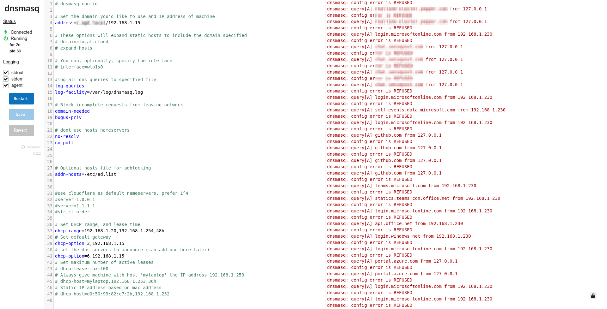

## Docker DNS and DHCP server

This is my setup for a dockerized DNS and DHCP server using the [jpillora/dnsmasq](https://hub.docker.com/r/jpillora/dnsmasq) docker image for dnsmasq.

I use this to set a local domain that points to my [media server](https://github.com/PARC6502/docker-media-server) where I have a reverse proxy that points specific subdomains to the different services I have there. I also use it to block ads on my home network, using [hosts](https://github.com/StevenBlack/hosts).

The example conf reflects this setup but it can also be setup in any other way you'd want to use a DNS or DHCP server.

It uses the following ports:

* 8080 Web UI
* 53 DNS
* 67 DHCP

### Caveats

Currently this is running in "host" network mode, so it's not really as isolated as it could be, and there could be port conflicts. However this was the easiest option for getting the DHCP server to work in a docker container. Another option maybe using a [macvlan network](https://docs.docker.com/network/macvlan/). [This page](https://docs.pi-hole.net/docker/DHCP/) contains a brief discussion of the different options.

Note that "bridge" mode works perfectly fine if all you need is a DNS server, and is preferable in that case. You also don't need NET_ADMIN capability if you're just running DNS.

### Installation

1. Clone this repo and cd into it

```plain
git clone https://github.com/PARC6502/docker-dns-dhcp.git && cd docker-dns-dhcp
```

2. Make copies of example files

```plain
cp dnsmasq.example.conf dnsmasq.conf && cp static_hosts.example static_hosts && cp ad.example.list ad.list && touch dnsmasq.log
```

3. Set a static IP for your server machine. You can either do this from the machine itself, setting an IP outside of the DHCP range, or from the `dnsmasq.conf` file

4. Set the domain(s) and IP address(es) in the `dnsmasq.conf` file

This is the line you want to change

```plain
address=/.local.cloud/192.168.1.3
```

5. (Optional) You can set static IPs based on hostname or MAC address in `dnsmasq.conf`

6. (Optional) Add static hosts to your static_hosts file (could point to different servers, android tv, etc)

7. (Optional) You can add sites you'd like to block in `ad.list` in the format shown below, I'm using [this file](https://raw.githubusercontent.com/StevenBlack/hosts/master/hosts) on my network

```plain
0.0.0.0 facebook.com
```

8. Turn off DHCP in your router

   For this container to work it's important that it's not clashing with another DHCP server. You need to access your router, find the DHCP option and turn it off. Take

9. Start up the container

### Usage

```plain
sudo docker-compose up -d
```

You should be able to access the web UI at `<IP address>:8080`, (user:foo, pass:bar).

You can view a live feed of the logs from the UI as well as make changes to `dnsmasq.conf`. If you make changes to any of the files the dnsmasq will need to be restarted, this can be done from the UI or from the command line (note that you need to be in the folder with the `docker-compose.yml` file for this command to work)

```plain
sudo docker-compose restart dnsmasq
```

### Troubleshooting

On error for port binding (53), stop local DNS resolver - `sudo systemctl stop systemd-resolved.service`

### Examples

#### Configuration DNS / DHCP

Assuming the local ethernet adapter is set to static IP `192.168.1.15/24`

```plain
$ cat dnsmasq.conf

# dnsmasq config

# Set the domain you'd like to use and IP address of machine
address=/.offsec.local/192.168.1.15

#log all dns queries to specified file
log-queries
log-facility=/var/log/dnsmasq.log

# Block incomplete requests from leaving network
domain-needed
bogus-priv

# dont use hosts nameservers
no-resolv
no-poll

# Optional hosts file for adblocking
addn-hosts=/etc/ad.list

# Set DHCP range, and lease time
dhcp-range=192.168.1.200,192.168.1.220,48h
# Set default gateway
dhcp-option=3,192.168.1.15
# set the dns servers to announce (can add one here later)
dhcp-option=6,192.168.1.15
# Set maximum number of active leases
# dhcp-lease-max=100
# Always give machine with host 'mylaptop' the IP address 192.168.1.253
# dhcp-host=mylaptop,192.168.1.253,36h
# Static IP address based on mac address
# dhcp-host=d0:50:99:82:e7:2b,192.168.1.252
```

Setting DNS answers for domains.

```plain
$ cat ad.list     
192.168.1.15 microsoft.com
192.168.1.15 azure.com
192.168.1.15 offsec.nl
192.168.1.15 dc01.offsec.nl
192.168.1.15 dc02.offsec.nl
192.168.1.15 fs2019.offsec.nl
192.168.1.15 fs2016.offsec.nl
```



### URL list

* [Github.com - Docker DNS and DHCP server](https://github.com/PARC6502/docker-dns-dhcp)
