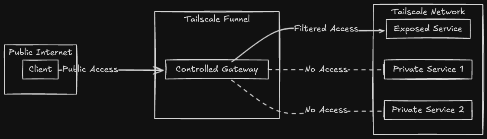
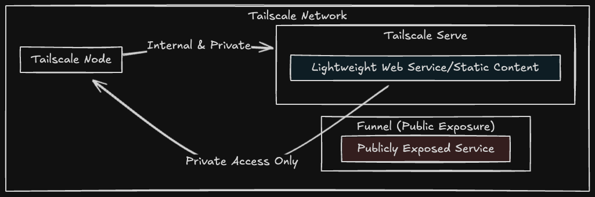

---

Discover Seamless Docker Networking with Tailscale.

If you're working with Docker and looking for a streamlined way to manage secure, private networking between containers across devices, check out the **Tailscale Docker Sidecar Configs** project: [2Tiny2Scale/tailscale-docker-sidecar-configs](https://github.com/2Tiny2Scale/tailscale-docker-sidecar-configs).

This repository offers example `docker-compose.yml` configurations designed to simplify deploying services with Tailscale as a sidecar. Whether you're setting up secure connectivity for self-hosted applications or exploring lightweight VPN solutions, this project is a great starting point.

Key features include:

- **Plug-and-play examples**: Quickly integrate Tailscale into your Dockerized services.
- **Simplified connectivity**: Effortlessly enable private networking between containers across devices.
- **Customizable configurations**: Adapt to your specific needs and environments.

Explore the repository, try out the examples, and feel free to contribute or provide feedback! 🚀

## Available Configurations

### Networking and Security

| 🌐 Service                 | 📝 Description                                                           | 🔗 Link                                 |
| -------------------------- | ------------------------------------------------------------------------ | --------------------------------------- |
| 🛡️ **AdGuard Home**        | Network-wide software for blocking ads and tracking.                     | [Details](services/adguardhome)         |
| 🧩 **Pi-hole**             | A network-level ad blocker that acts as a DNS sinkhole.                  | [Details](services/pihole)              |
| 🔒 **Technitium DNS**      | An open-source DNS server that can be used for self-hosted DNS services. | [Details](services/technitium)          |
| 🌐 **Traefik**             | A modern reverse proxy and load balancer for microservices.              | [Details](services/traefik)             |
| 🚀 **Tailscale Exit Node** | Configure a device to act as an exit node for your Tailscale network.    | [Details](services/tailscale-exit-node) |
| 🌐 **DDNS Updater**        | A self-hosted solution to keep DNS A/AAAA records updated automatically. | [Details](services/ddns-updater)        |

### Media and Entertainment

| 🎥 Service         | 📝 Description                                                                             | 🔗 Link                         |
| ------------------ | ------------------------------------------------------------------------------------------ | ------------------------------- |
| 🎬 **Plex**        | A media server that organizes video, music, and photos from personal media libraries.      | [Details](services/plex)        |
| 📺 **Jellyfin**    | An open-source media system that puts you in control of managing and streaming your media. | [Details](services/jellyfin)    |
| 🎞️ **Radarr**      | A movie collection manager for Usenet and BitTorrent users.                                | [Details](services/radarr)      |
| 📡 **Sonarr**      | A PVR for Usenet and BitTorrent users to manage TV series.                                 | [Details](services/sonarr)      |
| 🎥 **Bazarr**      | A companion tool to Radarr and Sonarr for managing subtitles.                              | [Details](services/bazarr)      |
| 📊 **Tautulli**    | A monitoring and tracking tool for Plex Media Server.                                      | [Details](services/tautulli)    |
| 📥 **qBittorrent** | An open-source BitTorrent client.                                                          | [Details](services/qbittorrent) |
| 🔗 **Slink**       | A fast, self-hosted alternative to ShareDrop for secure local file sharing.                | [Details](services/slink)       |

### Productivity and Collaboration

| 💼 Service           | 📝 Description                                                                  | 🔗 Link                            |
| -------------------- | ------------------------------------------------------------------------------- | ---------------------------------- |
| ☁️ **NextCloud**     | A suite of client-server software for creating and using file hosting services. | [Details](services/nextcloud)      |
| 📝 **Excalidraw**    | A virtual collaborative whiteboard tool.                                        | [Details](services/excalidraw)     |
| 🔗 **Pingvin Share** | A self-hosted file sharing platform.                                            | [Details](services/pingvin-share/) |
| 🗂️ **Stirling-PDF**  | A web application for managing and editing PDF files.                           | [Details](services/stirlingpdf)    |
| 🧠 **LanguageTool**  | An open-source proofreading software for multiple languages.                    | [Details](services/languagetool)   |
| 🔄 **Resilio Sync**  | A fast, reliable, and simple file sync and share solution.                      | [Details](services/resilio-sync)   |
| 🗃️ **Vaultwarden**   | An unofficial Bitwarden server implementation written in Rust.                  | [Details](services/vaultwarden)    |
| 🌿 **Isley**         | A self-hosted cannabis grow journal for tracking plants and managing grow data. | [Details](services/isley)          |

### Development Tools

| 🛠️ Service                | 📝 Description                                                                           | 🔗 Link                             |
| ------------------------- | ---------------------------------------------------------------------------------------- | ----------------------------------- |
| 🔧 **Cyberchef**          | A web app for encryption, encoding, compression, and data analysis.                      | [Details](services/cyberchef)       |
| 🔍 **searXNG**            | A free internet metasearch engine which aggregates results from various search services. | [Details](services/searxng)         |
| 🖥️ **Node-RED**           | A flow-based development tool for visual programming.                                    | [Details](services/nodered)         |
| 🖥️ **IT-Tools**           | A collection of handy online tools for developers and sysadmins.                         | [Details](services/it-tools)        |
| 🖥️ **Dozzle**             | A real-time log viewer for Docker containers.                                            | [Details](services/dozzle)          |
| 🖥️ **Portainer**          | A lightweight management UI which allows you to easily manage your Docker environments.  | [Details](services/portainer)       |
| 🖥️ **Gokapi**             | A lightweight self-hosted file sharing platform.                                         | [Details](services/gokapi)          |
| 🖥️ **Homarr**             | A sleek dashboard for all your Homelab services.                                         | [Details](services/homarr)          |
| 🖥️ **Changedetection.io** | A tool for monitoring website changes.                                                   | [Details](services/changedetection) |

### Monitoring and Analytics

| 📈 Service         | 📝 Description                                                                      | 🔗 Link                         |
| ------------------ | ----------------------------------------------------------------------------------- | ------------------------------- |
| 📊 **Uptime Kuma** | A self-hosted monitoring tool like "Uptime Robot".                                  | [Details](services/uptime-kuma) |
| 📉 **Beszel**      | A lightweight server monitoring hub with historical data, Docker stats, and alerts. | [Details](services/beszel)      |

## Tailscale Funnel vs. Tailscale Serve

Tailscale Funnel securely exposes services to the public internet. Tailscale Serve is for sharing content within a private Tailscale network (Tailnet). You'll need to decide how you want to expose the service, the configurations in this repository exposes the local Tailnet.

### Tailscale Funnel

[Tailscale Funnel](https://tailscale.com/kb/1223/funnel) is a feature that lets you route traffic from the wider internet to a local service running on a machine in your Tailscale network (known as a tailnet). You can think of this as publicly sharing a local service, like a web app, for anyone to access—even if they don’t have Tailscale themselves.

An example configuration for Tailscale Funnel for your service is available [here](funnel-serve/funnel-example.json).

### Tailscale Serve

[Tailscale Serve](https://tailscale.com/kb/1312/serve) is a feature that lets you route traffic from other devices on your Tailscale network (known as a tailnet) to a local service running on your device. You can think of this as sharing the service, such as a website, with the rest of your tailnet.

An example configuration for Tailscale Serve for your service is available [here](funnel-serve/serve-example.json).

## Tailscale Documentation

- [Tailscale.com - Knowledge Base](https://tailscale.com/kb)
- [Tailscale.com - Funnel](https://tailscale.com/kb/1223/funnel)
- [Tailscale.com - Serve](https://tailscale.com/kb/1242/tailscale-serve)
- [Tailscale.com - Docker Tailscale Guide](https://tailscale.com/blog/docker-tailscale-guide)
