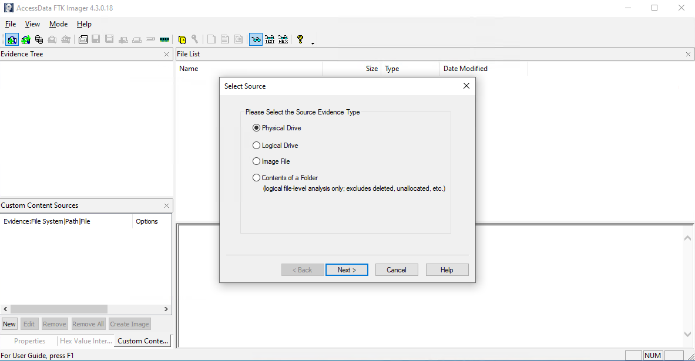
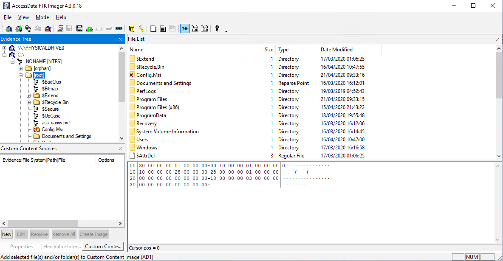
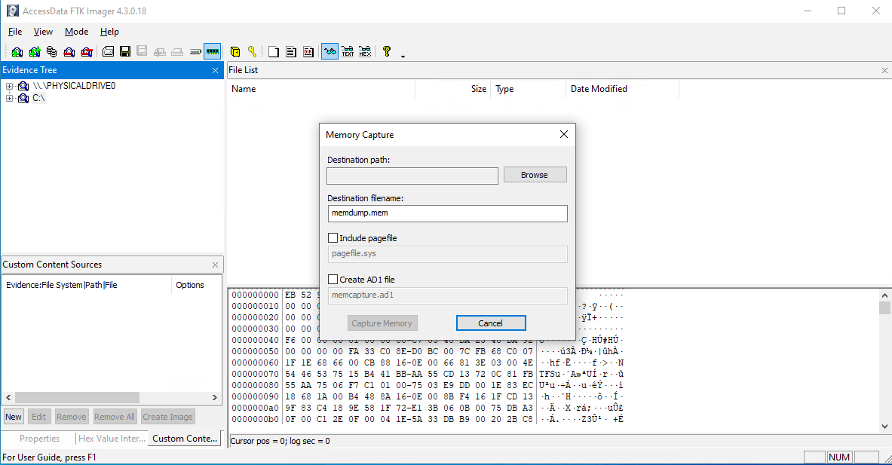

---

FTK® Imager is a data preview and imaging tool that lets you quickly assess electronic evidence to determine if further analysis.

## Installation

Download newest release from [exterro.com](https://www.exterro.com/digital-forensics-software/ftk-imager)

{}

## Examples

### Memory capture

## URL List

- [Exterro.com](https://www.exterro.com)
