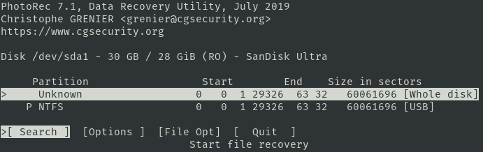

## Photorec

Recover lost files from harddisk, digital camera and cdrom.

### Installation

```plain
sudo apt install testdisk
```

### Usage

```plain
photorec [/log] [/debug] [/d recup_dir] [file.dd|file.e01|device]
```

### Flags

```plain
PhotoRec 7.1, Data Recovery Utility, July 2019
Christophe GRENIER <grenier@cgsecurity.org>
https://www.cgsecurity.org

Usage: photorec [/log] [/debug] [/d recup_dir] [file.dd|file.e01|device]
       photorec /version

/log          : create a photorec.log file
/debug        : add debug information

PhotoRec searches for various file formats (JPEG, Office...). It stores files
in the recup_dir directory.
```

### Examples

```plain
sudo photorec /dev/sda1
```



### URL list

* [CGSecurity.org - photorec](https://www.cgsecurity.org/wiki/PhotoRec)
