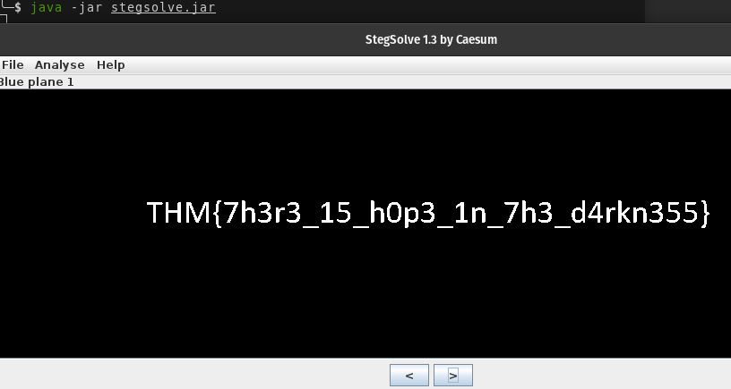

## Stegsolve

A stegano solver for challenges.

It provides these main functions:

* A quick view of different bit planes and some simple transformations.
* Data extraction from planes. This can be row order or column order, with bits treated as a bitstream and converted into bytes.
* Some simple checking of file formats and reporting on the filesize, additional bytes, file holes, etc. This is highly dependent upon the type of image.
* Stereogram solver - simply change the offset until the image becomes visible.
* Frame browser for animated images. This should also work for viewing layers in multi-layered PNG files.
* Image combiner to combine two images in a variety of ways and browse through the different combinations.

Copy/Cut and paste is available from most text using CTRL-C to copy, CTRL-V to paste and CTRL-X for cut.
If an image fails to load, for example because it is corrupt, then file analysis will still open the file that you just tried to view. It may, however, crash out before reporting the information that you want to know. This will work though on images where the PNG has corrupted CRC values for example.

### Installation

{}

```plain
wget http://www.caesum.com/handbook/Stegsolve.jar -O stegsolve.jar
chmod +x stegsolve.jar
```

### Usage

```plain
java -jar stegsolve.jar
```

### Examples



### URL list

* [Github.com - StegSolve](https://github.com/zardus/ctf-tools/blob/master/stegsolve/install)
