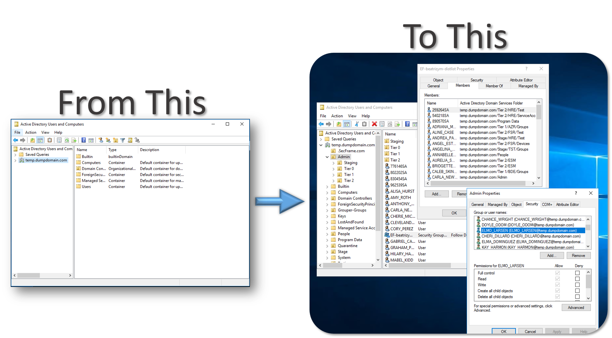
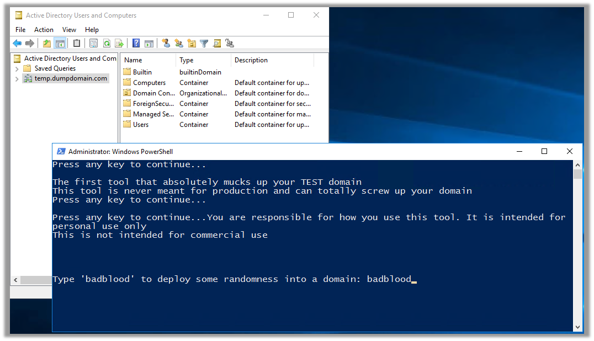
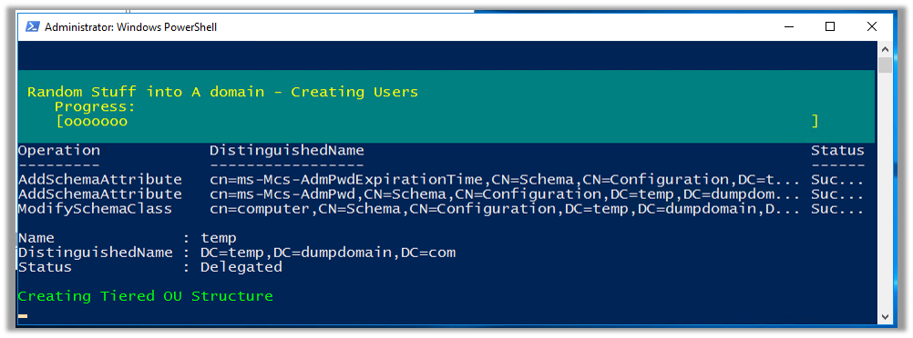

## BadBlood

BadBlood fills a Microsoft Active Directory Domain with a structure and thousands of objects.

[Github.com](https://github.com/davidprowe/BadBlood)

## Examples

### BloodHound example set based on BadBlood

Statistics:

* Users: 2492
* Groups: 551
* Computers: 102
* OUS: 223
* GPOs: 2
* Domains: 1

{}

## URL List

* [Github.com - BadBlood](https://github.com/davidprowe/BadBlood)
* [Secframe.com - BadBlood](https://www.secframe.com/badblood/)
