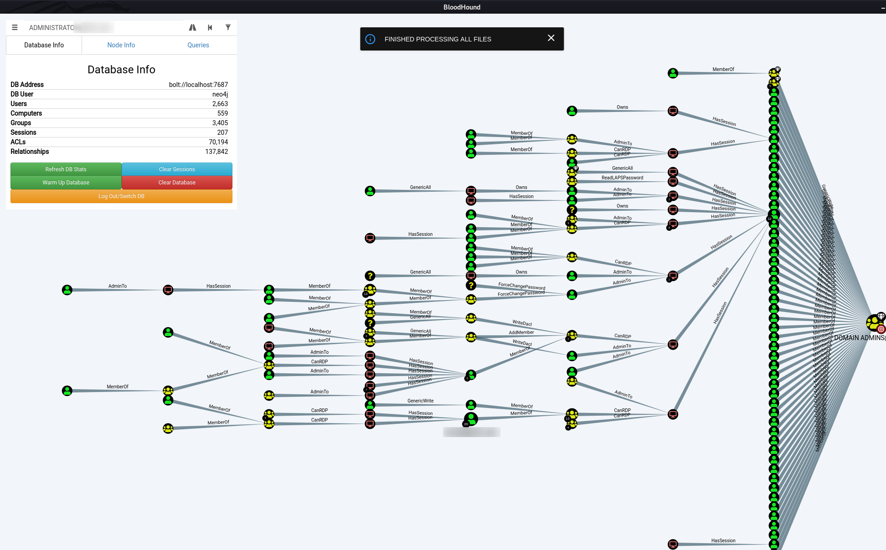
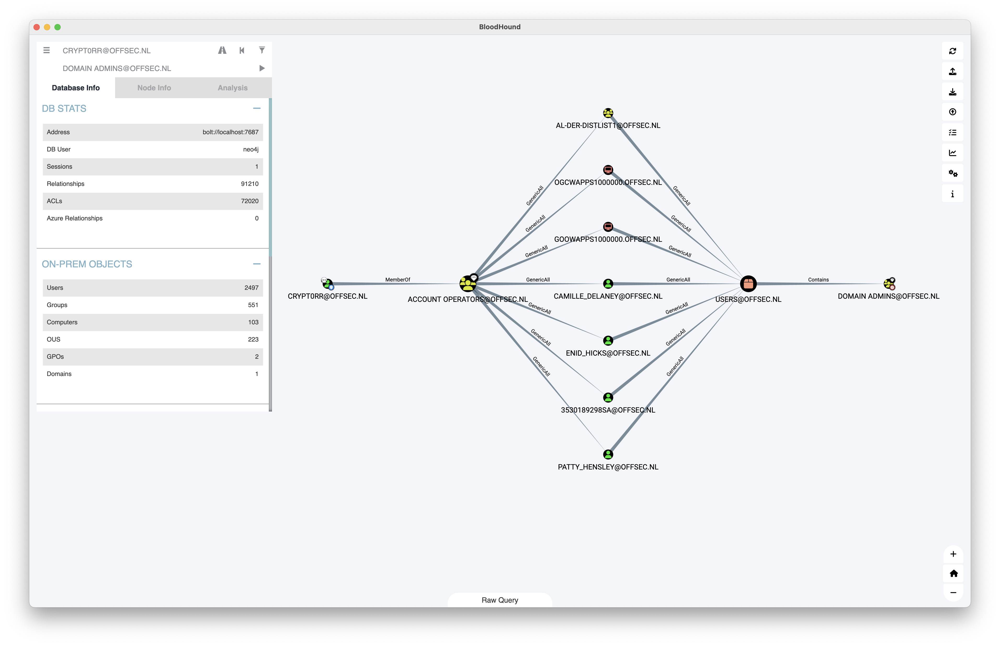

## BloodHound

Uses graph theory to reveal the hidden and often unintended relationships within an Active Directory environment.

### Collectors

{}

{}

To gather additional information directly from ADExplorer for BloodHound, check [ADExplorerSnapshot.py]()

## Installation

Download newest release from [Github.com](https://github.com/BloodHoundAD/BloodHound/releases)

### Apple macOS

The BloodHound binary is not signed, to still use it the following should be executed.

```plain
xattr -d com.apple.quarantine /Applications/BloodHound.app
```

## Usage

### Bloodhound - Run ingestor on target domain joined system

```plain
.\SharpHound.exe CollectionMethod All
```

Or:

```plain
. .\SharpHound.ps1 /exe
```

```plain
Invoke-BloodHound -CollectionMethod All
```

### Bloodhound - Remote ingestor

Please check [BloodHound.py]()

### AzureHound

Please check [AzureHound]()

## Examples




### Example dataset

Dataset based on lab environment with [BadBlood]().

Statistics:

- Users: 2497
- Groups: 551
- Computers: 103
- OUS: 223
- GPOs: 2
- Domains: 1

{}

### Custom Queries

{}

Linux

```plain
~/.config/bloodhound/customqueries.json
```

macOS

```plain
~/Library/Application Support/bloodhound
```

Some other custom queries:

- [Github.com - mgeeky - Handy-BloodHound-Cypher-Queries](https://github.com/mgeeky/Penetration-Testing-Tools/blob/master/red-teaming/bloodhound/Handy-BloodHound-Cypher-Queries.md)
- [Github.com - ly4k - Certipy](https://raw.githubusercontent.com/ly4k/Certipy/main/customqueries.json)
- [Github.com - ZephrFish - Bloodhound-CustomQueries](https://raw.githubusercontent.com/ZephrFish/Bloodhound-CustomQueries/main/customqueries.json)
- [Github.com - CompassSecurity - BloodHoundQueries](https://raw.githubusercontent.com/CompassSecurity/BloodHoundQueries/master/customqueries.json)
- [Github.com - Shutdownrepo - Exegol](https://raw.githubusercontent.com/ShutdownRepo/Exegol/master/sources/bloodhound/customqueries.json)

### Filter users from json export Bloodhound

Filter domain admins

```plain
grep -E '"name":' da-export-bloodhound.json | cut -d '"' -f 4 | cut -d '@' -f1
```

### Excessive privileges allowing for shadow Domain Admins

```plain
ForceChangePassword – Ability to reset password of another user
GenericAll          – Full control over an object (read/write)
GenericWrite        – Update of any attributes of an object
WriteOwner          – Assume ownership of an object
WriteDacl           – Modify the DACL of an object
Self                – Arbitrarily modify self
```

- [Infosecmatter.com - Top 16 Active Directory vulnerabilities](https://www.infosecmatter.com/top-16-active-directory-vulnerabilities/#5-excessive-privileges-allowing-for-shadow-domain-admins)
- [iRed.team - Active Directory Kerberos Abuse](https://ired.team/offensive-security-experiments/active-directory-kerberos-abuse/abusing-active-directory-acls-aces)

### High privilege user groups

```plain
Administrators
Domain Admins
Enterprise Admins
Schema Admins
Account Operators
Server Operators
Backup Operators
```

## Helpfull Tools for BloodHound

### Neo4j

Neo4j is usually used as database for BloodHound data. Please see [neo4j]() for installation and multi-database usage.

### CypherHound

Tool that can be used to interact with BloodHound collected data in the Neo4j database.

Please see [CypherHound]().

### BloodHoundLoader

Tool that helps marking objects in the database, for example as `owned` or `high value`.

Please see [BloodHoundLoader]().

## URL List

- [GitHub.com - Bloodhound](https://github.com/BloodHoundAD/BloodHound/)
- [Github.com - Bloodhound - Pre-compiled binaries](https://github.com/BloodHoundAD/BloodHound/releases)
- [GitHub.com - Bloodhound.py](https://github.com/fox-it/BloodHound.py)
- [Bloodhound for IT teams - PlumHound](https://github.com/PlumHound/PlumHound)
- [GitHub - awsmhacks - BloodhoundCustomQueries](https://github.com/awsmhacks/awsmBloodhoundCustomQueries)
- [Github.com - Azurehound](https://bloodhound.readthedocs.io/en/latest/data-collection/azurehound.html)
