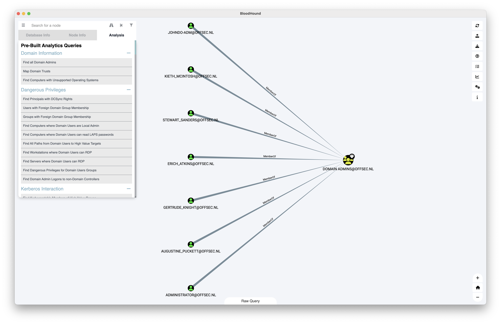

## BloodHound

Uses graph theory to reveal the hidden and often unintended relationships within an Active Directory environment.

### Collectors

{}

{}

To gather additional information directly from ADExplorer for BloodHound, check [ADExplorerSnapshot.py]()

### Installation

Download newest release from [Github.com](https://github.com/BloodHoundAD/BloodHound/releases)

### Custom Queries

{}

Linux

```plain
~/.config/bloodhound/customqueries.json
```

macOS

```plain
~/Library/Application Support/bloodhound
```

Some other custom queries:

* [Github.com - mgeeky - Handy-BloodHound-Cypher-Queries](https://github.com/mgeeky/Penetration-Testing-Tools/blob/master/red-teaming/bloodhound/Handy-BloodHound-Cypher-Queries.md)
* [Github.com - ly4k - Certipy](https://raw.githubusercontent.com/ly4k/Certipy/main/customqueries.json)
* [Github.com - ZephrFish - Bloodhound-CustomQueries](https://raw.githubusercontent.com/ZephrFish/Bloodhound-CustomQueries/main/customqueries.json)
* [Github.com - CompassSecurity - BloodHoundQueries](https://raw.githubusercontent.com/CompassSecurity/BloodHoundQueries/master/customqueries.json)
* [Github.com - Shutdownrepo - Exegol](https://raw.githubusercontent.com/ShutdownRepo/Exegol/master/sources/bloodhound/customqueries.json)

### Example dataset

Dataset based on lab environment with [BadBlood]().

Statistics:

* Users: 2492
* Groups: 551
* Computers: 102
* OUS: 223
* GPOs: 2
* Domains: 1

{}

### Usage

#### Bloodhound - Run ingestor on target domain joined system

##### v3/v4.0

```plain
. .\SharpHound.ps1 /exe
```

```plain
Invoke-BloodHound -CollectionMethod All -JSONFolder "OUTPUT-FOLDER"
```

##### v4.1+

```plain
.\SharpHound.exe --CollectionMethods All
```

#### Bloodhound - Remote ingestor

Please check [BloodHound.py]()

#### AzureHound

Please check [AzureHound]()

### Installation of Neo4j and BloodHound interface on Ubuntu

```plain
sudo wget -O - https://debian.neo4j.org/neotechnology.gpg.key | sudo apt-key add -
sudo echo 'deb https://debian.neo4j.org/repo stable/' | sudo tee -a /etc/apt/sources.list.d/neo4j.list
sudo apt update && sudo apt install neo4j openjdk-8-jdk apt-transport-https
```

Download newest binary from [Github.com](https://github.com/BloodHoundAD/BloodHound/releases)

```plain
sudo neo4j console
./BloodHound -no-sandbox
```

Change default Java JDK to 8

```plain
$ sudo update-alternatives --config java

There are 2 choices for the alternative java (providing /usr/bin/java).

  Selection    Path                                            Priority   Status
------------------------------------------------------------
* 0            /usr/lib/jvm/java-11-openjdk-amd64/bin/java      1111      auto mode
  1            /usr/lib/jvm/java-11-openjdk-amd64/bin/java      1111      manual mode
  2            /usr/lib/jvm/java-8-openjdk-amd64/jre/bin/java   1081      manual mode

Press <enter> to keep the current choice[*], or type selection number: 2
```

Change `DefaultLimitNOFILE` for Neo4j to run without standard `1024` limit. After changing the files reboot your system.

```plain
$ cat /etc/systemd/user.conf 
DefaultLimitNOFILE=60000

$ cat /etc/systemd/system.conf 
DefaultLimitNOFILE=60000
```

#### Start BloodHound (Kali)

Start database

```plain
neo4j console
```

Start bloodhound

```plain
bloodhound
```




#### Filter users from json export Bloodhound

Filter domain admins

```plain
grep -E '"name":' da-export-bloodhound.json | cut -d '"' -f 4 | cut -d '@' -f1
```

### Excessive privileges allowing for shadow Domain Admins

```plain
ForceChangePassword – Ability to reset password of another user
GenericAll          – Full control over an object (read/write)
GenericWrite        – Update of any attributes of an object
WriteOwner          – Assume ownership of an object
WriteDacl           – Modify the DACL of an object
Self                – Arbitrarily modify self
```

* [Infosecmatter.com - Top 16 Active Directory vulnerabilities](https://www.infosecmatter.com/top-16-active-directory-vulnerabilities/#5-excessive-privileges-allowing-for-shadow-domain-admins)
* [iRed.team - Active Directory Kerberos Abuse](https://ired.team/offensive-security-experiments/active-directory-kerberos-abuse/abusing-active-directory-acls-aces)

### High privilege user groups

```plain
Administrators
Domain Admins
Enterprise Admins
Schema Admins
Account Operators
Server Operators
Backup Operators
```

### URL list

* [GitHub.com - Bloodhound](https://github.com/BloodHoundAD/BloodHound/)
* [Github.com - Bloodhound - Pre-compiled binaries](https://github.com/BloodHoundAD/BloodHound/releases)
* [GitHub.com - Bloodhound.py](https://github.com/fox-it/BloodHound.py)
* [Bloodhound for IT teams - PlumHound](https://github.com/PlumHound/PlumHound)
* [GitHub - awsmhacks - BloodhoundCustomQueries](https://github.com/awsmhacks/awsmBloodhoundCustomQueries)
* [Github.com - Azurehound](https://bloodhound.readthedocs.io/en/latest/data-collection/azurehound.html)
