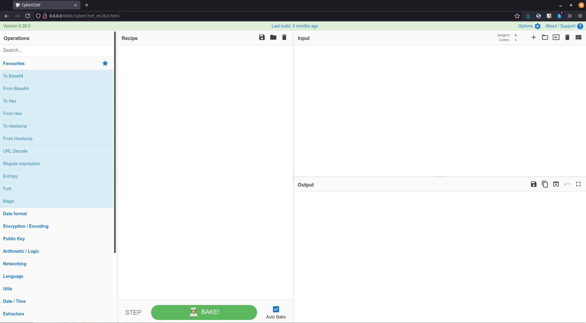
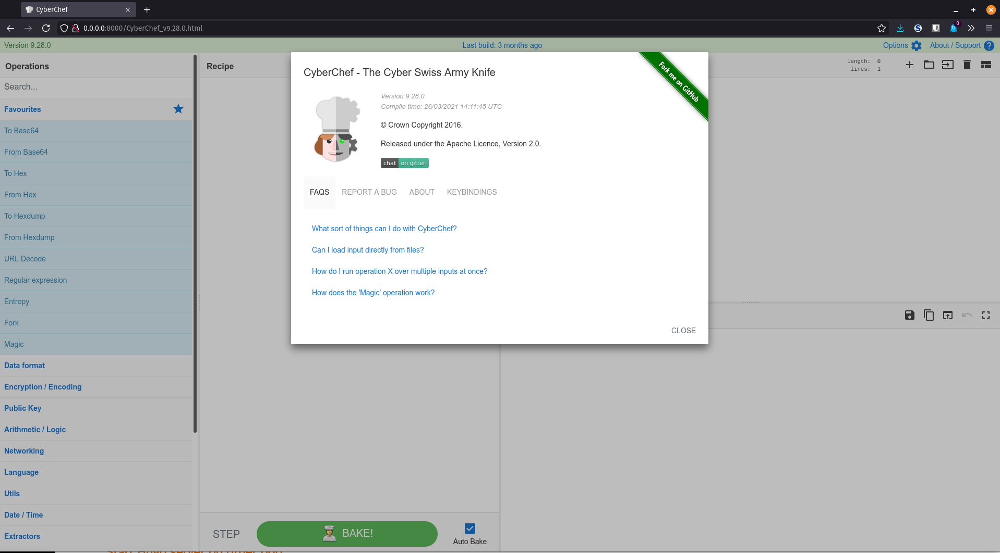
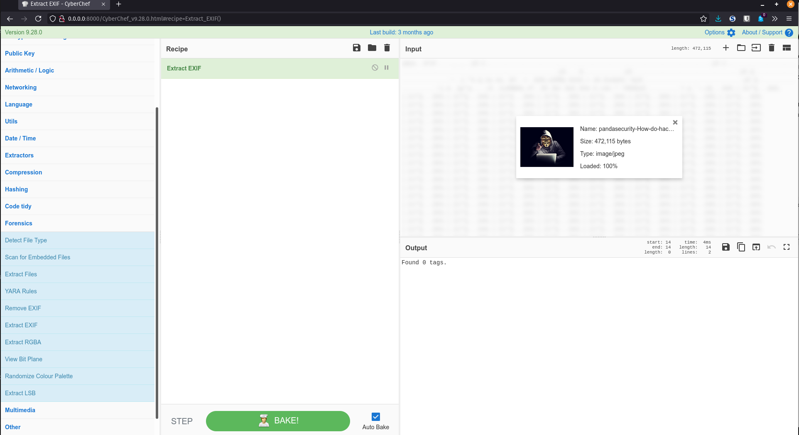

## CyberChef

"The Cyber Swiss Army Knife"

CyberChef is a simple, intuitive web app for carrying out all manner of "cyber" operations within a web browser. These operations include simple encoding like XOR or Base64, more complex encryption like AES, DES and Blowfish, creating binary and hexdumps, compression and decompression of data, calculating hashes and checksums, IPv6 and X.509 parsing, changing character encodings, and much more.

The tool is designed to enable both technical and non-technical analysts to manipulate data in complex ways without having to deal with complex tools or algorithms. It was conceived, designed, built and incrementally improved by an analyst in their 10% innovation time over several years.

## Installation

Download latest release from [Github](https://github.com/gchq/CyberChef/releases).

## Usage

```plain
wget https://github.com/gchq/CyberChef/releases/download/v9.28.0/CyberChef_v9.28.0.zip
unzip CyberChef_v9.28.0.zip

$ python3 -m http.server   
Serving HTTP on 0.0.0.0 port 8000 (http://0.0.0.0:8000/) ...
```

## Examples





## URL List

* [Github.com - CyberChef](https://github.com/gchq/CyberChef)
