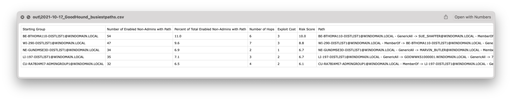
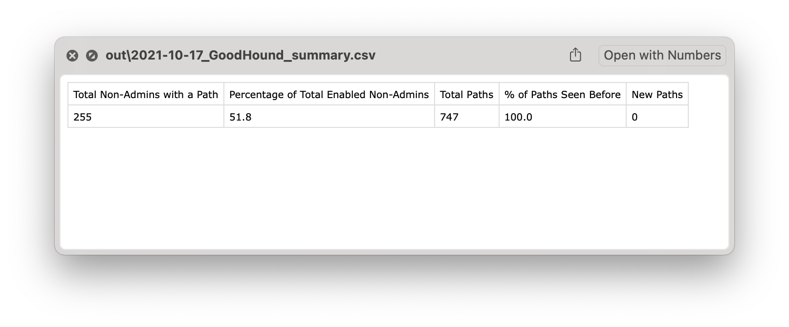
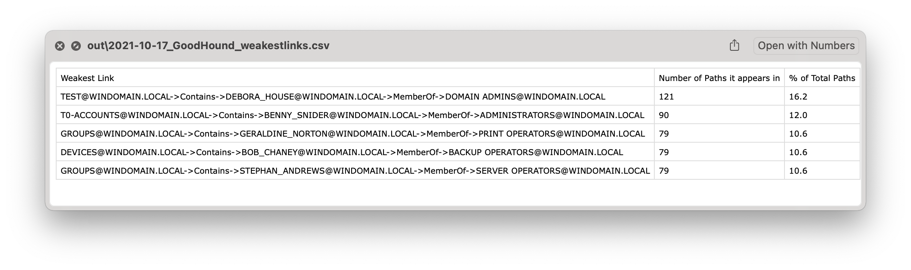

## GoodHound

Attackers think in graphs, defenders think in actions, management think in charts.

GoodHound operationalises Bloodhound by determining the busiest paths to high value targets and creating actionable output to prioritise remediation of attack paths.

## Installation

```plain
git clone https://github.com/idnahacks/GoodHound.git
cd GoodHound
pip install -r requirements.txt
```

## Usage

For a very quick start with most of the default options, make sure you have your neo4j server running and loaded with SharpHound data and run:

```plain
python3 goodhound.py -p neo4jpassword -o csv -f .
```

```plain
goodhound.py [-h] [-u USERNAME] [-p PASSWORD] [-s SERVER] [-o {stdout,csv,md,markdown}]
                [-f OUTPUT_FILEPATH] [-v] [-r RESULTS] [-sort {users,hops,risk}] [-q QUERY]
                [-sch SCHEMA] [--db-skip] [-sqlpath SQL_PATH]
```

## Flags

```plain
BloodHound Wrapper to determine the Busiest Attack Paths to High Value targets.

options:
  -h, --help            show this help message and exit

Neo4jConnection:
  -u USERNAME, --username USERNAME
                        Neo4j Database Username (Default: neo4j)
  -p PASSWORD, --password PASSWORD
                        Neo4j Database Password (Default: neo4j)
  -s SERVER, --server SERVER
                        Neo4j server Default: bolt://localhost:7687)

Output Formats:
  -o {stdout,csv,md,markdown}, --output-format {stdout,csv,md,markdown}
                        Output formats supported: stdout, csv, md (markdown). Default: stdout.
  -f OUTPUT_FILEPATH, --output-filepath OUTPUT_FILEPATH
                        File path to save the csv output.
  -v, --verbose         Enables verbose output.

Query Parameters:
  -r RESULTS, --results RESULTS
                        The number of busiest paths to process. The higher the number the longer
                        the query will take. Default: 5
  -sort {users,hops,risk}, --sort {users,hops,risk}
                        Option to sort results by number of users with the path, number of hops
                        or risk score. Default: Risk Score
  -q QUERY, --query QUERY
                        Optionally add a custom query to replace the default busiest paths query.
                        This can be used to run a query that perhaps does not take as long as the
                        full run. The format should maintain the 'match
                        p=shortestpath((g:Group)-[]->(n)) return distinct(g.name) as groupname,
                        min(length(p)) as hops' structure so that it doesn't derp up the rest of
                        the script. e.g. 'match p=shortestpath((g:Group
                        {highvalue:FALSE})-[*1..]->(n {highvalue:TRUE})) WHERE tolower(g.name) =~
                        'admin.*' return distinct(g.name) as groupname, min(length(p)) as hops'

Schema:
  -sch SCHEMA, --schema SCHEMA
                        Optionally select a text file containing custom cypher queries to add
                        labels to the neo4j database. e.g. Use this if you want to add the
                        highvalue label to assets that do not have this by default in the
                        BloodHound schema.

SQLite Database:
  --db-skip             Skips the logging of attack paths to a local SQLite Database
  -sqlpath SQL_PATH, --sql-path SQL_PATH
                        Sets the location of the SQLite Database

Attackers think in graphs, Defenders think in actions, Management think in charts.
```

## Examples

```plain
$ python3 goodhound.py -p neo4jpassword -o csv -f out
   ______                ____  __                      __
  / ____/___  ____  ____/ / / / /___  __  ______  ____/ /
 / / __/ __ \/ __ \/ __  / /_/ / __ \/ / / / __ \/ __  / 
/ /_/ / /_/ / /_/ / /_/ / __  / /_/ / /_/ / / / / /_/ /  
\____/\____/\____/\__,_/_/ /_/\____/\__,_/_/ /_/\__,_/   
Setting cost.
Running query, this may take a while.
Counting Users in Groups
Processing path 747 of 747
```

This will create three files containing analysis output.

```plain
$ ll out*      
-rw-r--r--  1 crypt0rr  staff   2.4K Feb  5 16:54 out\2021-10-17_GoodHound_busiestpaths.csv
-rw-r--r--  1 crypt0rr  staff   134B Feb  5 16:54 out\2021-10-17_GoodHound_summary.csv
-rw-r--r--  1 crypt0rr  staff   639B Feb  5 16:54 out\2021-10-17_GoodHound_weakestlinks.csv
```

{}





## URL List

* [Github.com - GoodHound](https://github.com/idnahacks/GoodHound)
