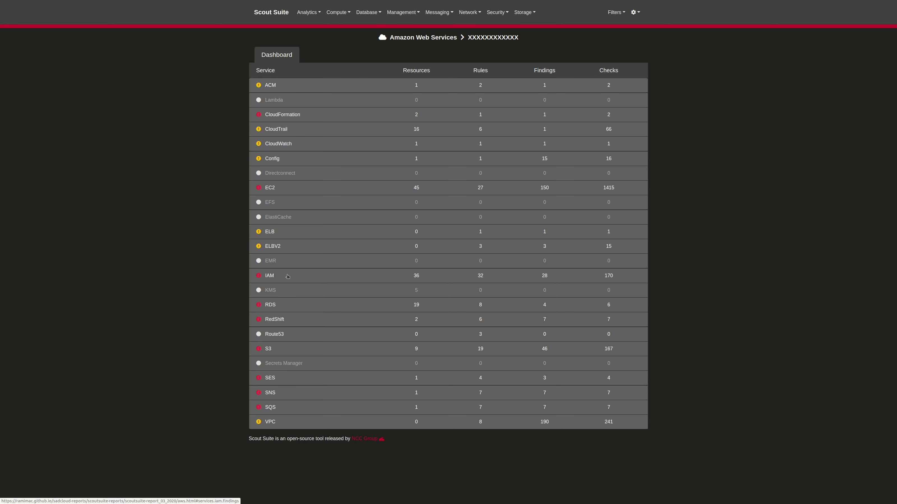

---

Scout Suite is an open source multi-cloud security-auditing tool, which enables security posture assessment of cloud environments. Using the APIs exposed by cloud providers, Scout Suite gathers configuration data for manual inspection and highlights risk areas. Rather than going through dozens of pages on the web consoles, Scout Suite presents a clear view of the attack surface automatically.

Scout Suite was designed by security consultants/auditors. It is meant to provide a point-in-time security-oriented view of the cloud account it was run in. Once the data has been gathered, all usage may be performed offline.

The project team can be contacted at <scoutsuite@nccgroup.com>.

## Cloud Provider Support

The following cloud providers are currently supported:

- Amazon Web Services
- Microsoft Azure
- Google Cloud Platform
- Alibaba Cloud (alpha)
- Oracle Cloud Infrastructure (alpha)

## Installation

Refer to the [wiki](https://github.com/nccgroup/ScoutSuite/wiki/Setup).

## Usage

Scout Suite is run through the CLI:

Once this has completed, it will generate an HTML report including findings and Cloud account configuration:

The above report was generated by running Scout Suite against <https://github.com/nccgroup/sadcloud>.

Additional information can be found in the [wiki](https://github.com/nccgroup/ScoutSuite/wiki).
There are also a number of handy [tools](https://github.com/nccgroup/ScoutSuite/tree/master/tools) for automation of common tasks.

## URL List

- [Github.com - ScoutSuite](https://github.com/nccgroup/ScoutSuite)
