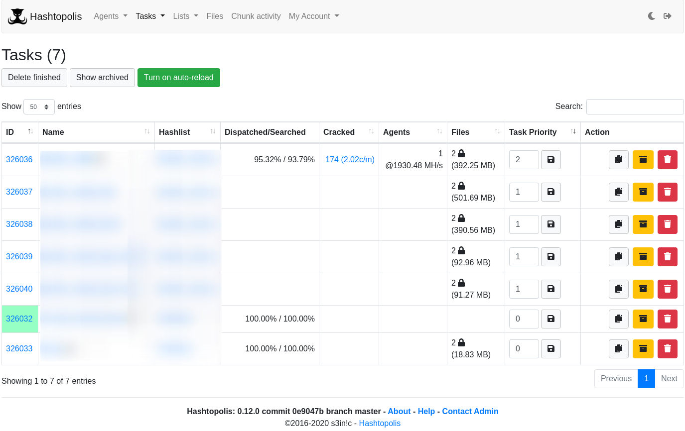
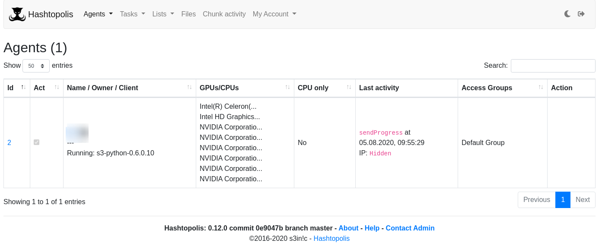
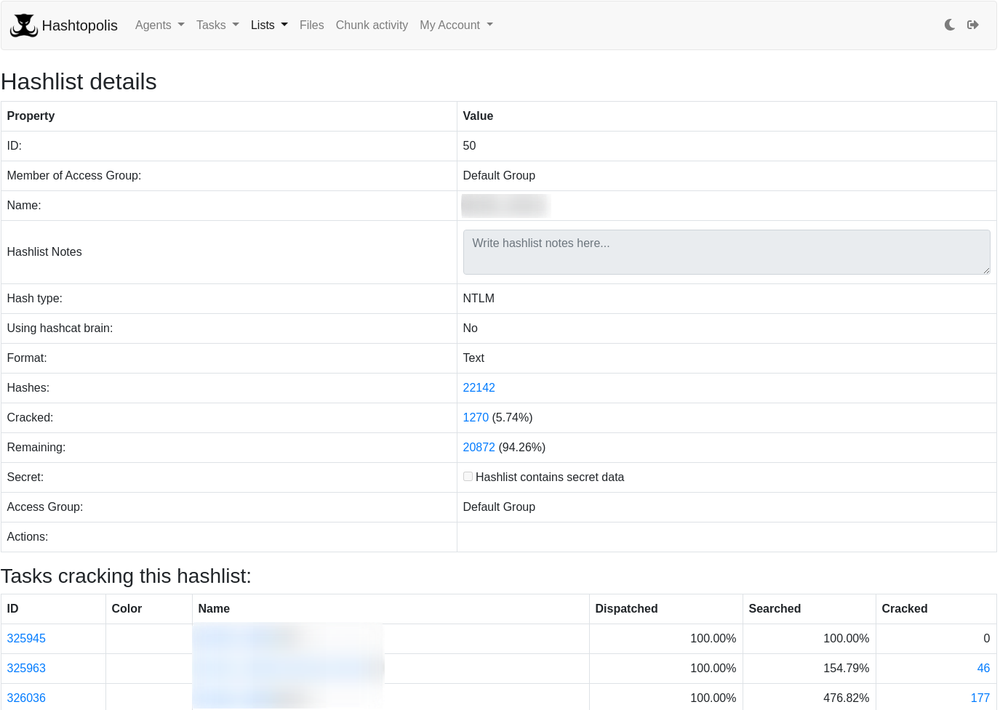

## Hashtopolis

A multi-platform client-server tool for distributing hashcat tasks to multiple computers

## Installation

See website on [Github.com](https://github.com/s3inlc/hashtopolis)

## Examples

## URL List

- [Hashtopolis.org](https://hashtopolis.org/)
- [GitHub.com - hashtopolis](https://github.com/s3inlc/hashtopolis)
- [GitHub.com Wiki](https://github.com/s3inlc/hashtopolis/wiki)
