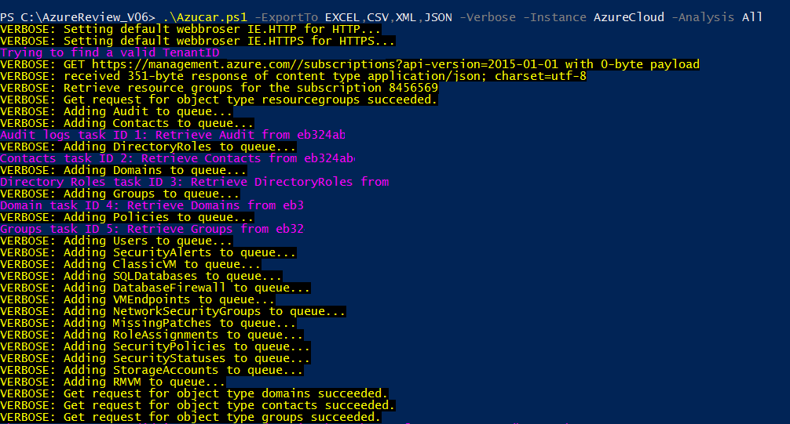
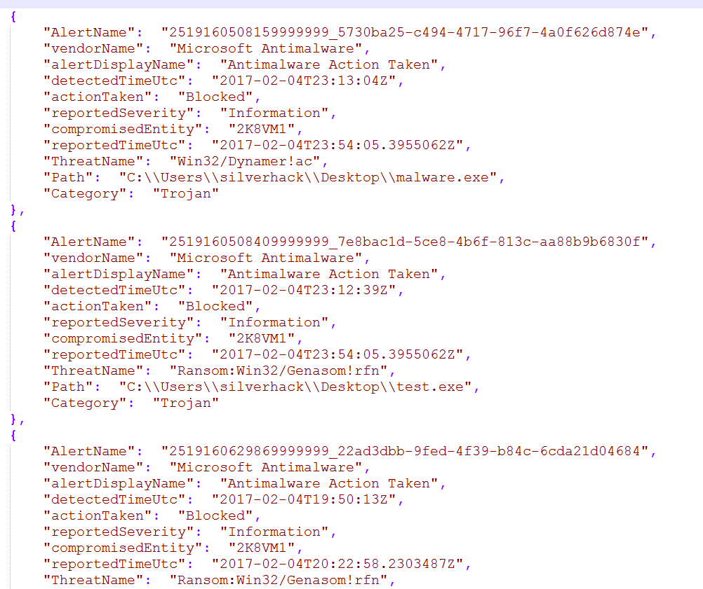

## Azucar

Azucar is a multi-threaded plugin-based tool to help you assess the security of your Azure Cloud environment.

The script will **not change or modify** any assets deployed in an Azure subscription.

As the script uses the .NET ADAL library for authenticating a user and calling REST APIs, it only supports Windows OS.

### Features

* Return a number of attributes on computers, users, groups, contacts, events, etc... from Azure Active Directory.
* Search for High Level Accounts in a specific Azure Tenant, including Azure Active Directory, classic administrators, and Directory Roles (RBAC).
* Multi-Threading support.
* Plugin Support.
* The following assets are supported by Azucar:
* Azure SQL Databases, including MySQL and PostgreSQL databases,
* Azure Active Directory,
* Storage Accounts,
* Classic Virtual Machines,
* Virtual Machines V2,
* Security Status,
* Security Policies,
* Role Assignments (RBAC),
* Missing Security Patches,
* Missing Security Baseline,
* Web Application Firewall,
* Network Security Groups,
* Classic Endpointsy,
* Azure Security Alerts,
* Azure KeyVault.

### Prerequisites

Azucar works straight out of the box with PowerShell version 3.x and .NET4.5. To check a Windows PowerShell version, open a console and run the command $PsVersionTable:

```plain
PS C:\Users\silverhack> $psversiontable

Name                           Value
----                           -----
PSVersion                      5.1.14393.693
PSEdition                      Desktop
PSCompatibleVersions           {1.0, 2.0, 3.0, 4.0...}
BuildVersion                   10.0.14393.693
CLRVersion                     4.0.30319.42000
WSManStackVersion              3.0
PSRemotingProtocolVersion      2.3
SerializationVersion           1.1.0.1
```

You should use an **account with at least read-permission** on the assets you want to access. More information about Role-Based Access Control in Azure can be found by clicking [here](https://docs.microsoft.com/en-us/azure/role-based-access-control/role-assignments-portal).

## Installation

You can either download the latest zip by clicking this link or download Azucar by cloning the repository:

```plain
git clone https://github.com/nccgroup/azucar.git
```

Once you have unzipped the zip file, you can use the PowerShell V3 Unblock-File cmdlet to unblock files:

```plain
Get-ChildItem -Recurse c:\Azucar_V10 | Unblock-File
```

## Usage

To get a list of basic options and switches use:

```plain
get-help .\azucar.ps1
```

To get a list of examples use:

```plain
get-help .\azucar.ps1 -Examples
```

To get a list of all options and examples with detailed info use:

```plain
get-help .\azucar.ps1 -Detailed
```

## Examples



```plain
PS C:\Users\john.do\azucar> .\Azucar.ps1 -ExportTo EXCEL,CSV,XML,JSON -Verbose -Instance AzureCloud -Analysis All
VERBOSE: [10:28:55:015] [Get-AzADALToken] - Executing Azucar with Interactive authentication flow
[10:28:55:078] [Get-AzADALToken] - There was an error with TokenCache which expires on . Trying to refresh token
VERBOSE: [10:29:48:613] [Authorize-Tenant] - Adding OFFSEC tenant displayName...
https://management.azure.com/subscriptions?api-version=2016-06-01
VERBOSE: [10:29:48:848] [Select-AzSecSubscription] - No valid subscription was found for OFFSEC tenant
VERBOSE: [10:29:48:848] [Select-AzSecSubscription] - No valid subscription were found
[Exception][Main][661]:Unable to retrieve resource groups....
```

### Reporting

Support for exporting data to popular formats like CSV, XML or JSON.

The following screenshot shows an example report in JSON format:



An example of report generated by Azucar can be downloaded from [Azucar_Report_20170308.xlsx](https://github.com/nccgroup/azucar/files/1915480/Azucar_Report_20170308.xlsx).

## URL List

- [Github.com - Azucar](https://github.com/nccgroup/azucar)
