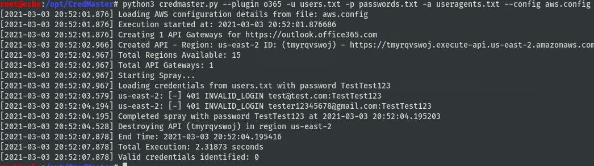

## Credmaster

Launch a password spray / brute force attach via Amazon AWS passthrough proxies, shifting the requesting IP address for every authentication attempt. This dynamically creates FireProx APIs for more evasive password sprays.

Shoutout to @ustayready for his CredKing and FireProx tools, which form the base of this suite.

See all the full notes on the Wiki, tool released with specifics in this blogpost

For detection tips, see the blogpost and detection section.

**Be careful** for account lockouts, know the reset policies of your target

### Benefits

* Fully supports all AWS Regions
* Automatically generates APIs for proxy passthru
* Spoofs API tracking numbers, forwarded-for IPs, and other proxy tracking headers
* Multi-threaded processing
* Password delay counters & configuration for lockout policy evasion
* Easily add new plugins
* Fully [anonymous](https://github.com/knavesec/CredMaster/wiki/Anonymity)

### The following plugins are currently supported

* [OWA](https://github.com/knavesec/CredMaster/wiki/OWA) - Outlook Web Access
* [EWS](https://github.com/knavesec/CredMaster/wiki/EWS) - Exchange Web Services
* [O365](https://github.com/knavesec/CredMaster/wiki/O365) - Office365
* [MSOL](https://github.com/knavesec/CredMaster/wiki/MSOL) - Microsoft Online
* [Okta](https://github.com/knavesec/CredMaster/wiki/Okta) - Okta Authentication Portal
* [FortinetVPN](https://github.com/knavesec/CredMaster/wiki/FortinetVPN) - Fortinet VPN Client
* [HTTPBrute](https://github.com/knavesec/CredMaster/wiki/HTTPBrute) - Generic HTTP Brute Methods (Basic/Digest/NTLM)
* [ADFS](https://github.com/knavesec/CredMaster/wiki/ADFS) - Active Directory Federation Services
* [AzureSSO](https://github.com/knavesec/CredMaster/wiki/AzureSSO) - Azure AD Seamless SSO Endpoint

## Installation

```plain
git clone https://github.com/knavesec/CredMaster.git
python3 -m pip install -r requirements.txt
```

#### Requirements

This tool requires AWS API access keys, a walkthrough on how to acquire these keys can be found here: <https://bond-o.medium.com/aws-pass-through-proxy-84f1f7fa4b4b>

All other usage details can be found [here](https://github.com/knavesec/CredMaster/wiki/Usage)

## Usage

```plain
credmaster.py [-h] [--plugin PLUGIN] [-u USERFILE] [-p PASSWORDFILE] [-f USERPASSFILE] [-a USERAGENTFILE] [-o OUTFILE] [-t THREADS] [-j JITTER] [-m JITTER_MIN] [-d DELAY] [--passwordsperdelay PASSWORDSPERDELAY] [--profile_name PROFILE_NAME] [--access_key ACCESS_KEY]
                     [--secret_access_key SECRET_ACCESS_KEY] [--session_token SESSION_TOKEN] [--config CONFIG] [--clean] [--api_destroy API_DESTROY] [--api_list]
```

## Flags

```plain
optional arguments:
  -h, --help            show this help message and exit
  --plugin PLUGIN       Spray plugin
  -u USERFILE, --userfile USERFILE
                        Username file
  -p PASSWORDFILE, --passwordfile PASSWORDFILE
                        Password file
  -f USERPASSFILE, --userpassfile USERPASSFILE
                        Username-Password file (one-to-one map, colon separated)
  -a USERAGENTFILE, --useragentfile USERAGENTFILE
                        Useragent file
  -o OUTFILE, --outfile OUTFILE
                        Output file to write contents (omit extension)
  -t THREADS, --threads THREADS
                        Thread count (default 1, max 15)
  -j JITTER, --jitter JITTER
                        Jitter delay between requests in seconds (applies per-thread)
  -m JITTER_MIN, --jitter_min JITTER_MIN
                        Minimum jitter time in seconds, defaults to 0
  -d DELAY, --delay DELAY
                        Delay between unique passwords, in minutes
  --passwordsperdelay PASSWORDSPERDELAY
                        Number of passwords to be tested per delay cycle
  --profile_name PROFILE_NAME
                        AWS Profile Name to store/retrieve credentials
  --access_key ACCESS_KEY
                        AWS Access Key
  --secret_access_key SECRET_ACCESS_KEY
                        AWS Secret Access Key
  --session_token SESSION_TOKEN
                        AWS Session Token
  --config CONFIG       Authenticate to AWS using config file aws.config
  --clean               Clean up all fireprox AWS APIs from every region, warning irreversible
  --api_destroy API_DESTROY
                        Destroy single API instance, by API ID
  --api_list            List all fireprox APIs
```

## Examples

```plain
python3 credmaster.py --plugin {pluginname} --access_key {key} --secret_access_key {key} -u userfile -p passwordfile -a useragentfile {otherargs}
```



## URL List

* [Github.com - CredMaster](https://github.com/knavesec/CredMaster)
