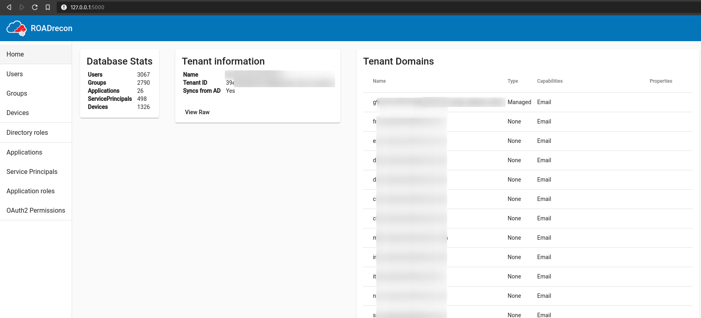

## ROADrecon

Rogue Office 365 and Azure AD (active) Directory tools - ROADtools is a framework to interact with Azure AD. It currently consists of a library (roadlib) and the ROADrecon Azure AD exploration tool.

### Installation

```plain
python3 -m pip install roadrecon
```

### Usage

```plain
roadrecon [-h] {auth,gather,dump,gui,plugin} ...
```

### Flags

```plain
ROADrecon - The Azure AD exploration tool.
By @_dirkjan - dirkjanm.io

To get started, use one of the subcommands. Each command has a help feature (roadrecon <command> -h).

1. Authenticate to Azure AD
roadrecon auth <options>

2. Gather all information
roadrecon gather <options>

3. Explore the data or export it to a specific format using a plugin
roadrecon gui
roadrecon plugin -h

positional arguments:
  {auth,gather,dump,gui,plugin}
    auth                Authenticate to Azure AD
    gather (dump)       Gather Azure AD information
    gui                 Launch the web-based GUI
    plugin              Run a ROADrecon plugin

optional arguments:
  -h, --help            show this help message and exit
```

### Examples

#### Authentication username / password based

```plain
$ roadrecon auth -u john.do@offsec.nl

Password:
Tokens were written to .roadtools_auth
```

#### Authentication with device code (when MFA required)

```plain
$ roadrecon auth --device-code
To sign in, use a web browser to open the page https://microsoft.com/devicelogin and enter the code D2DYVPQWC to authenticate.
Tokens were written to .roadtools_auth
```

#### Gather information

```plain
$ roadrecon gather -f .roadtools_auth

Starting data gathering phase 1 of 2 (collecting objects)
Starting data gathering phase 2 of 2 (collecting properties and relationships)
ROADrecon gather executed in 82.96 seconds and issued 4148 HTTP requests.
```

#### Start analysis tool

Requirement: roadrecon.db needs to be in the same folder as the GUI is started

```plain
$ roadrecon gui

 * Serving Flask app "roadtools.roadrecon.server" (lazy loading)
 * Environment: production
   WARNING: This is a development server. Do not use it in a production deployment.
   Use a production WSGI server instead.
 * Debug mode: off
 * Running on http://127.0.0.1:5000/ (Press CTRL+C to quit)
```

#### Export to XLS

```plain
$ roadrecon plugin xlsexport -d roadrecon.db -v
Export Users info
Export Devices info
Export Groups info
Export MemberOf info
Export Directory roles info
Export Applications info
Export Service principals info
Export Applications roles info
Export Oauth2 permissions info
Export MFA info
Data have been exported to the data.xls file
```



### URL list

* [GitHub.com - ROADtools](https://github.com/dirkjanm/ROADtools)
* [Dirkjanm.io - Introducing ROADtools - The Azure AD exploration framework](https://dirkjanm.io/introducing-roadtools-and-roadrecon-azure-ad-exploration-framework/)
