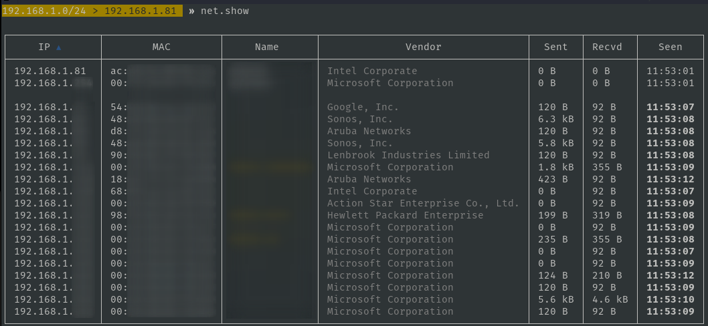
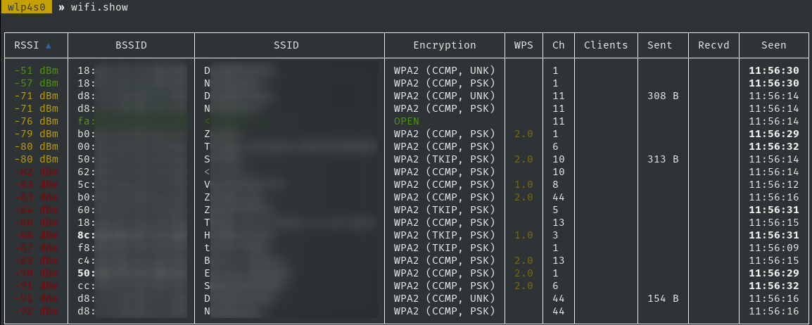

## Bettercap

The Swiss Army knife for WiFi, Bluetooth Low Energy, wireless HID hijacking and Ethernet networks reconnaissance and MITM attacks.

## Installation

Download newest release from [Github.com](https://github.com/bettercap/bettercap/releases)

Install requirements

```plain
sudo apt update && sudo apt install build-essential libpcap-dev net-tools libnetfilter-queue-dev
```

Unzip newest release and move to

```plain
sudo cp bettercap /usr/local/bin
```

Install caplet updates and UI, default credentials user:pass

```plain
sudo bettercap -eval "caplets.update; ui.update; quit"
```

## Usage

```plain
sudo bettercap [OPTIONS]
```

## Flags

```plain
Usage of bettercap:
  -autostart string
        Comma separated list of modules to auto start. (default "events.stream")
  -caplet string
        Read commands from this file and execute them in the interactive session.
  -cpu-profile file
        Write cpu profile file.
  -debug
        Print debug messages.
  -env-file string
        Load environment variables from this file if found, set to empty to disable environment persistence.
  -eval string
        Run one or more commands separated by ; in the interactive session, used to set variables via command line.
  -gateway-override string
        Use the provided IP address instead of the default gateway. If not specified or invalid, the default gateway will be used.
  -iface string
        Network interface to bind to, if empty the default interface will be auto selected.
  -mem-profile file
        Write memory profile to file.
  -no-colors
        Disable output color effects.
  -no-history
        Disable interactive session history file.
  -silent
        Suppress all logs which are not errors.
  -version
        Print the version and exit.
```

## Examples

### Start on active network interface

```plain
sudo bettercap
```

### Start on specific network interface

```plain
sudo bettercap -iface <interface>
```

### ARP spoofing

```plain
sudo bettercap
net.probe on
net.sniff on
http.proxy on
set arp.spoof.fullduplex true
arp.spoof on
```

### Use caplets

```plain
sudo bettercap -caplet http-ui
```

### Local network recon

```plain
sudo bettercap
```



### Wi-Fi network recon

```plain
sudo bettercap -iface <wifi-interface>
```



### Capturing PMKIDs

This can also be done by the [hcxdumptool]()

```plain
bettercap v2.31.0 (built for linux arm with go1.16.2) [type 'help' for a list of commands]

 mon0  » wifi.recon on
[01:52:35] [sys.log] [inf] wifi using interface mon0 (b8:27:eb:63:d9:2e)
 mon0  » [01:52:35] [sys.log] [inf] wifi started (min rssi: -200 dBm)
 mon0  » [01:52:35] [sys.log] [inf] wifi channel hopper started.
 mon0  » [01:52:35] [wifi.ap.new] wifi access point OFFSEC-G (-66 dBm) detected as c8:12:34:56:78:e1 (Hewlett Packard Enterprise).

 mon0  » wifi.assoc c8:12:34:56:78:e1
 mon0  » [01:52:59] [sys.log] [inf] wifi sending association request to AP OFFSEC-G (channel:11 encryption:WPA2)
 mon0  » [01:52:59] [sys.log] [war] wifi error while hopping to channel 12: iw: out= err=exit status 234
 mon0  » [01:52:59] [wifi.client.handshake] captured b8:12:34:56:78:2e -> OFFSEC-G (c8:12:34:56:78:e1) RSN PMKID to /root/bettercap-wifi-handshakes.pcap
```

The `/root/bettercap-wifi-handshakes.pcap` file can be converted with [hcxpcapngtool]() to [hashcat]() format.

### Troubleshooting

### libpcap not found

```plain
sudo ln -s /usr/lib/x86_64-linux-gnu/libpcap.so /usr/lib/x86_64-linux-gnu/libpcap.so.1
```

### Kali web-ui 404-error

```plain
bettercap
ui.update
cp -r /usr/local/share/bettercap/ui/ /usr/share/bettercap/ui/
```

### Kali web-ui 404-error Raspberry Pi

```plain
Download newest release: https://github.com/bettercap/ui/releases
unzip ui.zip -d /usr/share/bettercap/
```

### Filter IP's from Bettercap output

```plain
grep -oE "\b([0-9]{1,3}\.){3}[0-9]{1,3}\b" bettercap.log | sort -u > ip.txt
```

## URL List

* [Bettercap.org](https://www.bettercap.org/)
* [GitHub.com - Bettercap](https://github.com/bettercap/bettercap/)
